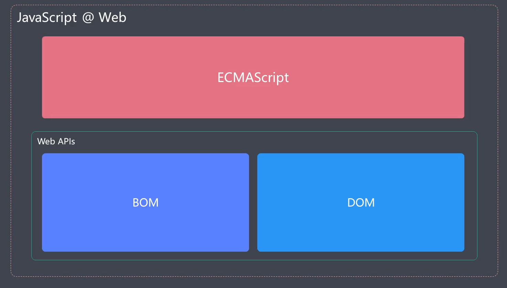
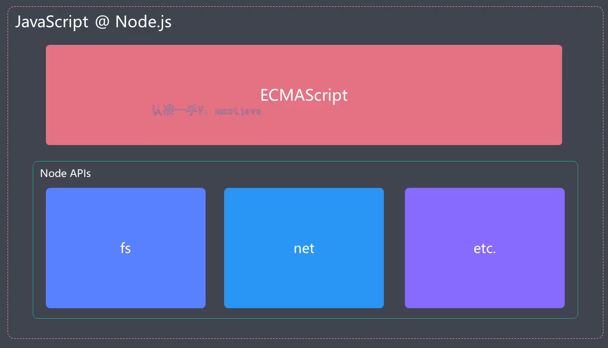
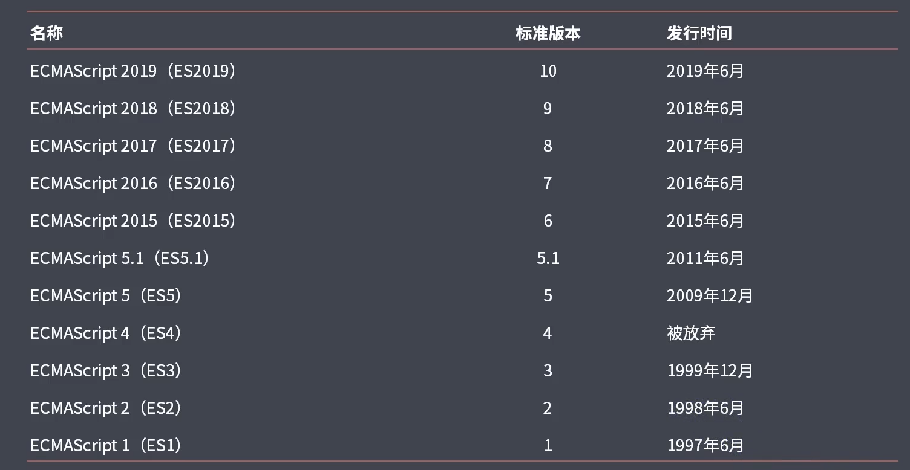

# 相关文档

[ECMAScript 官方文档](https://ecma-international.org/)

# 概述

ECMAScript 是一门脚语言，简写为 ES，通常看作是 Javascript 的标准化规范，实际上 Javascript 是 ECMAScript 的扩展语言。因为在 ECMAScript 中只提供了最基本的语法，通俗来说就是约定了代码如何编写，例如如何定义变量和函数。所以 ES 只是停留在语言层面，而并不能实现实际业务中的功能开发。

而 Javascript 实现了 ES 的语言标准，并在其基础上做了扩展，使得我们在浏览器环境中去操作 DOM 和 BOM，在 node 环境中执行文件读写的操作。

在浏览器环境中的 Javascript，相当于 ECMAScript + Web APIs（DOM、BOM）:

在 node 环境中的 Javascript，相当于 ECMAScript + Node APIs（fs、net、etc.）:

所以 Javascript 语言本身指的就是 ECMAScript。随着近几年 Web 模式的深入发展，从 2015 年开始 ES 保持着每年一个版本的迭代，伴随着新版本的迭代，很多新特性陆续出现，这就导致 Javascript 这门语言的本身变得日渐高级以及便捷。

下图展示了 ECMAScript 的迭代：

其中，ES2015 这个版本比较特殊，其在 ES5 发布之后经过了近 6 年时间才被完全标准化，并且这 6 年时间是 web 发展的黄金时间，所以在这个版本中包含了很多颠覆性的新功能，也正是因为 ES2015 等待的时间过长，导致发布的内容过多，所以在之后的版本开始，ES 的发布变得更加频繁，这也符合当下互联网小步快跑的精神。从 ES2015 过后，ECMAScript 不再决定按照版本号命名，而是按照年份命名，由于这种命名规则是在 ES205 诞生过程中产生的，很多人已经习惯将 ES2015 称之为 ES6。随着 ECMAScript 的稳固发展，市面上主流的运行环境也都纷纷跟进，逐步支持其最新的特性。

也就是说，ES2015（ES6）可以说是最新 ECMAScript 标准的代表版本，因为：

- 相对于 ES5.1 的变化比较大
- 自此，标准命名规则发生变化

目前很多开发者习惯将 ES6 泛指所有的新标准，比如很多资料中写到：“使用 ES6 的 async 和 await”，实际上 async 函数是 ES2017 中制定的标准，因此平时要注意分辨资料中的 ES6 是特指还是泛指。

本次学习重点在于 ES5.1 基础之上的变化，这些变化可以简单归纳为 4 类：

- 1.解决原有语法上的一些问题或者不足
- 2.对原有语法进行增强
- 3.全新的对象、全新的方法、全新的功能
- 4.全新的数据类型和数据结构
