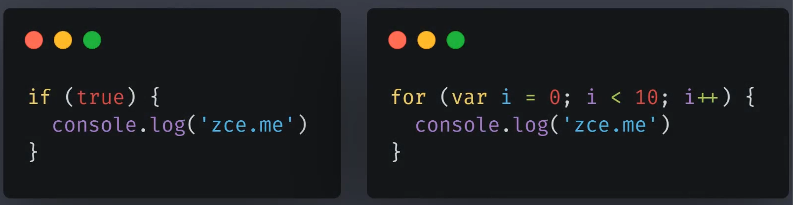

# ES2015 let 与块级作用域

## 块级作用域

作用域-某个成员能够起作用的范围

在 ES2015 之前，ES 中只有两种作用域：

- 全局作用域
- 函数作用域

在 ES2015 中新增了块级作用域。比如 if 或 for 中花括号中的就是一个块：


以前块没有独立的作用域，导致在块外面也可以访问到块里面的变量。这在复杂代码中是不利的，比如：

```javascript
for (var i = 0; i < 3; i++) {
  for (var i = 0; i < 3; i++) {
    console.log(i);
  }
}

// 在这里的代码中，由于i都是使用var来声明的，属于全局的，内部对外部的i进行了重复声明，导致当内部循环完成之后，i也变成了3，导致这个以为会console执行9次的情况实际上只执行了3次。
// 将内部for里的var改为let即可以解决这个同名计数器导致的问题
```

再比如：

```javascript
var elements = [{}, {}, {}];

for (var i = 0; i < elements.length; i++) {
  elements[i].onclick = function () {
    console.log(i);
  };
}

elements[0].click(); // 发现无论点击哪个element，打印出来的都是3
```

这个也是闭包的经典应用场景，将上例更改如下：

```javascript
var elements = [{}, {}, {}];

for (var i = 0; i < elements.length; i++) {
  elements[i].onclick = (function (i) {
    return function () {
      console.log(i);
    };
  })(i);
}

elements[0].click(); // 打印如预期，闭包也是借助函数作用域摆脱全局作用域的影响；有了块级作用域之后，不用闭包，直接将for里的var改为let即可
```

## 变量提升

为何 ES 不直接升级 var，而是新增了一个变量 let？

避免以前对于 var 的使用产生报错信息。

## const

const 用来声明恒量/常量，其相较于 let 基础上多了「只读」特性，即声明之后就不可更改。

# 解构赋值

## 数组的解构

```javascript
const arr = [100, 200, 300];
// 不使用数组解构
// const third = arr[2]

// 使用数组解构
const [, , third] = arr;
// rest只能放在最后
const [first = "default", ...rest] = arr;
console.log(rest); // 输出[200,300]
```

## 对象的解构

```javascript
const obj = { name: "zce", age: 18 };
const { name } = obj;

// 避免name冲突
const { name: objName = "default" } = obj;
```

# 模版字符串

在 ES2015 中增强了定义字符串的方式，传统的做法是通过单引号或双引号来表示，而新增的模版字符串是通过反引号来标识。

- 1.支持多行换行
- 2.支持插值表达式
- 3.模版字符串可以带标签（标签实际上是一个特殊的函数，在模版字符串前加上这个标签就相当于调用这个函数）

```javascript
const obj = { name: "zce", age: 18 };
const { name } = obj;

function myTagFunc(string, name) {
  console.log(string, name);
}

const res = myTagFunc`hey, this is ${name}`;
```

# 字符串的扩展方法

ES2015 为字符串新增了扩展方法，常用的有：

- includes
- startWith
- endsWith

# ES2015 参数默认值

在 ES2015 之前，如果想要对函数的参数设置默认值，就需要在函数体内部通过逻辑代码来实现，比如需要先判断是否为 undefined，再设置其默认值。

```javascript
// ES2015 之前
function foo(enable) {
  enable = enable === "undefined" ? true : enable;
}

// ES2015之后，注意设置默认值的参数放在最后
function foo(first, enable = true) {}
```

# ES2015 剩余参数

在 ES2015 之前，使用 arguments 去就接收未知个数的参数，arguments 是一个伪数组。ES2015 新增了一个...操作符，

```javascript
// ES2015 之前
function foo(arguments) {
  console.log(arguments)
}

// ES2015之后，注意放在最后，并且只能使用一次
function foo(...args) {
  console.log(args)
}
```

# ES2015 展开数组

下面展示了将数组里的元素按次序传递给 console.log 的三种方法：

```javascript
// 方法1:适合已知个数的数组
const arr = ["1", "2", "3"];
console.log(arr[0], arr[1], arr[2]);

// 方法2:apply方法去调用函数，因为apply方法可以用数组的方式接收实参列表
console.log.apply(console, arr);

// 方法3:使用...操作符
console.log(...arr); // ...操作符自动按顺序展开数组
```

# ES2015 箭头函数 arrow functions

箭头函数不会改变 this 指向

```javascript
const person = {
  name: "tom",
  sayHi: function () {
    console.log(`hi,my name is ${this.name}`);
  },
  sayHello: () => {
    console.log(`hello,my name is ${this.name}`);
  },
  sayHiAsync: function () {
    setTimeout(function () {
      console.log(`hi,my name is ${this.name}`);
    }, 1000);
  },
  sayHiAsync2: function () {
    const _this = this;
    setTimeout(function () {
      console.log(`hi,my name is ${_this.name}`);
    }, 1000);
  },
  sayHiAsyncWithArrow: function () {
    setTimeout(() => {
      console.log(`hi,my name is ${this.name}`);
    }, 1000);
  },
};

person.sayHi(); // 正常打印出name
person.sayHello(); // 不能正常打印出name，显示为undefined
person.sayHiAsync(); // 也不能正常打印出name，因为setTimeout会被放到全局作用域被调用，因此是拿不到当前作用域里的this
person.sayHiAsync2(); // 能正常打印出name，基于闭包保存当前作用域的this
person.sayHiAsyncWithArrow(); // 能正常打印出name，箭头函数不改变this
```
