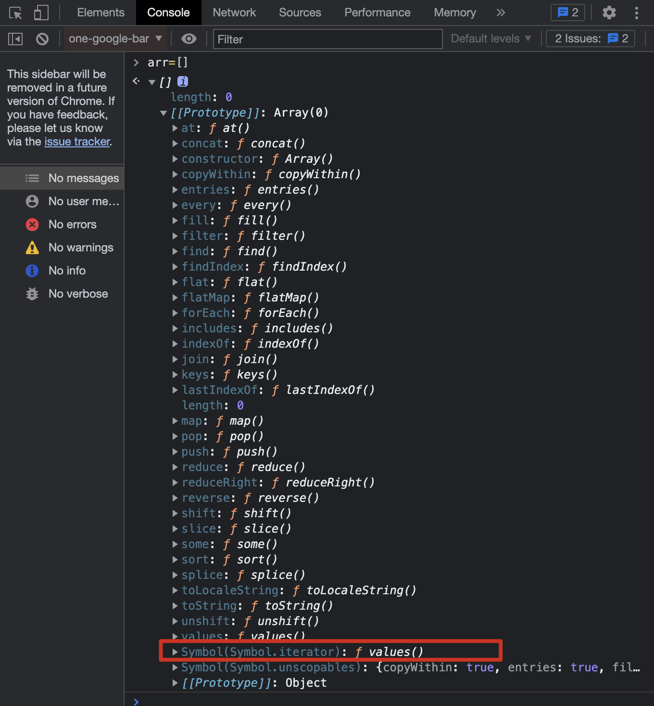
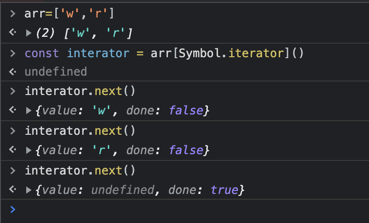

# ES2015 对象字面量的增强

```javascript
// 1.属性名：属性值的简化
const obj = {
  // name: name
  name,
};

// 2.对象里的一个普通方法
const obj = {
  //   method1: function(){},
  method1() {},
};

// 3.表达式的返回值可以作为对象的属性名——称为计算属性名
const staticKey = Math.random();
const obj = {
  // staticKey: 123,
  [Math.random()]: 123,
};
```

# ES2015 对象扩展方法

## Object.assign，作用是将多个源对象中的属性复制到一个目标对象中

```javascript
const source1 = { a: 123, b: 123 };
const source2 = { b: 789, d: 789 };
const target = { a: 456, c: 456 };

const result = Object.assign(target, source); // target = {a:123, c:456, b:789, d:789}
console.log(result === target); // true
```

## Object.is，判断两个值是否相等

```javascript
// 传统方法： === ==
// NaN === NaN
// 0==false
// +0 === -0
Object.is(NaN, NaN);
```

# ES2015 Proxy 代理对象

## Proxy 的基本用法

如果需要监视某个对象中的属性读写，就可以使用 ES2015 提供的 Object.defineProperty 去添加属性，就可以捕获到对象中属性的读写过程。

在 Vue3.0 版本之前就是使用 Object.defineProperty 方式实现的数据响应，从而完成双向数据绑定。Vue3.0 开始使用 Proxy 实现数据响应

而在 ES2015 中全新设计了一种 proxy 的类型，专门用来为对象设置访问代理器的。相对于 Object.defineProperty，Proxy 功能更为强大，使用起来也更为方便。

使用：第一个参数是代理的目标对象，第二个参数是代理的处理对象，其中可以通过 get 方法监视属性的访问，通过 set 方法监视属性的设置过程

```javascript
const person = {
  name: "zce",
  age: 20,
};

const personProxy = new Proxy(person, {
  get(target, property) {
    console.log(target, property);
    return 100;
    // return property in target ? target[property] : undefined
  },
  set(target, property, value) {
    if (property === "age") {
      throw new TypeError(`${value} is not an int`);
    }
    console.log(target, property, value);
  },
});

console.log(personProxy.name);
console.log(personProxy.xxx);
personProxy.age = "100";
```

## Proxy VS Object.defineProperty

Proxy 相较于 Object.defineProperty 更为强大，强大在哪？

- 1.Object.defineProperty 只能监视属性的读写，而 Proxy 能够监视到更多对象操作，例如 delete
- 2.Proxy 更好的支持数组对象的监视（传统做法是重写数组的操作方法）
- 3.Proxy 是以非侵入的方式监管了对象的读写（对于已经定义好的对象，使用 Proxy 不需要对对象本身进行操作，但是 defineProperty 就需要对对象单独定义需要监听的属性）

```javascript
const person = {
  name: "zce",
  age: 20,
};

const personProxy = new Proxy(person, {
  deleteProperty(target, property) {
    console.log("delete", property);
    delete target[property];
  },
});

delete personProxy.age;
console.log(person);
```

```javascript
const list = [];

const listProxy = new Proxy(list, {
  set(target, property, value) {
    console.log("set", property, value);
    target[property] = value;
    return true; // 表示设置成功
  },
});
listProxy.push(100);
```

# ES2015 Reflect——统一的对象操作 API

Reflect 属于一个静态类，即不能通过 new 构建实例对象（new Reflect()），只能通过调用 Reflect 的静态方法(Reflect.get())。在 Reflect 内部封装了一系列对对象的底层操作，Reflect 成员方法就是 Proxy 处理对象的默认实现。

Reflect 的存在意义——统一提供一套用于操作对象的 API

```javascript
const obj = { foo: "123", bar: "456" };

const proxy = new Proxy(obj, {
  // 如果没有定义get方法，就相当于使用默认的：
  get(target, property) {
    return Reflect.get(target, property);
  },
});
```

```javascript
const obj = { foo: "123", bar: "456" };

// 以下都是操作对象，但是方法却截然不同
console.log('name' in obj);
console.log(delete obj['age']));
console.log(Object.keys(obj)));

// 使用Reflect
console.log(Reflect.has(obj, 'name'))
console.log(Reflect.deleteProperty(obj, 'name'))
console.log(Reflect.ownKeys(obj))
```

# ES2015 Promise

Promise 解决了传统异步编程中回调函数嵌套过深的问题，这里不详述

# ES2015 class 类

在 ES2015 之前，ECMAScript 都是定义函数以及函数的原型对象去实现类型，比如：

```javascript
// 实现一个Person的类型，先定义Person的函数作为构造函数，在构造函数中可以通过this访问当前的实例对象
function Person(name) {
  this.name = name;
}
// 如果要在所有的实例之间共享成员，可以借助prototype实现
Person.prototype.say = function () {
  console.log();
};
```

而在 ES2015 之后，可以通过 class 关键字声明一个类型，这种独立定义类型的语法相比于函数的方式更易理解：

```javascript
class Person {
  constructor(name) {
    this.name = name;
  }

  say() {
    console.log();
  }
}
const p = new Person();
```

## 静态方法与实例方法

类中的方法分为两种：静态方法与实例方法。

- 实例方法：通过类型构造实例对象去调用的方法
- 静态方法：直接通过类型本身调用

在 ES2015 之前，实现静态方法是直接在构造函数对象上挂载方法，因为在 js 中函数也是对象，可以添加一些方法和成员。而在 ES2015 中新增添加静态成员的 static 关键词，注意由于静态方法是挂载到类型上的，因此在静态方法内的 this 是不会指向某个实例对象，而是指向当前的类型。

```javascript
class Person {
  constructor(name) {
    this.name = name;
  }

  say() {
    console.log();
  }
  static create(name) {
    return new Person(name);
  }
}
const tom = new Person("tom");
tom.say();
```

## 类的继承

在 ES2015 之前，都是使用原型的方式去实现继承，而在 ES2015 中，新增了一个专门用于继承的关键词 extends。

```javascript
class Person {
  constructor(name) {
    this.name = name;
  }

  say() {
    console.log();
  }
}

class Student extends Person {
  constructor(name, number) {
    super(name);
    this.number = number;
  }
  hello() {
    super.say();
    console.log(this.number);
  }
}
const s = new Person("jack", 100);
s.say();
```

# ES2015 Set

ES2015 中新增了数据结构 set，可以理解为集合，set 内部成员不允许重复。

```javascript
const s = new Set();
s.add(1).add(2).add(3); // 可以链式调用

// 遍历：forEach、for
// 自带方法：has、size、delete、clear
// 转化为数组：Array.from(new Set(arr))、[...new Set(arr)]
```

# ES2015 Map

Map 可以用任意数据类型作为键，而对象只能使用字符串作为键。

```javascript
const obj = {};
obj[true] = "value";
obj[123] = "value";
(obj[{ a: 1 }] = "value";

console.log(Object.keys(obj));  // 打印出['true','123','object object'],说明键会自动转换成字符串

// 使用map
const m = new Map()
const tom = {name: 'tom'}
m.set(tom, 90)
console.log(m)
console.log(m.get(tom))
```

# ES2015 Symbol

在 ES2015 之前，对象的属性名都是字符串，而字符串有可能是重复的，就会产生冲突。Symbol 最主要的作用就是为对象添加独一无二的属性名。截止到 ES2019，一共定义了 7 种数据类型，之后还有个 Bigint 的数据类型，目前还处于 stage-4，标准化过后就一共有 8 种数据类型了。

```javascript
const s = Symbol(); // s是唯一的
console.log(Symbol() === Symbol()); // false
console.log(Symbol("name"));

const obj = {};
obj[Symbol()] = "value";
```

## Symbol 在使用中的注意事项

```javascript
const s1 = Symbol.for("foo");
const s2 = Symbol.for("foo");
console.log(s1 === s2); // false

// 用for in或Object.keys遍历obj或对obj进行json序列化时，Symbol()属性会被忽略掉
const obj = { [Symbol()]: "symbol value", foo: "name" };
for (var key in obj) {
  console.log(key); //只输出了foo
}
Object.keys(obj);
JSON.stringify(obj);

// 但是可以用Object.getOwnPropertySymbols(obj)获取到Symbol()属性
```

# ES2015 遍历

在 ECMAScript 中，遍历数组有很多方法：

- for——适合遍历普通数组
- for...in——适合遍历键值对
- forEach 等一些对象的遍历方法

以上遍历方式都有一定的局限性，所以 ES2015 借鉴了其他语言，引入了 for...of 循环。这种方式以后会作为遍历所有数据结构的统一方式。

```javascript
for (const item of arr) {
  console.log(item);
  if (item > 100) {
    break; // for...of可以用break终止循环，但是forEach是不可以的，some、every中可以返回true终止。
  }
}

const s = new Set("foo", "bar");
for (const item of s) {
  console.log(item);
}

const m = new Map();
m.set("foo", "123");
m.set("bar", "345");
for (const [key, value] of m) {
  console.log(key, value);
}
```

## ES2015 可迭代接口

从上面的例子可以看出，for...of 可以遍历数组类的数据结构，但是对于遍历普通对象就会报错：

```javascript
const obj = { foo: 123, bar: 456 };
for (const i of obj) {
  console.log(i); // TypeError:obj is not iterable。 obj是不可被迭代的
}
```

原因：ES 中能够表示有结构的数据类型越来越多，从最早的数组、对象，到现在的 set、map 等，为了提供一种统一的遍历方式，ES2015 提供了 Iterable 接口，实现 Iterable 接口就是 for...of 的前提。即能够被 for...of 遍历的数据类型在内部都实现了 Iterable 接口。

Iterable 接口约定了哪些内容？
首先，在浏览器控制台里可以查看到能被 for...of 遍历的数据类型的原型对象上都有一个 Symbol.iterator 对象。如截图所示：


调用这个 Symbol.iterator 方法会返回一个数组迭代器对象，这个对象中有一个 next 方法，此方法返回的也是一个对象，其中 value 的值是数组中的第一个元素，再次调用 next 方法，继续返回对象：


因此，可以被 for...of 遍历的数据类型都必须实现这个 Iterable 接口，即在内部要挂载 Iterable 方法，这个方法需要返回一个带有 next 方法的对象，不断调用这个 next 方法可以实现对内部所有元素的遍历。

## 实现可迭代接口

```javascript
const obj = {
  [Symbol.iterator]: function () {
    return {
      next: function () {
        return { value: "zce", done: true };
      },
    };
  },
};

for (const item of obj) {
  console.log("循环体"); // 发现没有报错，但是没有打印内容
}

const obj2 = {
  store: ["1", "2", "3"],
  [Symbol.iterator]: function () {
    let index = 0;
    const self = this;
    return {
      next: function () {
        const res = {
          value: self.store[index],
          done: index >= self.store.length,
        };
        index++;
        return res;
      },
    };
  },
};
for (const item of obj2) {
  console.log("循环体2");
}
```

## 迭代器模式

下面给个例子理解迭代器模式的优势：
假定现在需要 A、B 协同开发一个任务清单应用，A 的任务是设计一个用于存放所有任务的对象，B 的任务是把 A 定义的对象中的所有任务全部罗列呈现到页面上，A 为了更有结构性的记录每个数据，设计了一个对象结构，在对象中会定义两个数组，分别由于存放学习类和生活类的任务，此时 B 必须要了解 A 设计的数据结构是如何的，才能遍历到所有任务。

遍历方式 1:

```javascript
const todos = {
  life: ['吃饭'、'睡觉'],
  learn: ['语文'、'数学']
}

// 可以通过以下方式遍历到，但是当todos新增了一个数组时，那么B就又需要新增一个业务代码。
// 如果A的数据结构能够对外提供一个统一的遍历接口，对于B而言就不用去关系A内部定义的数据结构是如何的。更不用担心数据内部改动过后所产生的影响。
for(const item of todos.left){}
for(const item of todos.learn){}
```

遍历方式 2——使用统一的遍历方式:

```javascript
const todos = {
  life: ['吃饭'、'睡觉'],
  learn: ['语文'、'数学'],
  work:['喝茶'],
  each: function(callback) {
    const all = [].concat(this.lift, this.learn, this.work);
    for(const item of all){
      callback(item)
    }
  }
}

todos.each(function(item){
  console.log(item)
})
```

遍历方式 3——使用迭代器方式:

```javascript
const todos = {
  life: ['吃饭'、'睡觉'],
  learn: ['语文'、'数学'],
  work:['喝茶'],
  [Symbol.iterator]:function(){
    const all = [...this.left, ...this.learn, ...this.work];
    let index = 0;
    return {
      next: function () {
        return {value: all[index], done: index++ >= all.length}
      }
    }
  }
}
for(const item of todos){
  console.log(item)
}
```

总结：迭代器模式的意义核心就是对外提供统一遍历接口。

# ES2015 生成器

ES2015 引入生成器是为了避免异步编程中回调嵌套过深，提供更好的异步编程方案。

## 使用

- 在函数前加一个“\*”，函数就变成了生成器函数。

```javascript
function* foo() {
  console.log("zce");
  return 100;
}
const res = foo();
console.log(res); // 如果是普通函数应该是先后打印出zce、100，但由于是生成器函数，最后打印出了一个生成器对象：Object [Generator]{}
console.log(res.next()); // 先后打印出zce、{value:100,done:true}，说明函数体才开始被执行，并可以发现函数的返回值100放入了对象中的value值，这是因为生成器对象其实也实现了Integrator接口。
```

## yield

```javascript
function* foo() {
  console.log("111");
  yield 100;
  console.log("222");
  yield 200;
  console.log("333");
  yield 300;
}
const generator = foo();
console.log(res.next()); // 先后打印出111、{value:100,done:false}，说明yield后面的语句还未执行，
console.log(res.next()); // 先后打印出111、{value:100,done:false}、222、{value:200,done:false}
console.log(res.next()); // 先后打印出111、{value:100,done:false}、222、{value:200,done:false}、333、{value:300,done:false}
```
在调用 next() 的时候可以传递一个参数，在上次 yield 前接收到这个参数：
```javascript
function* gen() { 
  console.log('开始执行')
  let res1 = yield 1
  console.log('中断后继续执行')
  console.log(res1)
  
  let res2 = yield 2
  console.log(res2)
  
  console.log('执行结束')
  return 3
}

let iterator = gen()
console.log(iterator.next('first')) // 输出 开始执行、{ value: 1, done: false }
console.log(iterator.next('second')) // 输出 中断后继续执行、second、{ value: 2, done: false }
console.log(iterator.next('third')) // 输出 third、执行结束、{ value: 3, done: false }

```
总结：生成器函数会自动返回一个生成器对象，调用这个对象的 next 方法才会让函数体执行，执行过程中遇到了 yield 关键词，函数就会暂停执行，且 yield 后面的值会被作为 next 的结果返回。
生成器的最大特点就是惰性执行。

## 生成器应用

案例 1: 发号器——实际业务中需要用到自增的 id

```javascript
function* createIdMaker() {
  let id = 1;
  while (true) {
    yield id++;
  }
}

const idMaker = createIdMaker();
console.log(idMaker.next().value);
```

案例 2: 使用 Generator 函数实现 iterator 方法

```javascript
const todos = {
  life: ['吃饭'、'睡觉'],
  learn: ['语文'、'数学'],
  work:['喝茶'],
  [Symbol.iterator]: function * () {
    const all = [...this.lift, ...this.learn, ...this.work];
    for(const item of all){
      yield item
    }
  }
}
for(const item of todos){
  console.log(item)
}
```

# ES2015 Modules 语言层面的模块化标准

此处不详述

# ES2016 概述

ES2016 相对于 ES2015 是一个小版本，仅包含两个小功能。

## Array.prototype.includes

之前在数组里查找某个元素常见方法是使用 indexOf 方法，但这种方法无法查找 NaN

```javascript
const arr = ["123", NaN];
console.log(arr.indexOf(NaN)); // -1
console.log(arr.includes(NaN)); // true
```

## 指数运算符

```javascript
console.log(Math.pow(2, 10)); // ES2016之前已有的
console.log(2 ** 10); // ES2016新增的
```

# ES2017 概述

ES2017 相对于 ES2015 是一个小版本，其包含的内容有：

## 1.Object.values

## 2.Object.entries

```javascript
console.log(Object.entries(obj));
for (const [key, value] of Object.entries(obj)) {
}
```

## 3.Object.getOwnPropertyDescriptors

此属性主要是为了配合 set、get 使用

```javascript
const p1 = {
  firstName: "Li",
  lastName: "bruce",
  get fullName() {
    return this.firstName + " " + this.lastName;
  },
};
const p2 = Object.assign({}, p1);
p2.firstName = "liu";
console.log(p2); // 打印出{firstName: 'Li',lastName:'bruce',fullName:'Li bruce'}
// 这是因为Object.assign在复制时是把p1中的fullName当作一个普通的属性
// 这时可以用Object.getOwnPropertyDescriptors

const descriptors = Object.getOwnPropertyDescriptors(p1);
const p3 = Object.assign({}, descriptors);
p3.firstName = "liu2";
console.log(p2);
```

## 4.Strings.prototype.padStart / Strings.prototype.padEnd

## 5.在函数参数重添加尾逗号

允许在函数参数列表的最后一位添加尾逗号

```javascript
function foo(
  bar,
  baz,
)
```
