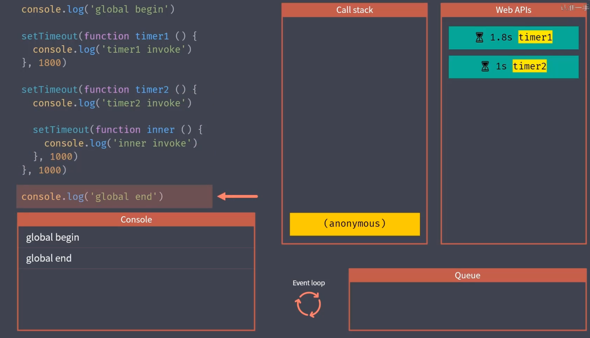

主要内容：同步模式和异步模式的调用差异（reject、catch、unhandleRejection）

# 同步模式
同步模式不是指同时执行，而是排队执行任务

# 异步模式
异步模式如下图：


结果如下：
```js
global begin
global end

timer2 invoke
timer1 invoke
inner invoke
```

# 回调函数
回调函数是所有异步编程方案的根基

# promise概述
直接使用传统回调方式去完成复杂的异步流程，会产生回调地狱的问题，为解决这一问题，commonjs社区提出了promise的规范，promise在es2015中别标准化，成为语言规范

# promise的基本使用
```js
const promise = new Promise(function(resolve, reject){
	resolve(100)
})

promise.then(function(value){
	console.log('resolved', value)
}, function(error){
	console.log('rejected', error)
})

console.log('end')
```
# promise方法的ajax
```js
function ajax(url){
	return new Promise(function(resolve, reject){
  	var xhr = new XMLHttpRequest()
    xhr.open('GET', url)
    xhr.responseType = 'json'
    xhr.onload = function(){
    	if(this.status === 200){
      	resolve(this.response)
      }else{
      	reject(new Error(this.statusText))
      }
    }
    xhr.send()
  })
}
ajax('/api/user.json').then(function(res){
	console.log(res)
}, function(error){
	console.log(error)
})
```
# promise常见误区
promise本质上也是使用回调函数定义的异步任务结束后所需要执行的任务
```js
function ajax(url){
	return new Promise(function(resolve, reject){
  	var xhr = new XMLHttpRequest()
    xhr.open('GET', url)
    xhr.responseType = 'json'
    xhr.onload = function(){
    	if(this.status === 200){
      	resolve(this.response)
      }else{
      	reject(new Error(this.statusText))
      }
    }
    xhr.send()
  })
}
// 错误的方法————仍然陷入了回调地狱的问题
ajax('/api/user.json').then(function(urls){
	ajax(urls.users).then(function(users){
  	ajax(urls.users).then(function(users){
    	...
    })
  })
})
// 正确的用法————借助于promise then方法链式调用的特点尽可能保证异步任务扁平化
ajax('/api/user.json')
	.then(function(value){
  	return ajax('/api/user.json')
  })   // =>promise
  .then(function(value){
  	return ajax('/api/user.json')
  })   // =>promise
  .then(function(value){
  	return 'hh'
  })   // =>promise
  .then(function(value){
  	console.log(value)
  })   
```

# promise链式调用
- promise对象的then方法会返回一个全新的promise对象
- 后面的then方法就是在为上一个then返回的promise注册回调
- 前面then方法中回调函数的返回值会作为后面then方法回调的参数
- 如果回调中返回的是promise，那后面then方法的回调会等待它的结果

# promise的异常处理以及差异——catch、reject、unhandledrejection
```js
// 1、reject

ajax('/api/user.json')
	.then(function onFulfilled(value){
  	console.log('onFulfilled', value)
  }, function onRejected(error){
  	console.log('onRejected', error)
  })
  
// 2、catch
 ajax('/api/user.json')
	.then(function onFulfilled(value){
  	console.log('onFulfilled', value)
  })   // 返回了一个新的promise，
  .catch(function onFulfilled(value){
  	//.catch方法里也捕获了新promise对象的异常，之所以能够捕获到第一个promise的异常，是因为异常往后传递了
  	console.log('onFulfilled', value)
  })
  
// 实际上，catch方法等同于下面的方法：
  ajax('/api/user.json')
	.then(function onFulfilled(value){
  	console.log('onFulfilled', value)
  })
  .then(undefined, function onFulfilled(value){
  	console.log('onFulfilled', value)
  })
```
之前已经知道promise对象的then方法会返回一个全新的promise对象，也就是说，.catch方法里实际上也捕获了第二个promise对象的异常。而通过reject方法，不会捕获到这个新promise对象的异常
```js
// 1、reject
ajax('/api/user.json')
	.then(function onFulfilled(value){
  	console.log('onFulfilled', value)
    
    // 这里调用了一个不存在的地址
    return ajax('/error-url')
  }, function onRejected(error){
  	console.log('onRejected', error)
    // 异常没有捕获到
  })
  
// 2、catch
  ajax('/api/user.json')
	.then(function onFulfilled(value){
  	console.log('onFulfilled', value)
    // 这里调用了一个不存在的地址
    return ajax('/error-url')
  })  
  .catch(function onFulfilled(value){
  	console.log('onFulfilled', value)
    // 异常捕获到了
  })
```
另外，还可以使用unhandledrejection方法去处理代码中没有被手动捕获的promise异常。但是这种方法不建议使用，应该在代码中明确捕获每一个可能的异常。在浏览器中一般是将这个事件绑定在windows对象上。而在node中一般是绑定在process上。

```js
// 1、浏览器
window.addEventListener('unhandledRejection', event => {
	const { reason, promise } = event
  
  console.log(reason, promise)
  // reason => promise失败原因，一般是一个错误对象
  // promise => 出现异常的promise对象
  event.preventDefault()
}, false)

// 2、node
process.on('unhandledRejection', (reason, promise) => {
	console.log(reason, promise)
  // reason => promise失败原因，一般是一个错误对象
  // promise => 出现异常的promise对象
})
```
# promise静态方法
promise.resolve() ——将一个值转化为一个promise对象

# promise并行执行——promise.all与promise.race
对于promise.all，需要任务都成功，这个并行的任务才算成功，而对于promise.race只需要成功一个。

# promise执行时序/宏任务 vs 微任务
目前绝大多数异步调用都是作为宏任务执行。
微任务：
- 1.Promise的then的回调函数
- 2.async 函数await下面的代码；
- 3.process.nextTick
- 4.mutationObserver
宏任务：
- 1.定时器（setInterval和setTimeout）
https://www.cnblogs.com/fangdongdemao/p/10262209.html

# Generator异步方案1——回顾Generator函数
相比于传统的回调方式，promise处理异步调用最大的优点就是可以用链式调用解决回调嵌套的问题，但是这样还是会有大量的回调函数，虽然它们是相互独立的，下面说一下Generator。
认识，ES2015提供的Generator——使异步调用再次回到扁平化
```js
// 定义生成器函数
function * foo(){
	console.log('start')
  
  // 使用yield关键字可以暂停函数
  yeild 'foo'  
  
  try{
  	...
  }catch(e){
  	console.log()
  }
}
//此时不会执行，只是会生成一个generator对象
const generator = foo()

// 执行到yield位置
const res = generator.next()
console.log(res)   // 输出一个对象，{value: 'foo', done: false}


// 再次执行时就会从yeild地方执行，如果传入了参数，这个参数会赋值给yeild 'foo'这行语句
generator.next('bar')  


// throw方法会对生成器内部抛出一个异常
generator.throw(new Error)
```

初步使用generator
```js
function * main () {
	const users = yield ajax('/api/users.json')
  console.log(users)
  
  const posts = yield ajax('/api/users.json')
  console.log(posts)
}

const g = main()

const res = g.next()

// 此处执行到yield位置，那么res的value值就是ajax('/api/users.json')，也就是一个promise对象
res.value.then(data => {
	const res2 = g.next(data)
  if(res2.done) return

  res2.value.then(data => {
  	g.next(data)
  })
})
```

递归执行generator函数：
```js
function * main () {
  try{
    const users = yield ajax('/api/users.json')
    console.log(users)

    const posts = yield ajax('/api/users.json')
    console.log(posts)
  } catch(e) {
  	console.log(e)
  }
}

function co(generator) {
	const g = generator()
  function handleResult (result){
    if(result.done) return   // 生成器函数结束
    result.value.then(data => {
      handleResult(g.next(data))
    }, error => {
      g.throw(error)
    })
  }
  handleResult(g.next())
}
co(main)

```

上述代码中的co函数功能有第三方库：https://github.com/tj/co

# Generator异步方案2（常用）——async/await语法糖
async function main () {
  try{
    const users = await ajax('/api/users.json')
    console.log(users)

    const posts = await ajax('/api/users.json')
    console.log(posts)
  } catch(e) {
  	console.log(e)
  }
}

const promise = main()
promise.then(()=>{
	console.log('all compl')
})

# async