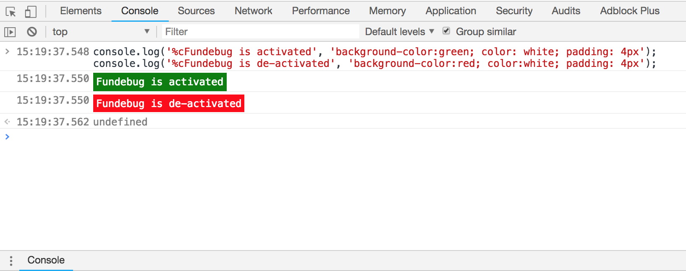

在面试中经常会被问到：
- 如何监测js错误？
- 如何保证产品质量
两者归根结底都是问错误监控。

# 前端错误的分类：
- 1.即时运行错误：代码错误
- 2.资源加载错误
- 3.promise里的错误

# 即时运行错误的捕获方式：
- try catch
- window.onerror（注意：window.onerror只能捕获即时运行错误，不能捕获到资源加载错误）

# 资源加载错误
- object.onerror（注意object.onerror这种资源加载错误不会冒泡到window，因此window.onerror是无法捕捉到资源加载错误的。）
- performance.getEntries()：performance.getEntries()可以获得该页面所有资源的加载过程各阶段的时刻及其他信息。
- window.onerror事件捕获（注意不是在冒泡阶段）

其中performance.getEntries()方法是：
- step1:控制台输入performance.getEntries().forEach(item=>{console.log(item.name)})，获取到该页面已经加载出来的资源
- step2:控制台输入document.getElementsByTagName('img')，获取到当前页面所有的img标签，与上一步的数据相减

# promise里的错误
promise里的错误有三种方式：promise.catch、reject、unhandledrejection。

nhandledrejection用来处理代码中没有被手动捕获的promise异常（这个错误不会被windows.onerror监控到）。在浏览器中一般是将这个事件绑定在windows对象上。而在node中一般是绑定在process上。

```js
<!DOCTYPE html>
<html lang="en">
<head>
    <meta charset="UTF-8">
    <title>错误监控</title>
    <script type="text/javascript">
        window.addEventListener("error", function(e){
            console.log('捕获',e)
        }, true)  // 这里改成false就捕获不到错误了，false为默认值，表示在冒泡阶段执行
    </script>
</head>
<body>
    <script src="//baidu.com/test.js" charset="utf-8"></script>
</body>
</html>
```

# 延伸：跨域的js运行错误可以捕获吗，错误提示是什么，应该怎么处理？
可以捕获到错误，但是拿不到具体信息。

解决方法：
- step1:在script标签增加crossorigin属性
- step2:设置js资源响应头Access-Control-Allow-Origin:*


# 上报错误的基本原理
- 1.采用Ajax通信的方式上报（这种一般都不会用）
- 2.利用Image对象上报（常用）

```js
<script>
    (new Image()).src='http://baidu.com/test/';
</script>

```


# 调试技巧
[10个用Console来Debug的高级技巧](https://blog.fundebug.com/2018/03/19/10-tips-for-debugging-with-console/)   
[14招搞定JavaScript调试](https://blog.fundebug.com/2017/11/08/14-javascript-debugging-tips/)  
[20个Chrome DevTools调试技巧](https://blog.fundebug.com/2018/08/22/art-of-debugging-with-chrome-devtools/)  
- 1.console.log与debug
- 2.console.memory
如果你发现性能问题很难分析，可能还要考虑是否有内存泄露，你可以使用console.memory（注意 memory 是 console 的属性，不是函数），来查看当前的堆的使用情况。


- 3.console.time() && console.timeEnd()
如果你想分析函数的性能，可以使用console.time()来计时，console.timeEnd()来结束计时，控制台会打印出两次之间的时间差。
了解代码的执行时间是非常有用的，特别是调试耗时的 for 循环。你可以通过定义不同的名字来设置多个 timer。我们来演示一下如何操作：
    ```js
    console.time("Timer1");
    var items = [];
    for (var i = 0; i < 100000; i++) {
        items.push({ index: i });
    }
    console.timeEnd("Timer1");
    ```
    
    **比如分析哪种循环遍历方法最快?**

    for、forEach、for...of、for...in中，for 速度最快, 但可读性差；foreach 速度快, 可控制属性；for...of 比较慢, 但好用；for...in 比较慢, 最不好用
- 4.给 log 加点颜色
log 有时候变得非常多，包含你自己的、一些第三方扩展或者浏览器的 logs。除了使用过滤器(filter)以外，你还可以使用颜色来更好地区分。
    
- 5.why did you update：查看哪个props导致了组件的变化
- 6.source map
- 7.chrome DevTools 的API：返回在 DOM 元素上注册的所有的事件
    ```
    getEventListeners($('#wrap'))
    getEventListeners(document)
    ```
    比如某个事件未能注销，在页面上另一个元素上点击出现了bug，一时不知道是哪里出现了问题。
    
- 8.暂停UI在Hover状态下的展现结果：使用快捷键暂停脚本执行（F8 or command\）
- 9.移动端：第三方插件模拟console-eruda；针对第三方应用：内网穿透


