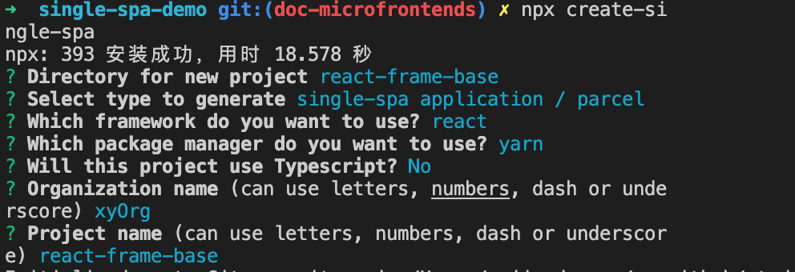
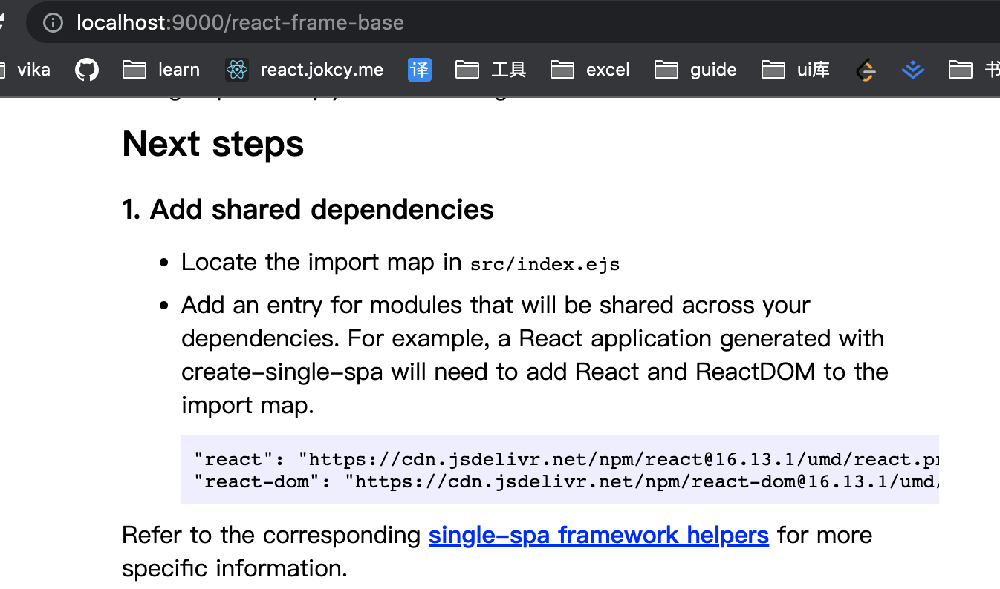
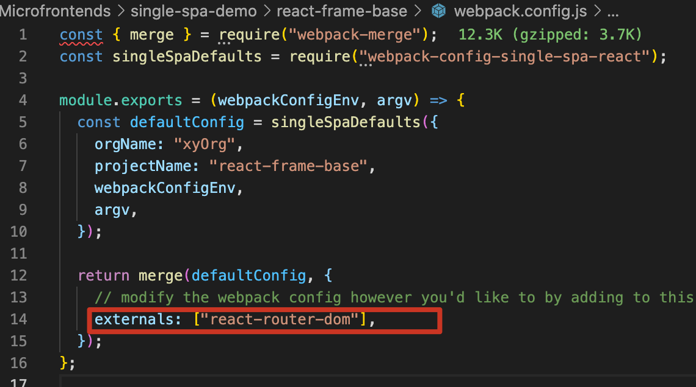

# demo 概述

使用 create-single-spa 脚手架工具创建容器应用， demo 见 workspace/container 文件夹

# 步骤

## step1 创建容器应用 `container`

- 1-1. 创建微前端应用目录：  
   `mkdir single-spa-demo && cd "$_"`
- 1-2. 创建微前端容器应用：`create-single-spa`

  1. 应用文件夹填写 container
  2. 应用选择 single-spa root config
  3. 组织名称填写 xyOrg  
     组织名称可以理解为团队名称，微前端架构允许多团队共同开发应用，组织名称可以标识应用由哪个团队开发。  
     应用名称的命名规则为@组织名称/应用名称，比如@xyOrg/no-frame-base
       
     

- 1-3. 启动应用：cd container && npm start
- 1-4. 访问应用：localhost:9000

## step2 创建不基于框架的微应用 `no-frame-base`

- 2-1. 创建应用目录：  
   `mkdir no-frame-base && cd "$_"`
- 2-2. 安装相关依赖并配置 webpack：
  ```js
  const singleSpaDefaults = require("webpack-config-single-spa");
  const { merge } = require("webpack-merge");
  module.exports = () => {
    const defaultConfig = singleSpaDefaults({
      orgName: "xyOrg",
      projectName: "no-frame-base",
    });
    return merge(defaultConfig, {
      devServer: {
        port: 9001,
      },
    });
  };
  ```
- 2-3. 新建应用入口文件 `no-frame-base/src/xyOrg-no-frame-base.js`

  > 导出微前端应用所需的生命周期函数，生命周期函数必须返回 Promise

  ```js
  let containerDom = null;
  export async function bootstrap() {
    console.log("应用正在启动");
  }
  export async function mount() {
    console.log("应用正在挂载");
    containerDom = document.createElement("div");
    containerDom.id = "containerDom";
    containerDom.innerHTML = "Hello, this is NO FRAME BASE";
    document.body.appendChild(containerDom);
  }
  export async function unmount() {
    console.log("应用正在卸载");
    document.body.removeChild(containerDom);
  }
  ```

- 2-4. 在容器应用中注册此微前端应用

  1.`container/src/xyOrg-root-config.js文件`

  ```js
  registerApplication({
    name: "@xyOrg/no-frame-base",
    activeWhen: "/no-frame-base",
    app: () => System.import("@xyOrg/no-frame-base"),
  });
  ```

  2.在模板文件`container/src/index.ejs`中指定模块添加访问地址

  ```js
  <script type="systemjs-importmap">
        {
          "imports": {
            "@xyOrg/no-frame-base": "//localhost:9001/xyOrg-no-frame-base.js"
          }
        }
      </script>
  ```

- 2-5. 在`no-frame-base`项目设置启动命令
  ```js
  "scripts": {"start": "webpack serve"},
  ```
- 2-6. 启动
  先启动`no-frame-base`子应用，再启动`container`应用，此时访问`http://localhost:9000/no-frame-base`可以在容器应用页面看到添加进的子应用内容。

## step3 创建基于 React 的微应用 `react-frame-base`

- 3-1. 使用`create-single-spa`创建微前端应用：`react-frame-base`
  
- 3-2. 修改应用端口 && 启动应用
  ```js
  // react-frame-base/package.json
  "scripts":{
    "start":"webpack serve --port 9002"
  }
  ```
- 3-3. 将此子应用的入口文件注册到容器应用中 1.`container/src/xyOrg-root-config.js文件`

  ```js
  registerApplication({
    name: "@xyOrg/react-frame-base",
    activeWhen: "/react-frame-base",
    app: () => System.import("@xyOrg/react-frame-base"),
  });
  ```

  2.在模板文件`container/src/index.ejs`中指定微前端应用模块的引用地址

  ```js
  <script type="systemjs-importmap">
        {
          "imports": {
            "@xyOrg/react-frame-base": "//localhost:9002/xyOrg-react-frame-base.js"
          }
        }
      </script>
  ```

- 3-4 指定公共库的访问地址

  > 默认情况下，应用中的`react`和`react-dom`没有被 webpack 打包，single-spa 认为它是公共库，不应该单独打包。
  > 

  此时，先启动`react-frame-base`子应用，再启动`container`应用，此时访问`http://localhost:9000/react-frame-base`可以在容器应用页面看到添加进的子应用内容。

- 3-5 基于 React 框架的微前端应用配置路由 1.引入`react-router-dom`
  首先在容器应用的`container/src/index.ejs`文件里引入`react-router-dom`，并在子应用的`react-frame-base`文件夹里设置：
    
   2.更改 root.component.js 文件

  ```js
  import React from "react";
  import {
    BrowserRouter,
    Switch,
    Route,
    Redirect,
    Link,
  } from "react-router-dom";
  import Home from "./Home";
  import About from "./About";
  // export default function Root(props) {
  //   return <section>{props.name} is mounted!</section>;
  // }
  export default function Root(props) {
    return (
      <BrowserRouter basename="/react-frame-base">
        {" "}
        <div>{props.name}</div> <div>
          {" "}
          <Link to="/home">Home</Link> <Link to="/about">About</Link>{" "}
        </div> <Switch>
          {" "}
          <Route path="/home">
            {" "}
            <Home />{" "}
          </Route> <Route path="/about">
            {" "}
            <About />{" "}
          </Route> <Route path="/">
            {" "}
            <Redirect to="/home" />{" "}
          </Route>{" "}
        </Switch>{" "}
      </BrowserRouter>
    );
  }
  ```
