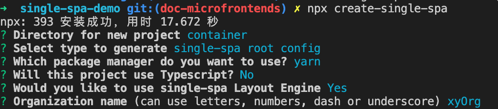
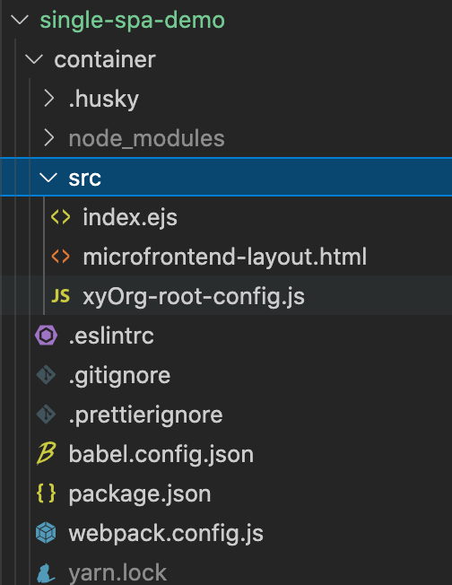

# demo 概述

使用 create-single-spa 脚手架工具创建容器应用， demo 见 workspace/container 文件夹

# 步骤

## step1 创建容器应用 `container`

- 1-1. 创建微前端应用目录：  
   `mkdir single-spa-demo && cd "$_"`
- 1-2. 创建微前端容器应用：`create-single-spa`

  1. 应用文件夹填写 container
  2. 应用选择 single-spa root config
  3. 组织名称填写 xyOrg  
     组织名称可以理解为团队名称，微前端架构允许多团队共同开发应用，组织名称可以标识应用由哪个团队开发。  
     应用名称的命名规则为@组织名称/应用名称，比如@xyOrg/no-frame-base
       
     

- 1-3. 启动应用：cd container && npm start
- 1-4. 访问应用：localhost:9000

## step2 创建不基于框架的微应用 `no-frame-base`

- 2-1. 创建应用目录：  
   `mkdir no-frame-base && cd "$_"`
- 2-2. 安装相关依赖并配置 webpack：
  ```js
  const singleSpaDefaults = require("webpack-config-single-spa");
  const { merge } = require("webpack-merge");
  module.exports = () => {
    const defaultConfig = singleSpaDefaults({
      orgName: "xyOrg",
      projectName: "no-frame-base",
    });
    return merge(defaultConfig, {
      devServer: {
        port: 9001,
      },
    });
  };
  ```
- 2-3. 新建应用入口文件 `no-frame-base/src/xyOrg-no-frame-base.js`

  > 导出微前端应用所需的生命周期函数，生命周期函数必须返回 Promise

  ```js
  let containerDom = null;
  export async function bootstrap() {
    console.log("应用正在启动");
  }
  export async function mount() {
    console.log("应用正在挂载");
    containerDom = document.createElement("div");
    containerDom.id = "containerDom";
    containerDom.innerHTML = "Hello, this is NO FRAME BASE";
    document.body.appendChild(containerDom);
  }
  export async function unmount() {
    console.log("应用正在卸载");
    document.body.removeChild(containerDom);
  }
  ```

- 2-4. 在容器应用中注册此微前端应用

  1.`container/src/xyOrg-root-config.js文件`

  ```js
  registerApplication({
    name: "@xyOrg/no-frame-base",
    activeWhen: "/no-frame-base",
    app: () => System.import("@xyOrg/no-frame-base"),
  });
  ```

  2.在模板文件`container/src/index.ejs`中指定模块添加访问地址

```js
 <script type="systemjs-importmap">
      {
        "imports": {
          "@xyOrg/no-frame-base": "//localhost:9001/xyOrg-no-frame-base.js"
        }
      }
    </script>
```

- 2-5. 在`no-frame-base`项目设置启动命令
  ```js
  "scripts": {"start": "webpack serve"},
  ```
- 2-6. 启动
  先启动`no-frame-base`子应用，再启动`container`应用，此时访问`http://localhost:9000/no-frame-base`可以在容器应用页面看到添加进的子应用内容。
