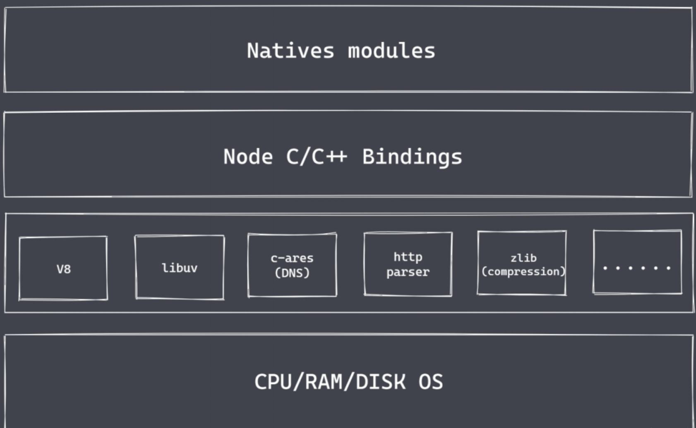
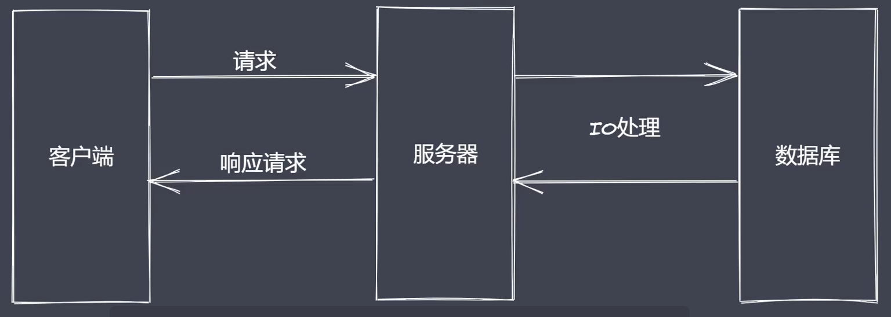
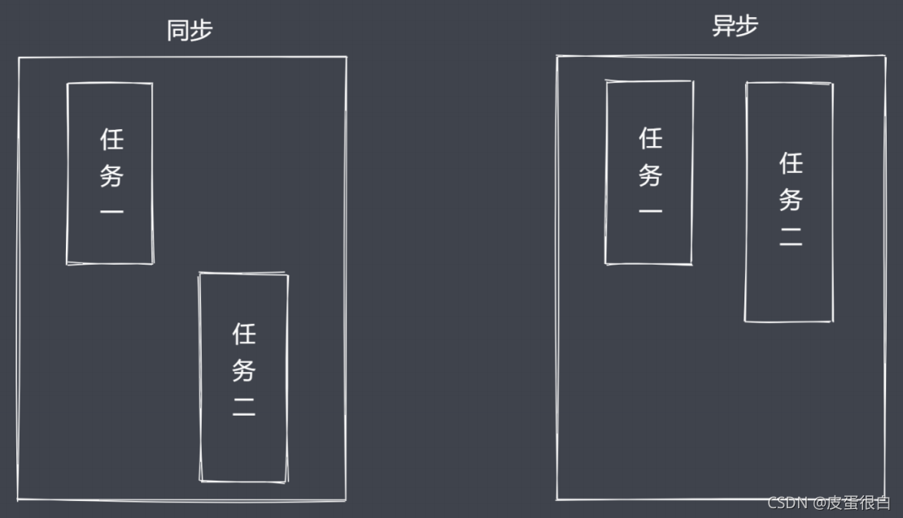

# Nodejs 可以做什么？
前端为何要学习Node.js?
- 脱离浏览器运行JS
- NodeJs Stream（前端工程化基础）
- 服务端API 
- 作为中间层

公司CTO往往是由服务端工程师担任，因为：
- 需要设计整个公司技术架构
- 需要从全局考虑问题
- 需要掌握公司最重要的资产：数据（谁掌握数据，谁才有话语权）

Nodejs 可以做什么？
- 轻量级、高性能的 Web 服务
- 前后端 JavaScript 同构开发
- 便捷高效的前端工程化

# Nodejs 架构

Nodejs 核心分为三个部分：
- Natives modules：内置核心模块。暴露了响应的 JS 功能接口，供开发者进行调用
- Builtin modules “胶水层”：帮助找到对应功能的 C/C++ 具体实现。这个过程需要 V8 引擎配合实现
- 具体的功能模块，如 V8、libuv 等。V8 引擎除了构建 Nodejs 运行环境，还负责 JS 代码的最终执行，libuv 处理具体的 Node 环境下代码执行环境的许多细节
## 1.Natives modules
- 当前层内容都是由 JS 实现
- 提供了应用程序可以直接调用的库，也就是常说的内置核心模块，例如 fs、path、http 等
## 2.Builtin modules “胶水层”
JS 语言无法直接操作底层硬件设置，因此 Nodejs 核心模块与硬件设备想要通信，还需要有一个桥梁。Builtin modules 就是这个桥梁，通过这个桥梁，就可以让 Nodejs 的核心模块获取具体的服务支持，从而完成更底层的操作，例如文件的读写行为。在这一层中，除了内置的模块之外，还有很多第三方的模块充当桥梁。在这一层的内容主要是由 C/C++ 代码编写而成的，例如 socket、zlib、http。这些模块并不是真正代码级别上 JS 函数的功能实现，它们更像是一个功能调用的对照表。它们的具体实现被放置在另一个地方，Builtin modules 的作用就是帮助调用这些功能的具体实现。
## 3.具体的功能模块
### 3-1.V8
V8 引擎的主要功能还有两个：第一个功能类似于虚拟机，主要负责完成 JS 代码的执行，这里被执行的代码一般被分为三种情况：
- 用户自己编写的 JS 代码
- 内置的 JS 代码
- 第三方的 JS 代码
第二个功能就是提供桥梁接口，接口就是通过 JS 调用那些由 C/C++ 具体实现的功能，这中间的转换和调用的具体实现需要由 V8 引擎完成，也就是负责 JS 与 C/C++ 之间的转换。

简单的说就是，V8 为 Nodejs 提供了初始化操作，它创建了执行上下文环境和作用域。

### 3-2.Libuv
有了 V8 之后，Nodejs 就具备了执行和调用功能的大前提，而最终 Nodejs 代码在执行的过程中还存在着很多的细节，例如事件循环、事件队列、异步IO等要处理的问题。

这些就需要 Libuv 库参与和进行实现了。

### 3-3.第三方模块
有了 V8 和 Libuv，Nodejs 就已经非常强大了，余下的就是一些具体的第三方功能模块，用于完成相对应的功能，如 zlib、http、c-ares 等

**总结**
如此之后，就可以使用 JS 在 Node 平台下，完成 fs、http、tcp 等在浏览器环境下使用 JS 无法实现的功能。所谓 Node，只是一个平台或运行时，它扩展了 JS 的功能。

# Nodejs 的崛起-为什么是nodejs？
Nodejs在诞生之初是为了实现高性能的Web服务器，后来经历了长时期的发展，Nodejs慢慢演化成一门服务端“语言”（比喻成“语言”，实际上是个平台），这使得Javascript在浏览器之外的平台也可以运行。在众多方案中，为何Nodejs是最出彩的？

下面以BS架构为基础来说明一下用户发送请求到获取数据（探讨Nodejs作为服务器使用时涉及到的内容）的整个过程：

首先用户通过客户端向服务端发送请求来获取目标数据，而服务端在接收到请求后返回数据即可。

从图上可以得知，在忽略到网络带宽、硬件性能等客观条件之后，真正影响用户获取数据速度的是IO的时间消耗。

IO是计算机操作过程中最缓慢的环节，访问RAM级别设备的IO时间消耗是纳秒级别的，而在磁盘和网络中访问数据的IO时间消耗是毫秒级别的，也就是说，数据的读写操作终归是有时间消耗的，假设当前是一个串行的模式，那么对于一个服务器来说，如果当前正在处理请求当中，包含了一个需要长时间等待的IO行为，那么后续任务就不能得到及时的响应，显示这是不友好的，我们当下在开发过程中使用到的一些服务器，大多具备并发事务的能力。

在并发的实现上，传统的做法或者说其它高级编程语言的实现方式采用的是**多线程（进程）**的方式。当前有几个请求从客户端发送到服务端，服务端就分配几个线程（进程）接收并处理这些请求，这样的服务对用户的体验是非常友好的，但问题也很明显。如果同一时间客户端发送了很多请求，服务端不可能无限增加线程的数量，这样额外的请求就要等待服务器处理完前面的请求，才会将线程分配给它们，这就发生请求无响应的情况。

其实大部分的时间消耗都来自于线程等待处理请求结果的过程，在这个过程中，线程是处于空闲状态的。基于这种情况，就有了**Reactor模式**，也被叫做**应答者模式**。

它的核心思想就是只保留一个主线程，主线程只负责调度任务，如接收请求后交给服务器其它线程，服务器只管去处理请求，当服务器处理完成后，再分配给这个主线程。

在请求处理过程中，主线程还可以继续接收其它请求。

这样就相当于使用单线程完成了多线程的工作，并且它是非阻塞的。

这样也避免了在多个线程之间在进行上下文切换的时候需要去考虑的状态保存、时间消耗等问题。

Nodejs 正是基于 Reactor 模式，再结合 JS 语言本身所具备的一些单线程、事件驱动的架构和异步编程这些特性，使单线程可以远离阻塞，从而通过异步非阻塞的 IO 更好的使用 CPU 的资源，并且实现高并发请求的处理。

这也是为什么历史上尝试将 JS 移植到其它平台的实现方案有很多，而 Nodejs 最出彩的原因。

总结：
- Reactor模式，单线程完成多线程工作
- Reactor模式下实现异步IO、事件驱动
- Nodejs更适用于IO密集型高并发请求，而不是大量且复杂的业务逻辑处理，如 CPU 密集型（请求无需太多等待）高并发请求。

# Nodejs异步IO

## 异步的好处
- 同步模式下处理多个任务，会依次处理，总消耗时间大于所有任务处理的时间和。
- 异步模式下处理多个任务，会分配给多个线程同时处理，总消耗时间仅大于耗时最长的任务的时间。  

异步模式下程序执行效率更高。异步 IO 并不是 Nodejs 原创，但是它在 Nodejs 中拥有广泛的应用。

对于操作系统来说，IO 分为阻塞 IO 和 非阻塞 IO，区别就是是否可以立即获取调用后返回的结果。