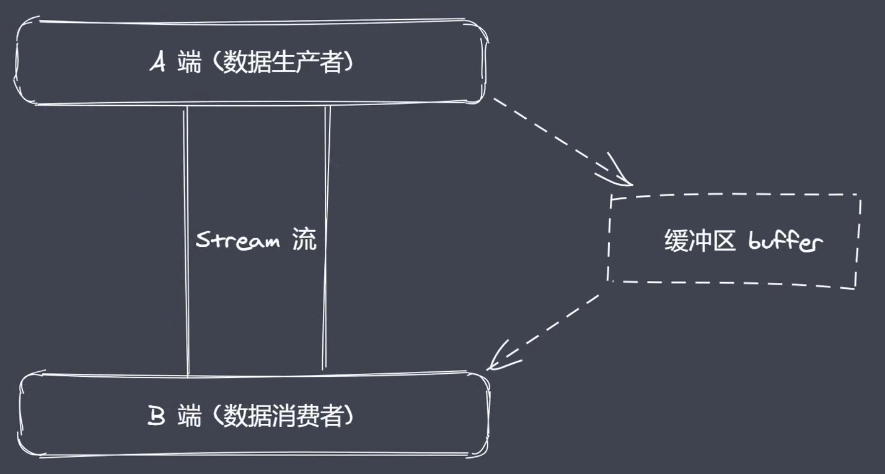

# 内置模块之path
内置模块，require之后可以直接使用
path：用于处理文件/目录的路径，我们需要掌握path模块中常见的API

## path模块常见API
- basename()获取路径中基础名称
- dirname()获取路径中目录名称
- extname()获取路径中扩展名称
- isAbsolute()获取路径是否为绝对路径
- join()拼接多个路径片段
- resolve()返回绝对路径
- parse()解析路径
- format()序列化路径
- normalize()规范化路径


## 1.获取路径中的基础名称 - basename
```js
const path = require('path')
console.log(__filename)  // /Users/aojiaodemeng/my-github/study-notes/Nodejs/demo.js
/**
 * 01 返回的就是接收路径当中的最后一部分 
 * 02 第二个参数表示扩展名，如果说没有设置则返回完整的文件名称带后缀
 * 03 第二个参数做为后缀时，如果没有在当前路径中被匹配到，那么就会忽略
 * 04 处理目录路径的时候如果说，结尾处有路径分割符，则也会被忽略掉
 */
console.log(path.basename(__filename))  // demo.js
console.log(path.basename(__filename, '.js')) // demo
console.log(path.basename(__filename, '.css')) // demo.js
console.log(path.basename('/a/b/c')) // c
console.log(path.basename('/a/b/c/'))  // c
```
## 2.获取路径目录名 (路径) - dirname
```js
const path = require('path')
console.log(__filename)  // /Users/aojiaodemeng/my-github/study-notes/Nodejs/demo.js
/**
 * 01 返回路径中最后一个部分的上一层目录所在路径
 */
console.log(path.dirname(__filename))  // /Users/aojiaodemeng/my-github/study-notes/Nodejs
console.log(path.dirname('/a/b/c'))  // /a/b
console.log(path.dirname('/a/b/c/'))   // /a/b
```
## 3.获取路径的扩展名 - extname
```js
const path = require('path')
console.log(__filename)  // /Users/aojiaodemeng/my-github/study-notes/Nodejs/demo.js
/**
 * 01 返回 path路径中相应文件的后缀名
 * 02 如果 path 路径当中存在多个点，它匹配的是最后一个点，到结尾的内容
 */
console.log(path.extname(__filename))  // .js
console.log(path.extname('/a/b'))  // 什么都没有输出
console.log(path.extname('/a/b/index.html.js.css'))  // .css
console.log(path.extname('/a/b/index.html.js.'))    // .
```
## 4.解析路径 - parse
```js
/**
 * 01 接收一个路径，返回一个对象，包含不同的信息
 * 02 root dir base ext name
 */
const obj1 = path.parse('/a/b/c/index.html')
console.log(obj1)   // {root:'/',dir:'/a/b/c',base:'index.html',ext:'.html',name:'index'}
const obj2 = path.parse('/a/b/c/')
console.log(obj2)   // { root: '/', dir: '/a/b', base: 'c', ext: '', name: 'c' }
const obj3 = path.parse('./a/b/c/')
console.log(obj3)   // { root: '', dir: './a/b', base: 'c', ext: '', name: 'c' }
```
## 5.序列化路径 - format，可以理解为是解析路径的反操作
```js
const obj = path.parse('./a/b/c/')
console.log(path.format(obj))  // ./a/b/c
```
## 6.判断当前路径是否为绝对 - isAbsolute
```js
console.log(path.isAbsolute('foo'))  // false
console.log(path.isAbsolute('/foo'))  // true
console.log(path.isAbsolute('///foo'))   // true
console.log(path.isAbsolute(''))  // false
console.log(path.isAbsolute('.'))  // false
console.log(path.isAbsolute('../bar'))  // false
```
## 7.拼接路径 - join
```js
console.log(path.join('a/b', 'c', 'index.html'))   // a/b/c/index.html
console.log(path.join('/a/b', 'c', 'index.html'))  //   /a/b/c/index.html
console.log(path.join('/a/b', 'c', '../', 'index.html')) //    /a/b/index.html
console.log(path.join('/a/b', 'c', './', 'index.html')) //    /a/b/c/index.html
console.log(path.join('/a/b', 'c', '', 'index.html'))   //    /a/b/c/index.html
console.log(path.join(''))  //     .
```
## 8.规范化路径 - normalize
```js
console.log(path.normalize(''))      //    .
console.log(path.normalize('a/b/c/d'))      //    a/b/c/d
console.log(path.normalize('a///b/c../d'))    //    a/b/c../d
console.log(path.normalize('a//\\/b/c\\/d'))  //     a/\/b/c\/d
console.log(path.normalize('a//\b/c\\/d'))   //   a/c\/d
```
## 9.绝对路径 - resolve
```js
// resolve没有参数，就自动返回当前工作目录的绝对路径
console.log(path.resolve())  //   /Users/aojiaodemeng/my-github/study-notes/Nodejs
/**
 * resolve([from], to)，把to拼接成绝对路径
 */
console.log(path.resolve('/a', '../b'))     //    /b
console.log(path.resolve('index.html'))    //   /Users/aojiaodemeng/my-github/study-notes/Nodejs/index.html
```


# 全局变量之Buffer
[Node.js Buffer(缓冲区)-菜鸟教程](https://www.runoob.com/nodejs/nodejs-buffer.html)   
[Buffer | Node.js API 文档](http://nodejs.cn/api/buffer.html)


Buffer的存在让开发者在nodejs平台下直接使用js语言完成二进制的操作。
主要内容：Buffer是什么？在哪？做什么？主要概念：二进制数据、流操作、Buffer

我们知道，Js语言起初服务于浏览器平台，而在Nodejs平台下Js可实现IO操作。IO行为操作的是二进制数据，Stream流操作并非Nodejs独创，流操作配合管道实现数据分段传输，数据的端到端传输会有生产者和消费者。Nodejs中Buffer是一片内存空间

## Buffer总结
- 无须require的一个全局变量
- 实现Nodejs平台下的二进制数据操作
- 不占据V8堆内存大小的内存空间
- 内存的使用由Node来控制，由V8的GC回收
- 一般配合Stream流使用，充当数据缓冲区



## 创建Buffer
Buffer是Nodejs的内置类，如果要调用其api，需要先创建实例。

创建Buffer实例：
- Buffer.alloc: 创建指定字节大小的 Buffer
- Buffer.allocUnsafe: 创建指定字节大小的 Buffer (不安全)
- Buffer.from：接收数据 创建 Buffer
- 不推荐使用 new 直接创建

