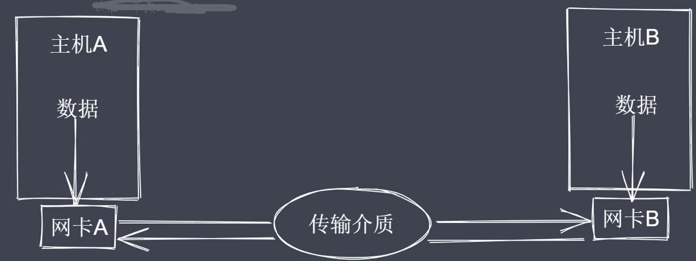
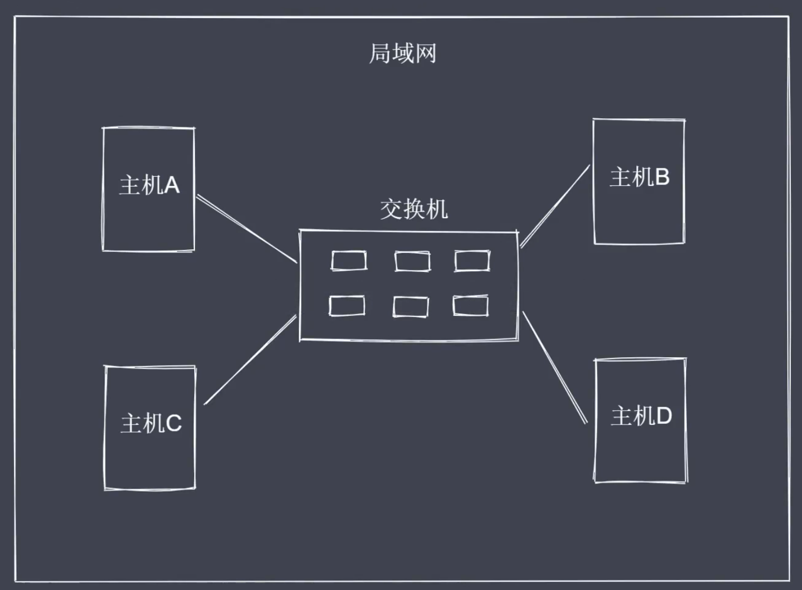
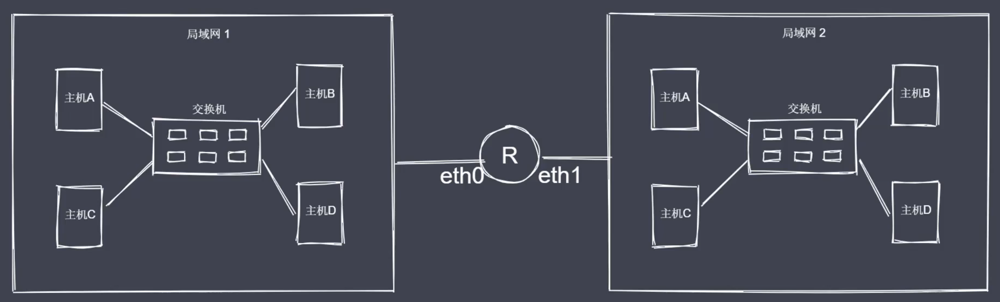
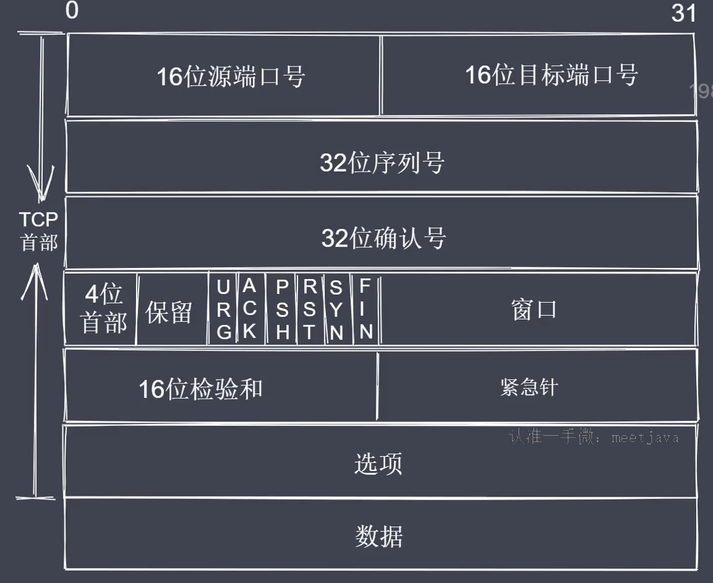
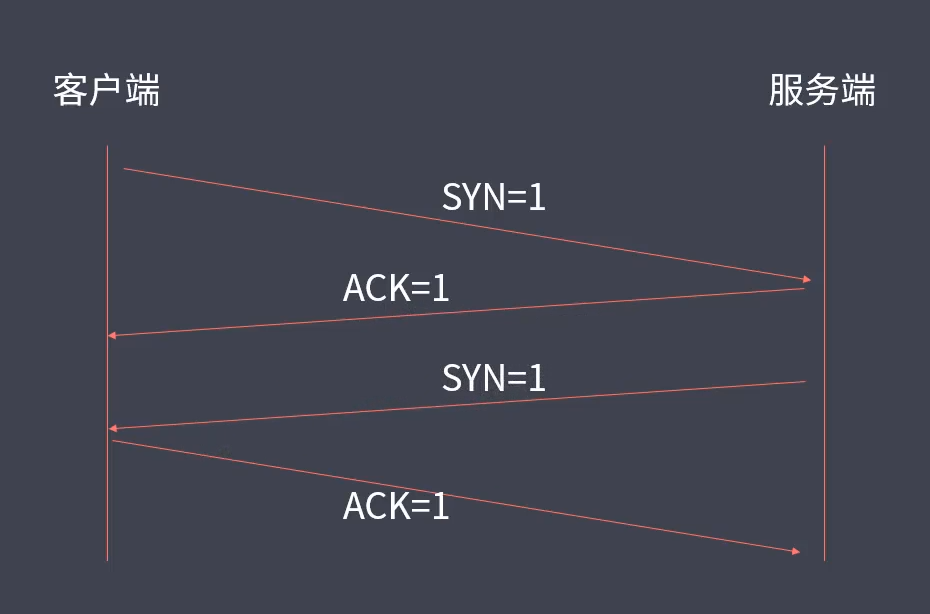
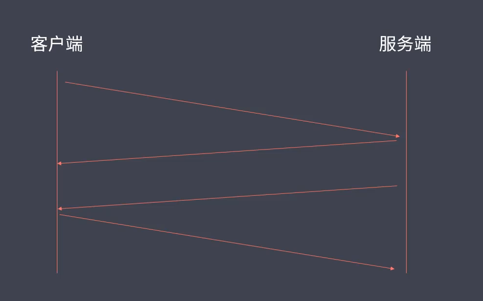
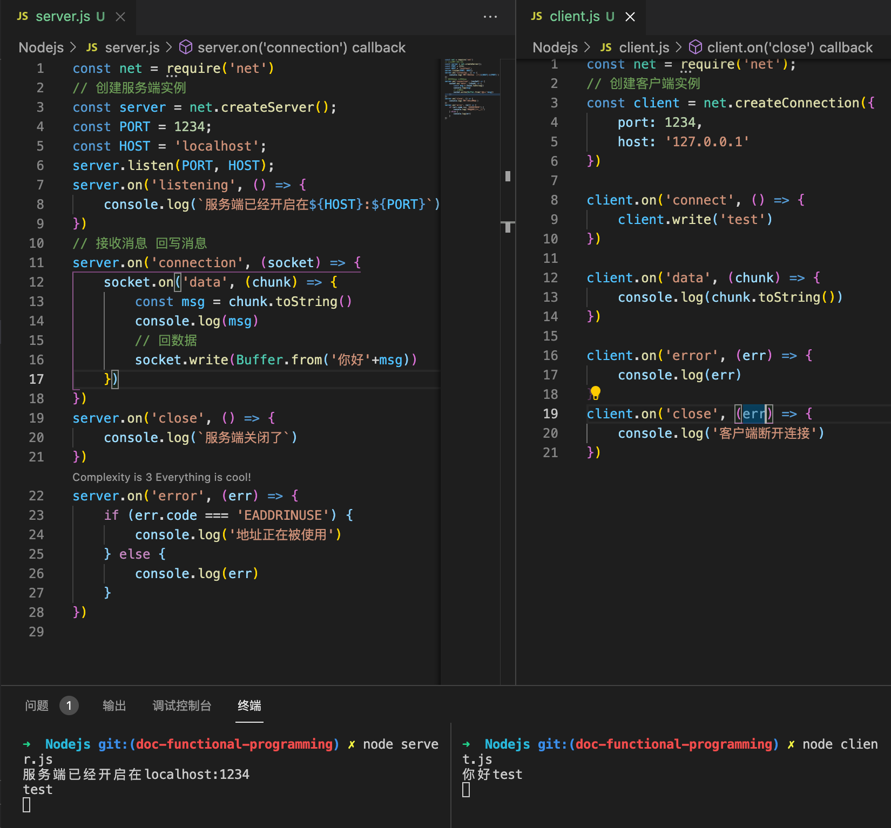
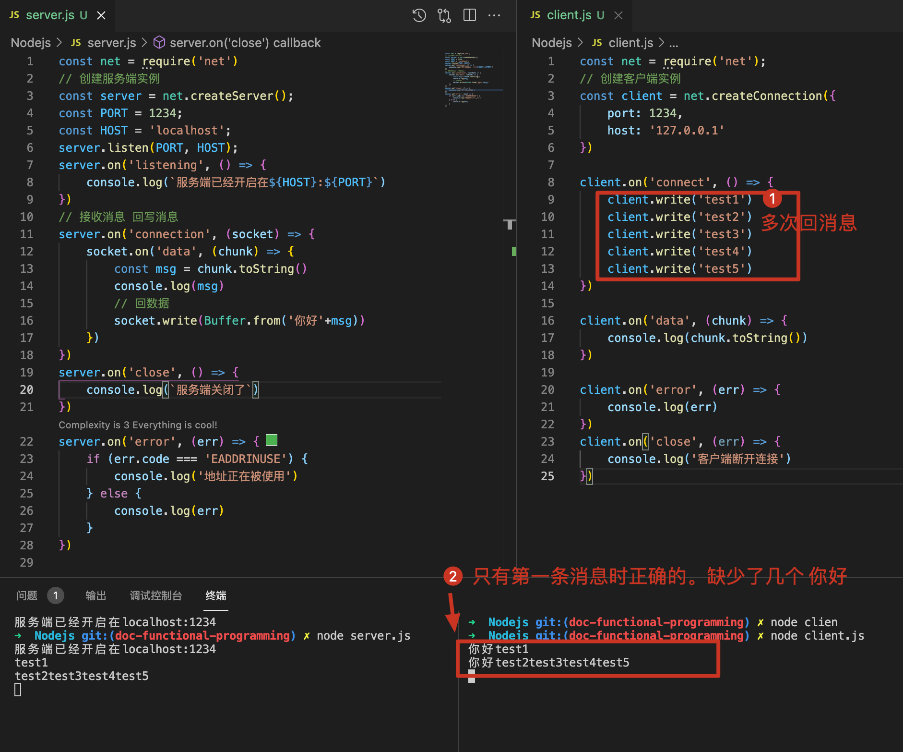
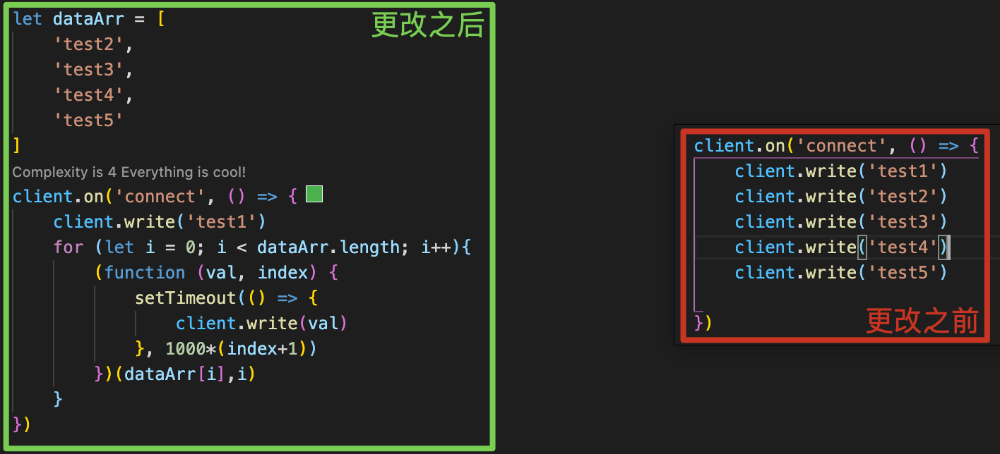
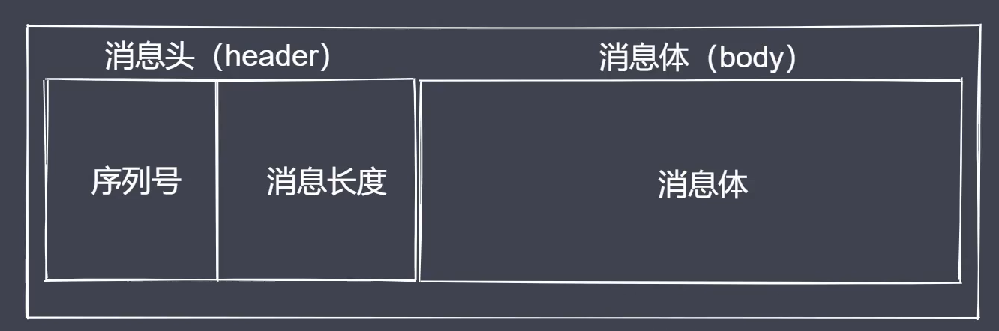

# 通信基本原理
两台主机之间，实现通信的必要条件：
- 主机之间需要有传输介质，比如网线、wifi、光纤（建立连接）
- 主机上必须有网卡设备（连接之后考虑数据采用什么形式进行传输，网卡可以完成信号的解调制）
- 主机之间需要协商网络速率

# 网络通讯方式
常见通讯方式：
- 交换机通讯
- 路由器通讯

如何建立多台主机互联？  
通过交换机：

交换机的接口数量有限，局域网存在大量主机会造成广播风暴
明确目标主机IP地址

# 网络层次模型
OSI七层模型
- 应用层：用户与网络的接口
- 表示层：数据加密、转换、压缩
- 会话层：控制网络连接建立与终止
- 传输层：控制数据传输可靠性
- 网络层：确定目标网络
- 数据链路层：确定目标主机
- 物理层：各种物理设备和标准

数据从A到B主机，先封装再接封。

# 数据封装与解封装
依据网络层次模型来说明所传输数据的封装与解封装过程：
首先，采用的是TCP/IP五层划分模式。
- 1.应用层-在应用层产生所要传输的数据，用data来表示（data）
- 2.传输层-常见的是TCP、UDP协议，两者都是基于端口的协议，端口的作用就是在主机上进程的唯一标识，所以这一层会被包裹上目标端口+源端口（目标端口+源端口+data）
- 3.网络层-一般来说主机都是处于不同的网络里，所以需要ip协议来确定目标主机所在的网络，因此数据在这一层会被包裹上目标主机的ip地址与当前主机的源IP（目标IP+源IP+目标端口+源端口+data）（此时能够确定某一个网络，并不能在这个网络里哪一台机器是我们想要的）
- 4.数据链路层-通过mac地址完成寻址操作，所以数据会被包裹上目标主机与当前主机的mac地址（目标mac+源mac+目标IP+源IP+目标端口+源端口+data）（此时一条数据就被完整封装了）
- 5.物理层-网线无法识别二进制，所以经过网卡的调制之后就会变成高低电压，此时封装的数据就会转换成二进制形式，再经过路由器的网络分配和传输介质的运输，最终就会到达目标主机的网卡
- 6.物理层-进行数据解调，将电压变为二进制，再向上传递至链路层。
- 7.数据链路层-分析目标mac地址是否是当前主机的mac地址，如果是就拆解数据并继续向上层传递
- 8.网络层-分析目标ip是否是自己的ip，如果是就拆解数据并继续向上层传递
- 9.传输层-分析目标端口是否是自己，如果是就拆解数据并继续向上层传递
- 10.数据层-此时主机B就拿到了主机A传过来的数据data了

# TCP三次握手与四次挥手
## TCP协议
- TCP属于传输层协议
- TCP是面向连接的协议（基于端口，面向连接）
- TCP用于处理实时通信（主机之间要想通信需要先建立双向数据通道）
- TCP的握手和挥手本质上都是四次（但是握手一般会被合并为三次）

以下是一个完整的TCP协议报文应该具有的信息：

其中，
- 端口的作用是为了标明自己和目标应用进程

常见控制字段：
- SYN=1表示请求建立连接
- FIN=1表示请求断开连接
- ACK=1表示数据信息确认

三次握手：

- step1:客户端向服务端发送一个建立连接的请求，用控制字段SYN=1来表示，服务端接收到这个请求之后会回送一个消息表示确认接收到了这个客户端请求（用ACK=1表示），任何一次完成的通信都是有来有回的，此时就相当于建立了一条由客户端向服务端发送数据的通道，注意只是客户端向服务端，所以服务端要想发送消息给客户端，还需要发送一个请求给客户端，表示服务端也想建立一个连接。
- step2:服务端也想要建立一个连接，此时也需要用SYN=1来表示，客户端接收到这个请求之后，也需要用ACK=1来回应。这里就建立了一个服务端向客户端之间的通信。以上两个步骤就有了客户端与服务端之间数据双向通信通道。（注意这里实际上本质是四位握手，不过在实践中一般服务端在第一次发送ACK=1时就会同时发送SYN=1，将四次握手合并成了三次）

四次挥手：

当客户端与服务端之间的数据传输结束之后，就会断开连接，让服务端可以去处理其他客户端的请求，首先客户端会发送一个断开连接的请求，服务端接收之后会回复一个消息确认，此时就相当于断开了客户端到服务端之间的通道。接着服务端接着会发送一个断开连接的请求给客户端，客户端接收之后也会回应一个确认消息。这样就断开了服务端到客户端之间的数据通道。这个过程就是四次挥手。（疑问，这里为何不可以合并为三次挥手？道理很简单，因为一个服务端会服务于多个客户端，我们不能保证某一个客户端将请求发送给服务端之后服务端就能立即将结果数据回给当前的客户端，即在某些情况下，客户端已经将请求数据信息传给了服务端，服务端还未将对应的回应数据传回给客户端，所以在断开连接的时候是分开处理的。这就是为什么挥手会有四次，而握手可以合并为三次的原因）

# 基于Net模块创建TCP通信
使用Nodejs内置模块来创建TCP客户端与服务端的实例，并完成两者之间的通信，这里使用了Net模块来实现底层通信接口。

通信过程描述；
- 创建服务端：接收和回写客户端数据
- 创建客户端：发送和接收服务端数据
- 数据传输：内置服务事件和方法读写数据

通信事件：
- listening事件：调用server.listen方法之后触发
- connection事件：新的连接建立时触发
- close事件：当server关闭时触发
- error事件：当错误出现的时候触发

通信事件&方法：
- data事件：当接收到数据时触发该事件
- write方法：在socket上发送数据，默认是UT8编码
- end操作：当socket的一端发送FIN包时触发，结束可读端

demo实践：
- 1.创建服务端实例，监听端口以开启服务，并监听具体的事件，如果想要提供服务，那么应该提供两个信息（host、port），客户端需要通过域名来找到主机，并确定当前应用进程在机器上占用的是哪一个端口。之后通过发布订阅模式来监听listening事件
- 2.客户端以及服务端分别创建了实例，都可以认为是双工流。如果想要获取到对方传过来的数据，就将其当作可读柳，使用toString方法获取，如果想要回消息，就当作可写流，调用write方法。

# TCP数据粘包及解决
TCP数据粘包问题的由来：数据通信包含数据发送端和接收端，发送端并不是实时的不停的将数据发送出去，而是会累积数据统一发送，同样，接收端也不是立马使用数据，而是缓冲数据之后再消费，这样可以减少IO操作带来的性能消耗，但是对于数据的使用会产生粘包的问题，并且数据是放在缓存中的，那么何时会发送？TCP拥塞机制决定发送时机。

粘包的现象：基于流的发送操作以及当前tcp的实现，导致出现了粘包。

- 解决方法1——增大发送数据的时间间隔：
缺点：降低了数据的传输效率

- 解决方法2——数据封包与拆包解决粘包问题
按照指定好的规则把数据打包，使用数据时再按制定规则进行拆包，这里是使用长度编码方式来约定通信双方的数据传递方式。
首先将分为消息头（header）和消息体（body），其中头部分为序列号和消息长度两个部分：

## 数据传输过程
- 进行数据编码，获取二进制数据包
- 按规则拆解数据，获取指定长度的数据

## Buffer数据读写
- writeInt16BE：将value从指定位置写入
- readInt16BE：从指定位置开始读取数据

