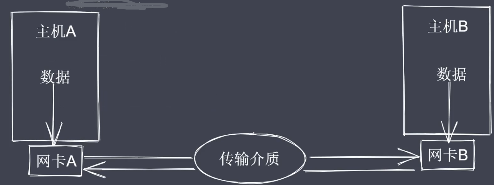
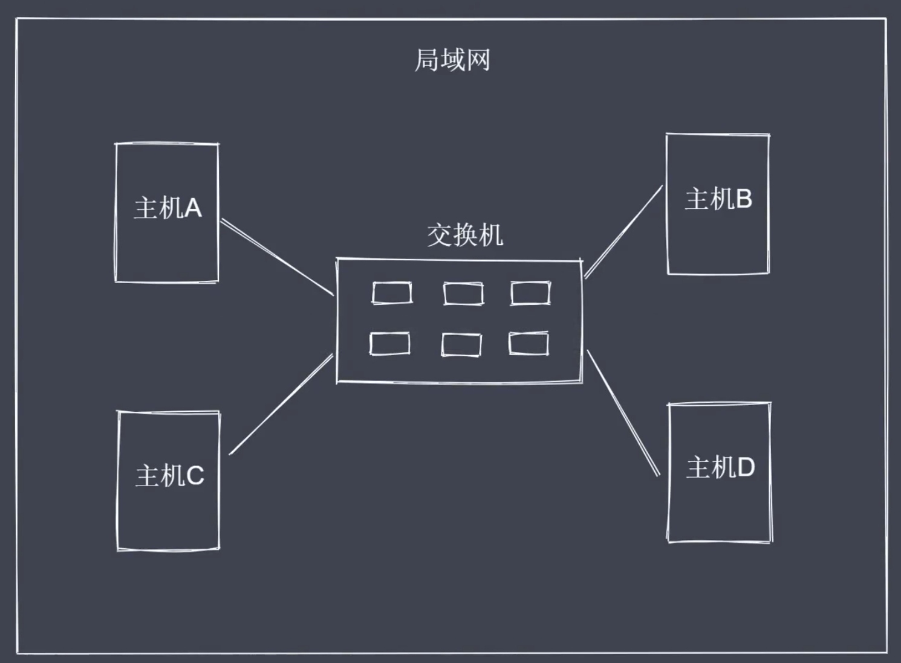
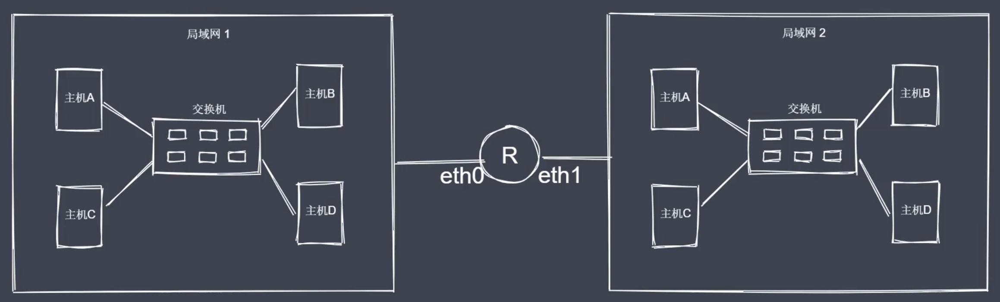
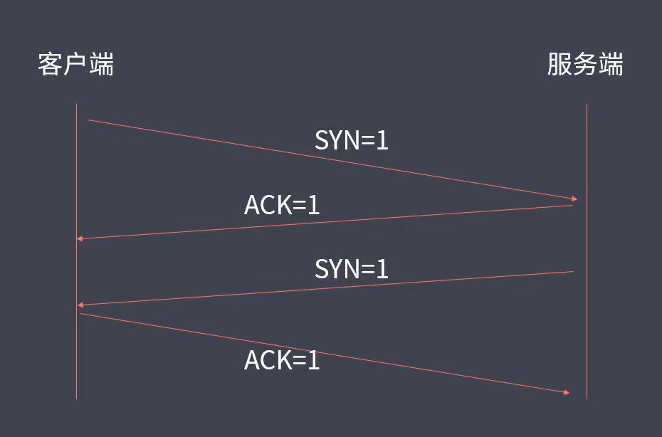
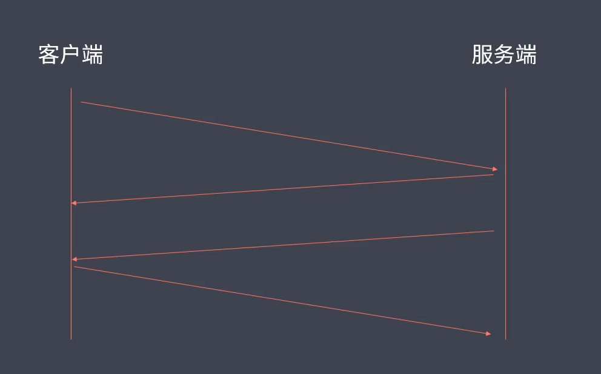
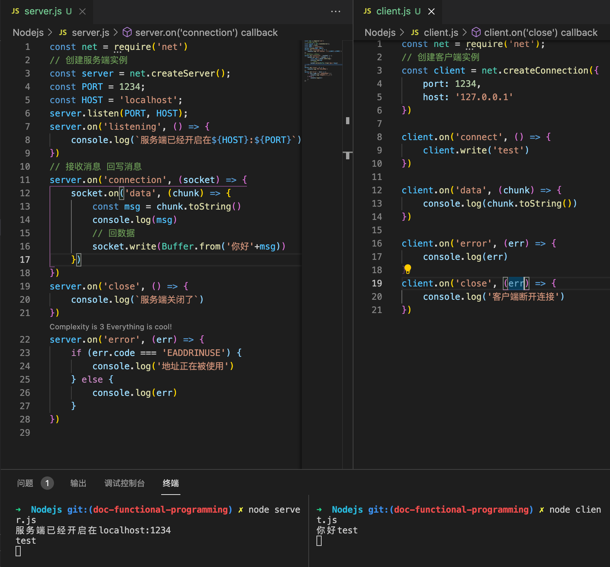
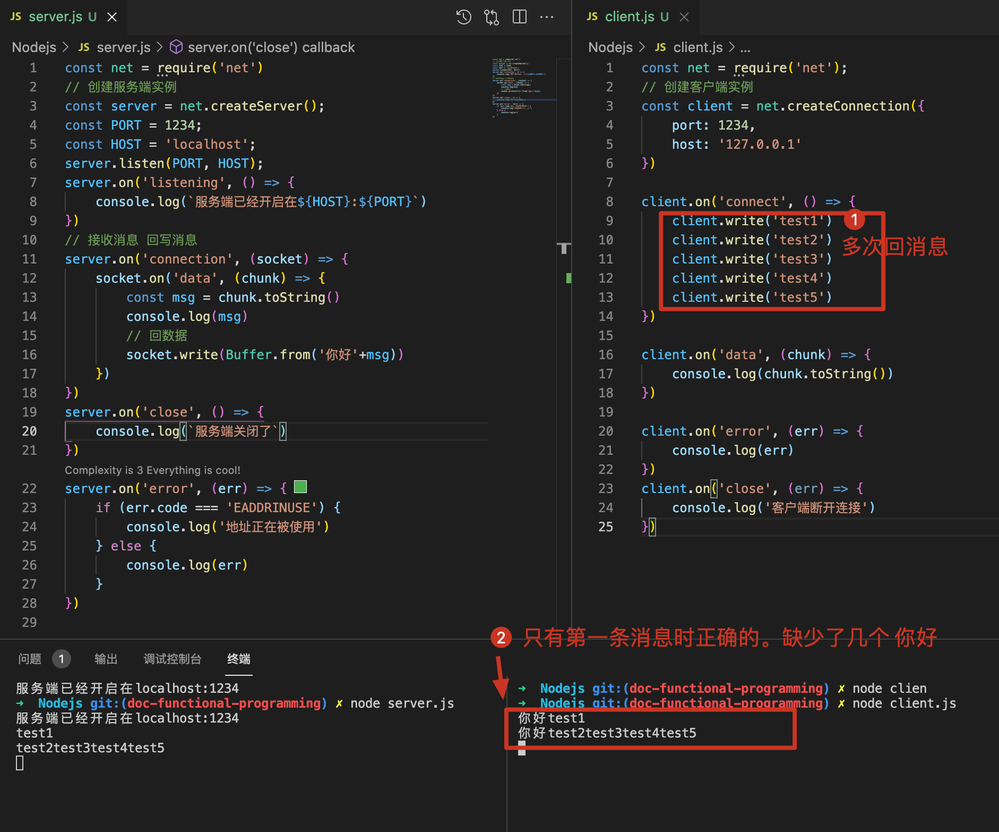
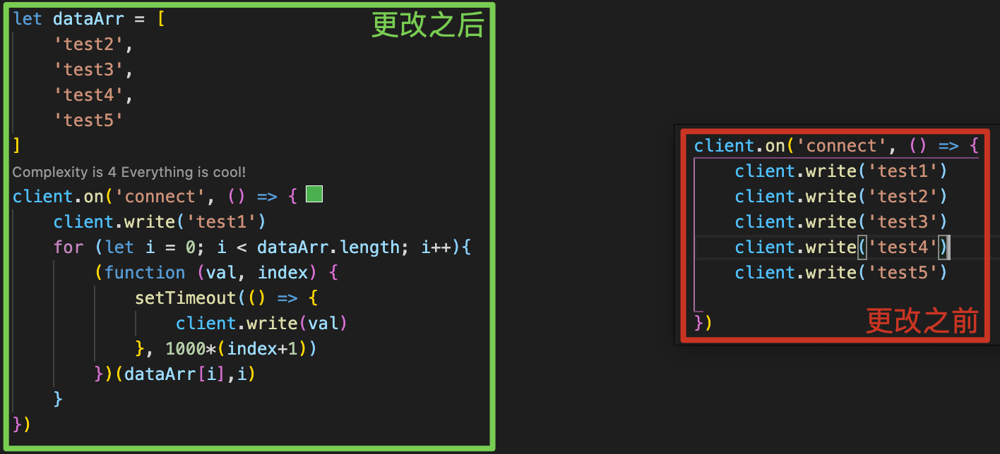
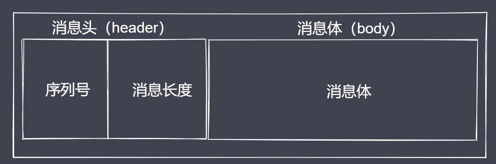

# 通信基本原理

两台主机之间，实现通信的必要条件：

- 主机之间需要有传输介质，比如网线、wifi、光纤（建立连接）
- 主机上必须有网卡设备（连接之后考虑数据采用什么形式进行传输，网卡可以完成信号的解调制）
- 主机之间需要协商网络速率
  

# 网络通讯方式

常见通讯方式：

- 交换机通讯
- 路由器通讯

如何建立多台主机互联？  
通过交换机：

交换机的接口数量有限，局域网存在大量主机会造成广播风暴
明确目标主机 IP 地址


# 网络层次模型

OSI 七层模型

- 应用层：用户与网络的接口
- 表示层：数据加密、转换、压缩
- 会话层：控制网络连接建立与终止
- 传输层：控制数据传输可靠性
- 网络层：确定目标网络
- 数据链路层：确定目标主机
- 物理层：各种物理设备和标准

数据从 A 到 B 主机，先封装再接封。

# 数据封装与解封装

依据网络层次模型来说明所传输数据的封装与解封装过程：
首先，采用的是 TCP/IP 五层划分模式。

- 1.应用层-在应用层产生所要传输的数据，用 data 来表示（data）
- 2.传输层-常见的是 TCP、UDP 协议，两者都是基于端口的协议，端口的作用就是在主机上进程的唯一标识，所以这一层会被包裹上目标端口+源端口（目标端口+源端口+data）
- 3.网络层-一般来说主机都是处于不同的网络里，所以需要 ip 协议来确定目标主机所在的网络，因此数据在这一层会被包裹上目标主机的 ip 地址与当前主机的源 IP（目标 IP+源 IP+目标端口+源端口+data）（此时能够确定某一个网络，并不能在这个网络里哪一台机器是我们想要的）
- 4.数据链路层-通过 mac 地址完成寻址操作，所以数据会被包裹上目标主机与当前主机的 mac 地址（目标 mac+源 mac+目标 IP+源 IP+目标端口+源端口+data）（此时一条数据就被完整封装了）
- 5.物理层-网线无法识别二进制，所以经过网卡的调制之后就会变成高低电压，此时封装的数据就会转换成二进制形式，再经过路由器的网络分配和传输介质的运输，最终就会到达目标主机的网卡
- 6.物理层-进行数据解调，将电压变为二进制，再向上传递至链路层。
- 7.数据链路层-分析目标 mac 地址是否是当前主机的 mac 地址，如果是就拆解数据并继续向上层传递
- 8.网络层-分析目标 ip 是否是自己的 ip，如果是就拆解数据并继续向上层传递
- 9.传输层-分析目标端口是否是自己，如果是就拆解数据并继续向上层传递
- 10.数据层-此时主机 B 就拿到了主机 A 传过来的数据 data 了

# TCP 三次握手与四次挥手

## TCP 协议

- TCP 属于传输层协议
- TCP 是面向连接的协议（基于端口，面向连接）
- TCP 用于处理实时通信（主机之间要想通信需要先建立双向数据通道）
- TCP 的握手和挥手本质上都是四次（但是握手一般会被合并为三次）

以下是一个完整的 TCP 协议报文应该具有的信息：


其中，

- 端口的作用是为了标明自己和目标应用进程

常见控制字段：

- SYN=1 表示请求建立连接
- FIN=1 表示请求断开连接
- ACK=1 表示数据信息确认

三次握手：


- step1:客户端向服务端发送一个建立连接的请求，用控制字段 SYN=1 来表示，服务端接收到这个请求之后会回送一个消息表示确认接收到了这个客户端请求（用 ACK=1 表示），任何一次完成的通信都是有来有回的，此时就相当于建立了一条由客户端向服务端发送数据的通道，注意只是客户端向服务端，所以服务端要想发送消息给客户端，还需要发送一个请求给客户端，表示服务端也想建立一个连接。
- step2:服务端也想要建立一个连接，此时也需要用 SYN=1 来表示，客户端接收到这个请求之后，也需要用 ACK=1 来回应。这里就建立了一个服务端向客户端之间的通信。以上两个步骤就有了客户端与服务端之间数据双向通信通道。（注意这里实际上本质是四位握手，不过在实践中一般服务端在第一次发送 ACK=1 时就会同时发送 SYN=1，将四次握手合并成了三次）

四次挥手：

当客户端与服务端之间的数据传输结束之后，就会断开连接，让服务端可以去处理其他客户端的请求，首先客户端会发送一个断开连接的请求，服务端接收之后会回复一个消息确认，此时就相当于断开了客户端到服务端之间的通道。接着服务端接着会发送一个断开连接的请求给客户端，客户端接收之后也会回应一个确认消息。这样就断开了服务端到客户端之间的数据通道。这个过程就是四次挥手。（疑问，这里为何不可以合并为三次挥手？道理很简单，因为一个服务端会服务于多个客户端，我们不能保证某一个客户端将请求发送给服务端之后服务端就能立即将结果数据回给当前的客户端，即在某些情况下，客户端已经将请求数据信息传给了服务端，服务端还未将对应的回应数据传回给客户端，所以在断开连接的时候是分开处理的。这就是为什么挥手会有四次，而握手可以合并为三次的原因）

# 基于 Net 模块创建 TCP 通信

使用 Nodejs 内置模块来创建 TCP 客户端与服务端的实例，并完成两者之间的通信，这里使用了 Net 模块来实现底层通信接口。

通信过程描述；

- 创建服务端：接收和回写客户端数据
- 创建客户端：发送和接收服务端数据
- 数据传输：内置服务事件和方法读写数据

通信事件：

- listening 事件：调用 server.listen 方法之后触发
- connection 事件：新的连接建立时触发
- close 事件：当 server 关闭时触发
- error 事件：当错误出现的时候触发

通信事件&方法：

- data 事件：当接收到数据时触发该事件
- write 方法：在 socket 上发送数据，默认是 UT8 编码
- end 操作：当 socket 的一端发送 FIN 包时触发，结束可读端

demo 实践：

- 1.创建服务端实例，监听端口以开启服务，并监听具体的事件，如果想要提供服务，那么应该提供两个信息（host、port），客户端需要通过域名来找到主机，并确定当前应用进程在机器上占用的是哪一个端口。之后通过发布订阅模式来监听 listening 事件
- 2.客户端以及服务端分别创建了实例，都可以认为是双工流。如果想要获取到对方传过来的数据，就将其当作可读柳，使用 toString 方法获取，如果想要回消息，就当作可写流，调用 write 方法。



# TCP 数据粘包及解决

TCP 数据粘包问题的由来：数据通信包含数据发送端和接收端，发送端并不是实时的不停的将数据发送出去，而是会累积数据统一发送，同样，接收端也不是立马使用数据，而是缓冲数据之后再消费，这样可以减少 IO 操作带来的性能消耗，但是对于数据的使用会产生粘包的问题，并且数据是放在缓存中的，那么何时会发送？TCP 拥塞机制决定发送时机。

粘包的现象：基于流的发送操作以及当前 tcp 的实现，导致出现了粘包。

在这个例子中，test1-test5 这 5 条数据“粘”在一起了，可以看到 server 接收到消息总共两条，回复的消息里，应该有 6 个“你好”。

## 粘包解决方法 1——增大发送数据的时间间隔：

缺点：降低了数据的传输效率


## 粘包解决方法 2——数据封包与拆包解决粘包问题

按照指定好的规则把数据打包，使用数据时再按制定规则进行拆包，这里是使用**长度编码方式**来约定通信双方的数据传递方式。
规定一条完整的消息分为消息头（header）和消息体（body），其中头部分为序列号和消息长度两个部分：


先来了解下什么是数据传输过程：

### 数据传输过程

- 进行数据编码，获取二进制数据包
- 按规则拆解数据，获取指定长度的数据

数据传输过程中需要使用到 Buffer：

### Buffer 数据读写

- writeInt16BE：将 value 从指定位置写入
- readInt16BE：从指定位置开始读取数据

### 数据封包与拆包的编解码功能实现-myTransform

代码看./demo/data_packet_and_unpacking

- 1.myTransform.js 定义一个类 MyTransformCode，功能是用于数据的编解码。
- 2.test.js 验证这个类的功能
- 3.server.js 服务端增加拆分包处理逻辑
- 4.client.js 客户端增加拆分包处理逻辑


# Http 协议

什么是 http 协议，以及如何用 node 模块开启 http 协议服务。

## demo1.用代码方式看 http 协议有哪些内容

执行命令：nodemon ./demo/http/1.server.js 之后，浏览器输入 localhost:1234 并回车，就可以在编辑器终端看到 http 协议请求内容：


## demo2.在 node 中利用 http 模块创建 http 服务端

执行命令：nodemon ./demo/http/2.create-httpserver.js 之后，浏览器输入 localhost:1234 并回车

## demo3.获取 http 请求信息

注意，浏览器网页打开 localhost:1234 是属于 get 请求，如果要模拟调试 post 请求，可以用 curl 工具：

```
curl -v -X POST -d "'name':'lg'" http://localhost:1234/
```

代码见./demo/http/3.get-request-info.js

```js
const http = require("http");
const url = require("url");

const server = http.createServer((req, res) => {
  console.log("请求进来了");
  // 获取请求路径
  let { pathname, query } = url.parse(req.url, true);
  console.log(pathname, query);
  // 请求方式
  console.log(req.method);
  //版本号
  console.log(req.httpVersion);
  // 请求头
  console.log(req.headers);

  // 请求体数据获取（这里使用curl工具发起post请求，浏览器打开网页是get请求）
  // req现在是一个可读流
  let arr = [];
  req.on("data", (data) => {
    arr.push(data);
  });
  req.on("end", () => {
    console.log(Buffer.concat(arr).toString()); // 输出'name':'lg'
  });
});

server.listen(1234, () => {
  console.log("server is start");
});
```

终端执行命令开启服务：

```
node 3.get-request-info.js
```

然后终端利用 curl 命令发起一个 post 请求：

```
curl -v -X POST -d "'name':'lg'" http://localhost:1234/
```

此时就可以在终端看到 post 请求信息：


## demo4.设置 http 响应

代码看./demo/http/4.set-response-info.js


## demo5.创建一个简单的代理客户端（代理客户端与服务端之间的交互通信）

功能：使用 nodejs 提供的 api 实现一个 http 客户端，由它向某一个服务端发送请求，当请求出现跨域时，就可以采用这种方式进行解决。

做法：让浏览器客户端直接向这个自己创建的代理客户端发送请求（此时这个代理客户端就充当浏览器访问的服务端），然后由这个代理客户端向服务端（可能存在跨域的服务端）发送请求，由于服务端之间发送请求是不存在跨域的，因此在 web 服务端数据处理完成之后，把数据返回给自己创建的代理客户端，再由这个代理客户端把数据回写给浏览器。这样的话，浏览器客户端就可以拿到 web 服务器所返回的数据了，解决了跨域的问题。

代码看./demo/http/5.agent-server.js 与 ./demo/http/5.agent-client.js，简单实现了代理客户端与服务器端之间的交互通信。

## demo6.代理客户端解决跨域问题

demo5 已经实现了代理客户端与服务端之间的通信，现在需要跨域的问题，主要是让这个代理客户端兼具客户端与服务端的双重身份，浏览器访问此代理客户端，然后这个代理客户端去访问真正的服务端。

demo6 主要针对代理客户端的代码进行了一些更改，首先创建一个服务器，然后在收到浏览器的请求时去对外部服务器发送一个请求，之后再将返回的数据返回给浏览器。


