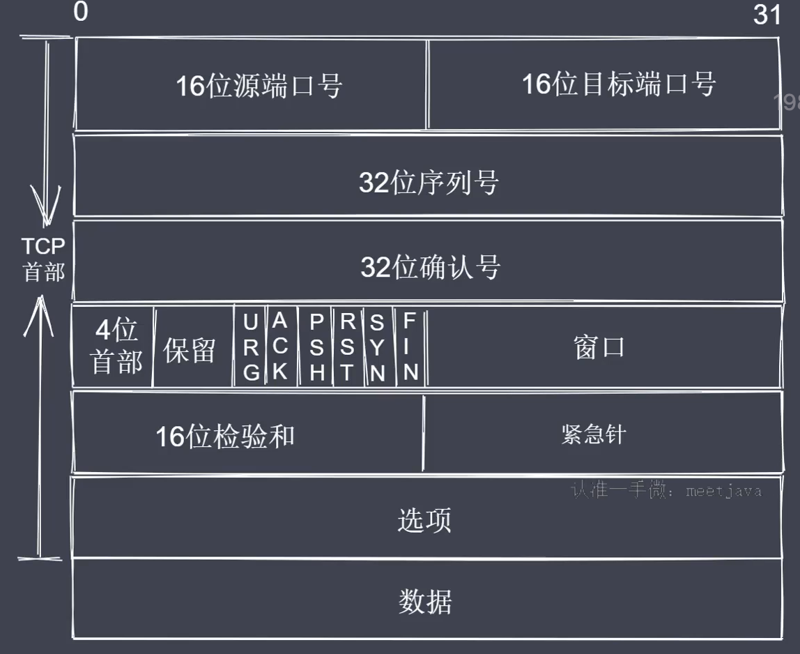

# TCP三次握手与四次挥手
## TCP协议
- TCP属于传输层协议
- TCP是面向连接的协议（基于端口，面向连接）
- TCP用于处理实时通信（主机之间要想通信需要先建立双向数据通道）
- TCP的握手和挥手本质上都是四次（但是握手一般会被合并为三次）

以下是一个完整的TCP协议报文应该具有的信息：

其中，
- 端口的作用是为了标明自己和目标应用进程

常见控制字段：
- SYN=1表示请求建立连接
- FIN=1表示请求断开连接
- ACK=1表示数据信息确认

三次握手：

- step1:客户端向服务端发送一个建立连接的请求，用控制字段SYN=1来表示，服务端接收到这个请求之后会回送一个消息表示确认接收到了这个客户端请求（用ACK=1表示），任何一次完成的通信都是有来有回的，此时就相当于建立了一条由客户端向服务端发送数据的通道，注意只是客户端向服务端，所以服务端要想发送消息给客户端，还需要发送一个请求给客户端，表示服务端也想建立一个连接。
- step2:服务端也想要建立一个连接，此时也需要用SYN=1来表示，客户端接收到这个请求之后，也需要用ACK=1来回应。这里就建立了一个服务端向客户端之间的通信。以上两个步骤就有了客户端与服务端之间数据双向通信通道。（注意这里实际上本质是四位握手，不过在实践中一般服务端在第一次发送ACK=1时就会同时发送SYN=1，将四次握手合并成了三次）

四次挥手：

当客户端与服务端之间的数据传输结束之后，就会断开连接，让服务端可以去处理其他客户端的请求，首先客户端会发送一个断开连接的请求，服务端接收之后会回复一个消息确认，此时就相当于断开了客户端到服务端之间的通道。接着服务端接着会发送一个断开连接的请求给客户端，客户端接收之后也会回应一个确认消息。这样就断开了服务端到客户端之间的数据通道。这个过程就是四次挥手。（疑问，这里为何不可以合并为三次挥手？道理很简单，因为一个服务端会服务于多个客户端，我们不能保证某一个客户端将请求发送给服务端之后服务端就能立即将结果数据回给当前的客户端，即在某些情况下，客户端已经将请求数据信息传给了服务端，服务端还未将对应的回应数据传回给客户端，所以在断开连接的时候是分开处理的。这就是为什么挥手会有四次，而握手可以合并为三次的原因）