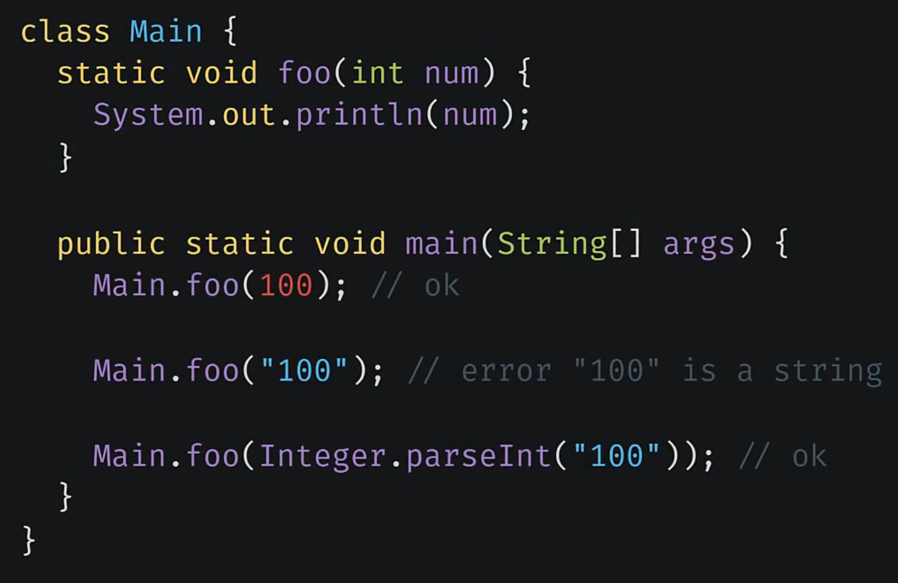
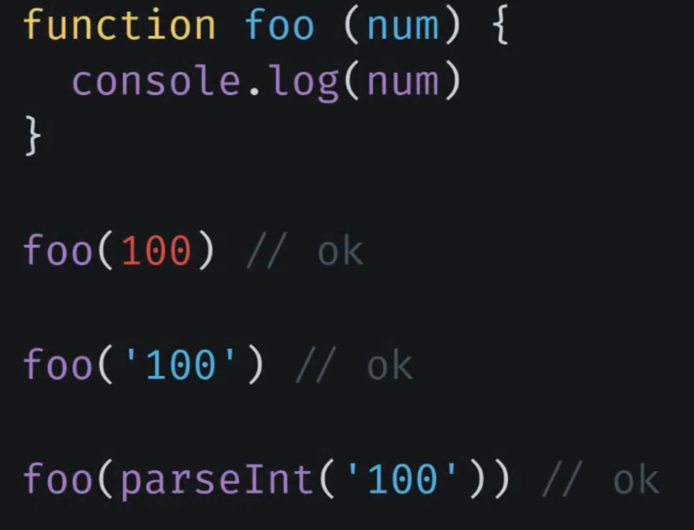
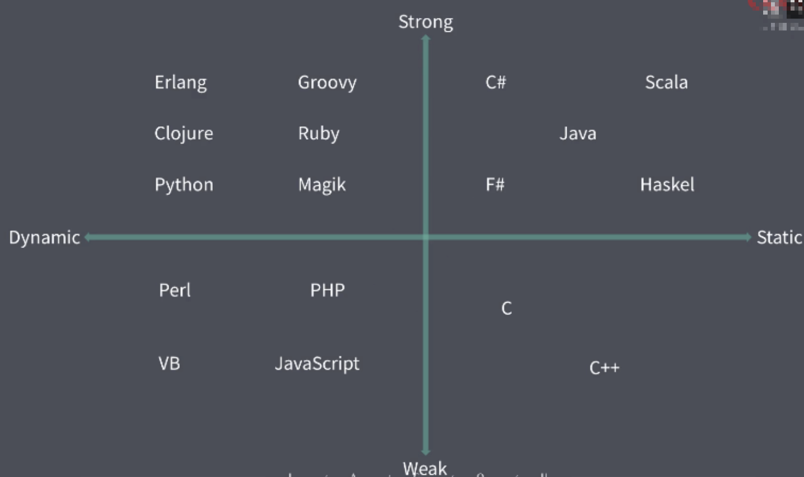

# 概述

TypeScript 是一门基于 Javascript 的编程语言，其重点解决了 Javascript 类型系统的问题，TypeScript 可以大大提高代码的可靠程度，这里重点探讨 Javascript 自有类型系统的问题。

## 内容概要

- 强类型与弱类型
- 静态类型与动态类型
- Javascript 自有类型系统的问题
- Flow 静态类型检查方案
- Typescript 语言规范与基本应用

# 类型系统

- 强类型与弱类型（类型安全）
- 静态类型与动态类型（类型检查）

## 强类型与弱类型

从类型安全来说，编程语言分为强类型与弱类型。其中，

- 强类型：语言层面限制函数的实参类型必须与形参类型相同  
  
- 弱类型：弱类型语言层面不会限制实参的类型
  

由于这种强弱类型之分根本不是某一个权威机构的定义，因此后人对于两者的界定细节会有不一样的理解。但整体上其界定方式基本是描述：强类型有更强的类型约束，而弱类型中几乎没有什么约束。或者说强类型语言中不允许任意的隐式类型转换，而弱类型语言中允许任意的隐式类型转换。

注意：变量类型允许随时改变的特点，不是强弱类型的差异。比如 python 是强类型语言，但是变量类型允许随时改变。

## 静态类型与动态类型

- 静态类型：一个变量声明时它的类型就是明确的，声明过后，它的类型就不允许再修改。
- 动态类型：运行阶段才能明确变量类型，而且变量的类型随时可以改变。动态类型语言中的变量没有类型，变量中存放的值是有类型的。


总结：从类型安全角度，语言类型分为强类型与弱类型，两者的区别就是是否允许随意的隐式类型转换。从类型角度，分为静态类型和动态类型，两者区别是是否允许随时修改变量的类型。

## Javascript 自有类型系统的问题

javascript 是动态类型且弱类型的，在灵活多变的表象背后，却缺失了类型系统的可靠性，在代码中遇到变量会担心是否是需要的类型。

为什么 Javascript 不是强类型或者静态类型？

- 1.早前的 Javascript 应用简单，类型限制很多余
- 2.Javascript 没有编译环节，而静态类型是在编译阶段去做类型检查。

在大规模应用下，以上的“优势”就变成了短板。

## 弱类型的问题

- 1.代码运行时才会发现类型异常
- 2.由于允许隐式类型转换，就可能因为传入的参数类型不确定而造成结果跟预期不一样。
- 3.在 js 中，普通对象的 key 会被转换成字符串，会容易造成对索引的用法错误

```
const obj = {}
obj[true]=1000
console.log(obj['true'])
```

虽然弱类型的问题在代码量小的情况下可以通过约定方式去规避，而对于周期长的大规模项目，君子约定有隐患，强制要求有保障。

## 强类型的优势

- 1.错误更早暴露
- 2.代码更智能，编码更准确（比如智能提示插件）
- 3.重构更牢靠
- 4.减少不必要的类型判断
