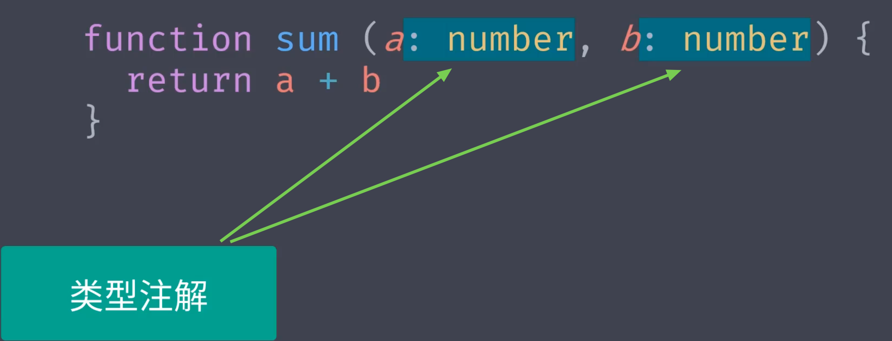
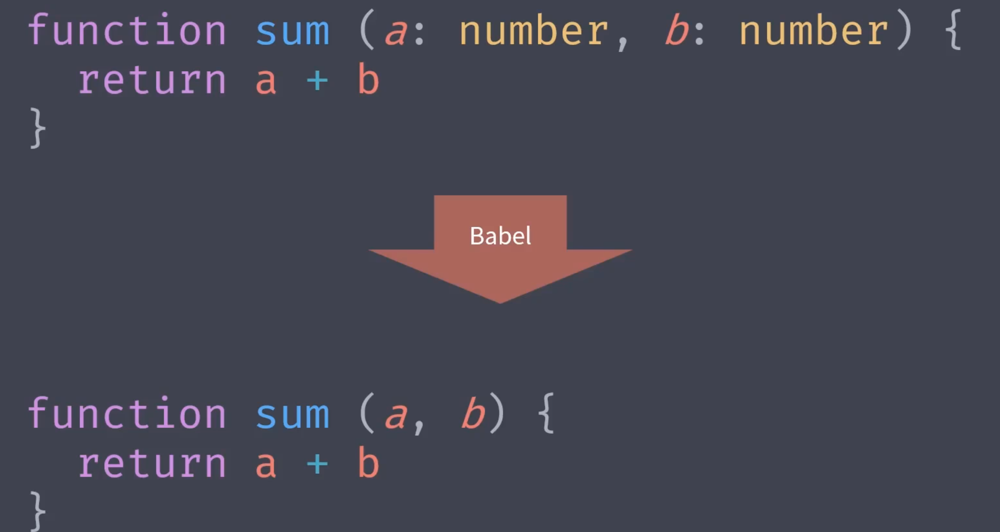
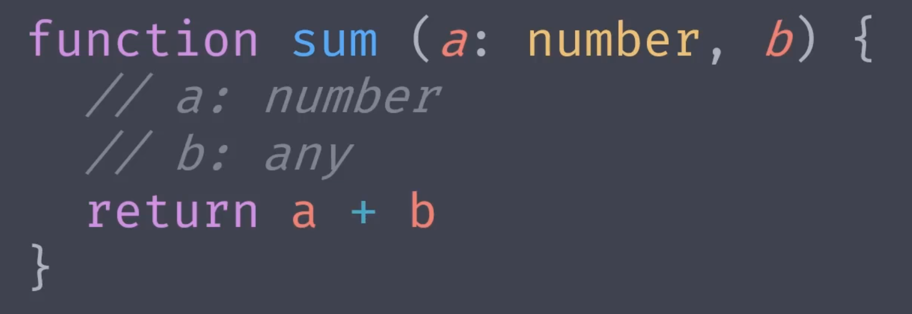

# Flow 静态类型检查方案

## flow 概述

flow 是 facebook 推出的一款工具，其可以弥补 javascript 弱类型带来的弊端，或者说为 javascript 提供了更完善的类型系统。

工作原理：通过在代码中添加类型注解的方式去标记变量或参数的类型，flow 根据这些类型注解检查代码中是否会存在使用上的异常，从而去实现开发阶段中对类型异常的检查，去避免运行阶段才发现错误。

对于代码中的一些额外的类型注解，可以在运行之前通过 babel 或 flow 官方提供的模块自动去除，所以在生产环境中这些类型注解不会有任何影响。

而且 flow 并不要求给每个变量去添加注解：

相比于 TypeScript，Flow 只是一个小工具，上手简单。

## Flow 快速上手

四、Flow 工具的配置及相关插件的使用
