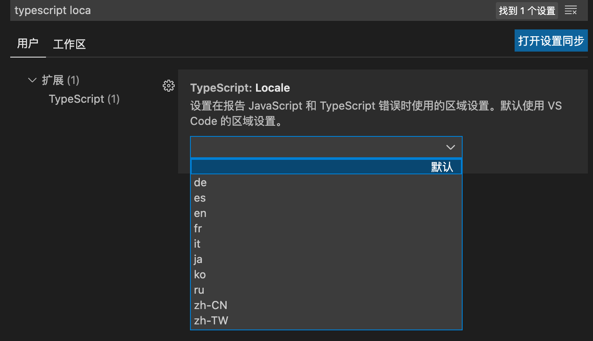

# Typescript 概述

Typescript 是 Javascript 的超集，即在 Javascript 的基础上扩展了一些功能，下面是两种的关系：


由于 Typescript 会被编译成 Javascript，因此 Typescript 在任何一种 Javascript 运行环境下都支持。

相较于 Flow，Typescript 作为一门编程语言，功能更为强大，生态也更健全、更完善。目前来说，Typescript 可以说是前端领域中的第二语言。

## Typescript 缺点：

- 语言本身多了很多概念，造成学习成本大，但是 ts 属于渐进式，即可以当作 js 去使用，很多概念都可以不用知道也可以上手。可以完全按照 Javascript 标准语法编写代码。
- 项目初期，Typescript 会增加一些成本。比如编写很多的类型声明

# Typescript 快速上手

```
yarn init --yes
yarn add typescript --dev   // 安装typescript在项目本地

yarn tsc ***.ts  // 执行完该命令之后会在ts文件同级生成一个编译之后的同名js文件，tsc-typescript compile
```

# Typescript 配置文件

tsc 命令不仅仅用来编译指定的 ts 文件，还可以编译整个项目/工程，在编译工程之前，一般要创建 ts 的配置文件。

```
yarn tsc --init   // 自动生成ts配置文件——tsconfig.json
yarn tsc // 编译工程
```

| 属性      | 作用                             | 默认值                                                                                   |
| --------- | -------------------------------- | ---------------------------------------------------------------------------------------- |
| target    | 指定 ts 编译成 js 所用的 es 标准 | es5，会把所有新特性转换成 es5 标准的代码，将其改为 es2015 就不会去转换 es2015 的新特性了 |
| module    | 输出的代码采用的模块化方式       | commonjs                                                                                 |
| outDir    | 编译结果输出的文件夹             | './'，可以将其设置为"dist"                                                               |
| rootDir   | 配置源代码，即 ts 所在的文件夹   | 一般设置为 src                                                                           |
| sourceMap | 开启 源代码映射                  | 一般设置为 true                                                                          |
| strict    | 是否开启严格模式                 |

# Typescript 原始类型与标准库声明

标准库就是内置对象所对应的声明文件，在代码中使用内置对象，就必须要引用对应的标准库，否则 TS 找不到对应的类型，从而报错。

```javascript
const a: string = "hh";
const b: number = 100;
const c: boolean = true;

const d: string = null; // 严格模式下会报错
// 相当于 Flow，string、number、boolean 这三种类型在严格模式下是可以允许默认为空（可以赋值为 null 或 undefined）

const e: void = undefined; // 一般用在函数没有返回值，标记返回值类型；void类型只能存放null或undefined；严格模式下只能是undefined

const f: null = null;
const g: undefined = undefined;

const h: symbol = Symbol();
```

其中，由于 symbol 类型是属于 ES2015 的新特性，如果 ts 配置中所配置的所用 es 标准为 es5，即 target="es5"，则会报如下图中的错:


- 解决方法 1——target 由"es5"设置为"es2015":
  可以将 target 值改为"es2015"

- 解决方法 2——lib 设置为['ES2015','DOM']:
  如果必须要编译到 ES5，可以使用 lib 选项指定所引用的标准库。这样对于 symbol 的使用就不会报错了，但是这时发现 console 却报错了：
  
  这是因为 console 对象在浏览器环境中是 dom 对象所提供的，而如果在 lib 选项中只设置了 es2015 的话，那么其他的标准库就都被覆盖掉了，（注意在 Typescript 中 Bom 和 Dom 都被归结为一个标准库文件了，即 Dom），可以设置 lib 为['ES2015','DOM']。

# Typescript 中文错误消息

Typescript 本身支持多语言的错误消息，默认跟随操作系统的语言设置。
可以在执行编译命令的时候可以添加语言设置参数：

```
yarn tsc --locale zh-CN
```

而对于 VScode 里的错误消息，可以在配置选项里设置：


# Typescript 作用域问题

在不同文件中存在相同变量名称，这种情况肯定存在，如果变量定义在全局作用域里，typescript 会报“重复定义变量的”的错误：


可以用一个立即执行函数创建一个单独作用域：

```
(function(){
    const a = 9
})()
```

或者在文件中使用 export 导出，这样这个文件就会作为一个模块，模块是有自己的模块作用域的：

```
const a = 9
export {}   // 这里是export的语法，并不是导出一个空对象的意思
```

# Typescript 类型

## Object 类型

Object 类型不单指对象，还有数组、函数。

```javascript
const foo: object = function () {}; // 也可以是{} || []
const obj: {} = {}; // 只能是对象
```

## 数组类型

```javascript
const arr1: Array<number> = [1, 2, 3];
const arr2: number[] = [1, 2, 3];

function sum(...args: number[]){
    return args.reduce(prev,current) => prev+current, 0)
}
```

## 元组类型

元组类型是一种特殊的数据结构，元组就是一个明确元素数量以及每个元素类型的数组，各个元素的类型可以不相同。比如在 React 中的 useState 返回的就是一个元组类型。

```javascript
const tuple: [number, string] = [18, "123"];
```

## 枚举类型

```javascript
enum Status {
    Draft = 2,  // 这里指定了从2开始累加，表示后面的Unpublished与Published分别是3、4；如果设置的是字符串类型，则无法自增
    Unpublished,
    Published
}
const post = {
  tag: 2, // 1 || 3, 不用枚举类型，用字面量形式
  status: Status.Draft
};
```

编译之后会发现一个双向键值对的对象，双向键值对可以通过键获取到值，也可以通过值获取到键。这样可以动态的根据枚举值去获取枚举的名称。


## 函数类型

在 Javascript 中有函数定义方式：函数声明和函数表达式。这两种方式如何进行类型约束：

```javascript
// 函数声明
function fun1(a: number): string {
  return "fun1";
}

// 函数表达式
const fun2 = function (a: number): string {
  return "fun2";
};
```

## 任意类型

由于 Javascript 是弱类型的关系，很多内置 API 本身接收任意类型的参数。Typescript 提供了 any 这种类型，其不会进行类型检查。

```javascript
let foo: any = "string";
```

## 隐式类型推断

在 Typescript 中，如果没有明确通过类型注解去标记变量的类型，Typescript 就会根据变量的使用情况去推断便来那个类型，这个行为就叫做隐式类型推断。如果 Typescript 无法判断出类型就会标记为 any。

```javascript
let foo = 1;
foo = "123"; // 报错

let foo2; // 判定为any
foo2 = 123;
foo2 = "123";
```

## 类型断言

在某些情况下，Typescript 无法判断出变量的类型，而作为开发者，可以根据变量使用情况推断出类型。

类型断言可以告诉 Typescript 变量的类型是什么，但它并不是类型转换。类型断言是属于编译阶段的概念，而类型转换属于代码执行阶段的概念。

```typescript
const nums = [1, 2, 3];
const res = nums.find((i) => i > 0); // 这里明显会返回一个number，但是typescript却推断出是一个number或undefined。这时就可以进行 as关键词 或<number>断言，告诉typescript res是一个number

const num1 = res as number;
const num2 = <number>res; // 不过当在代码中使用jsx时，这种方法会与jsx语法产生冲突
```

# Typescript 接口 interface

interface 可以理解为一种规范或契约。接口用来约束对象的结构。接口可以设定可选、只读成员

```typescript
interface IPost {
  title: string;
  subTitle?: string; // 可选
  readonly summary: string; // 只读
  [Math.random()]: "2"; // 动态
}
function printPost(post) {
  console.log(post.title);
}
```

# Typescript 的类

## 类的基本使用

类的作用：描述一类具体事物的抽象特征，从代码程度上来说，用来描述一类具体对象的抽象成员。
在 ES6 以前，Javascript 都是通过函数+原型模拟实现类。ES6 开始 Javascript 中有了专门的 class，而 Typescript 中则增强了 class 的相关语法。

Typescript 相对于 ECMAScript 新增了哪些内容：

- 1.类的属性在使用之前必须类型声明

```typescript
class Person {
  name: string;
  constructor(name: string, age: number) {
    this.name = name; // 未报错
    this.age = age; // 报错类型“Person”上不存在属性“age”。
  }
}
```

## 类的访问修饰符

定义成员可访问的级别

| 访问修饰符 | 描述                                                          |
| ---------- | ------------------------------------------------------------- |
| private    | 私有属性，只能在类的内部访问                                  |
| public     | 默认值，公有属性                                              |
| protected  | 在外部不能访问，跟 private 区别在于，protected 可以被子类访问 |

而对于构造函数 constructor 的访问修饰符，默认也是 public，如果设置成了 private，那么这个类型不能被外部实例化，也不能被继承，这样只能在类的内部添加一个静态方法，在这个静态方法中创建实例；如果设置成了 protected，也不能被外部实例化，但是可以被继承。

```typescript
class Person {
  name: string;
  private constructor(name: string) {
    this.name = name;
  }
}
const jack = new Person(); // 报错：类“Person”的构造函数是私有的，仅可在类声明中访问。
```

```typescript
class Person {
  name: string;
  private constructor(name: string) {
    this.name = name;
  }

  static create(name: string) {
    return new Person(name);
  }
}
const jack = Person.create("jack");
```

## 类的只读属性

如果有访问修饰符，则只读属性放在修饰符后面

```typescript
class Person {
  private readonly name: string;
  constructor(name: string) {
    this.name = name;
  }
}
```

## 类与接口

```typescript
interface EatAndRun {
  eat(food: string): void;
  run(distance: number): void;
}
class Person implements EatAndRun {
  eat(food: string): void {
    console.log("eat");
  }
  run(distance: number) {
    console.log("run");
  }
}

class Animal implements EatAndRun {
  eat(food: string): void {
    console.log("eat1");
  }
  run(distance: number) {
    console.log("run1");
  }
}
```

注意，实际开发中，一般是一个接口约束一个能力，一个类型实现多个接口，低耦合原则:

```typescript
interface Eat {
  eat(food: string): void;
}
interface Run {
  run(distance: number): void;
}
class Person implements Eat, Run {
  eat(food: string): void {
    console.log("eat");
  }
  run(distance: number) {
    console.log("run");
  }
}

class Animal implements Eat, Run {
  eat(food: string): void {
    console.log("eat1");
  }
  run(distance: number) {
    console.log("run1");
  }
}
```

## 抽象类

抽象类不同于接口的是：抽象类可以包含一些具体的实现。

定义抽象类的方式：在 class 关键词之前添加 abstract。抽象类只能被继承，不能通过 new 创建实例对象。抽象类里可以定义抽象方法，抽象方法不需要方法体，当父类有这个抽象方法，子类就需要实现这个方法。

```typescript
export {};
abstract class Animal {
  // 抽象类
  eat(food: string): void {
    console.log("eat1");
  }
  abstract run(distance: number): void; // 抽象方法
}
class Dog extends Animal {
  run(distance: number): void {
    // 子类修正父类的抽象方法
    console.log("run");
  }
}

const d = new Dog();
```

## 泛型

泛型：声明时不指定具体的类型，使用时再指定。目的是极大程度的复用代码。

```typescript
function createNumberArray(length: number, value: number): number[] {
  const arr = Array<number>(length).fill(value);
  return arr;
}

function createStringArray(length: number, value: string): string[] {
  const arr = Array<string>(length).fill(value);
  return arr;
}

// 使用泛型，不明确类型的地方使用T
function createArray<T>(length: number, value: T): T[] {
  const arr = Array<T>(length).fill(value);
  return arr;
}
const res = createArray<string>(3, "foo");
```

## 类型声明

在开发过程中难免会用到 npm 的第三方模块，这些模块不一定都是通过 Typescript 编写的，因此其提供的成员不会有强类型的体验。比如 lodash，就需要安装类型说明模块 types/lodash。如果没有对应的声明模块，可以通过 declare 语句自定义声明。

```
import { camelCase } from 'lodash';
declare function camelCase(input: string): string
const res = camelCase('hello typed')
```

安装了 lodash，但是没有安装类型声明文件 types/lodash，因此在代码中会报错：

