# 初识微服务

微服务运行在 Docker 容器里，Kubernetes 管理 Docker 容器。

# 一、画一个微服务架构图

假定业务场景：

- 一个在线教育的网站的部分功能
- 用户可以登录注册，获取用户信息
- 有发送邮件发送短信的功能
- 可以查看课程列表和对课程的基本操作 CRUD

## 单体架构：

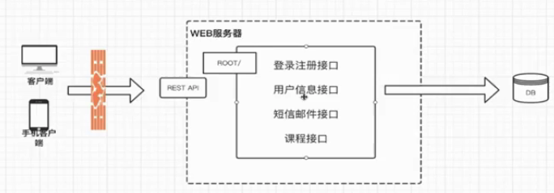

## 微服务架构：

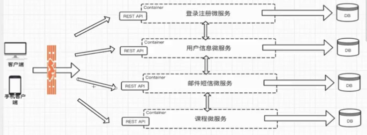
问题：

- 前端需要同时调用多个微服务
- 并不是每个服务都能提供 REST API
- 难以重构

引入 ApiGatWay 的微服务架构：  
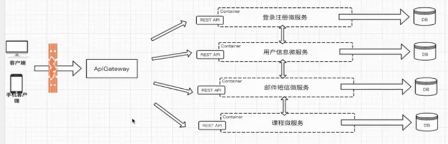

# 二、微服务架构引入的问题及解决方案

- 微服务间如何通讯？
- 微服务如何发现彼此？
- 微服务怎么部署？更新？扩容？

# 三、微服务间如何通讯？

## 从通讯模式角度考虑：

- 服务间的通讯是一对一还是一对多？
- 同步还是异步？

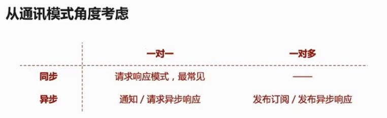

## 从通讯协议角度考虑：

- REST API  
  下面图展示了哪些是 REST API 哪些不是：  
  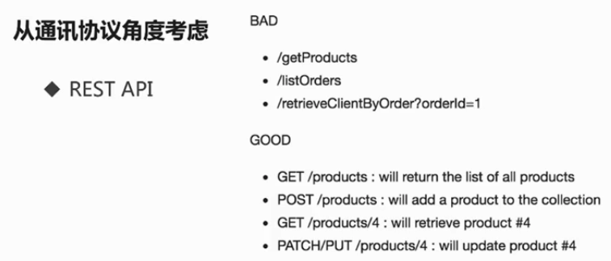
- RPC  
  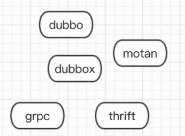
- MQ

## 如何选择 RPC 框架？

- I/O、线程调度模型
- 序列化方式
- 多语言（java 等）支持
- 服务治理（比如服务监控等）

## 流行的 RPC 框架

- Dubbo/Dubbox
- Thrift
- Motan
- Grpc

### 1.Dubbo

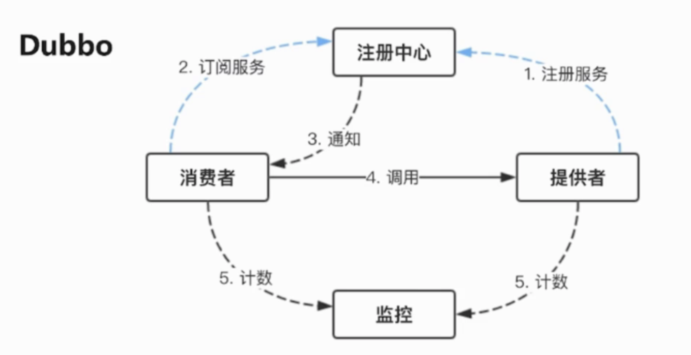

- 蓝色箭头部分是服务初始化时做的工作，可以理解为服务的提供者，会把服务注册到注册中心。而在启动时消费者也会跟注册中心通信，订阅自己需要的服务。
- 消费者在调用时，有异步和同步两种调用方式，图中的实线时表示同步，虚线表示异步。
- 消费者、提供者和注册中心之间都是使用的长链接，消费者和提供者会在内存中累积服务调用的次数，并定时将调用的信息发送到监控中心。消费者、提供者之间的通讯使用的是非阻塞 IO
- Dubbo 是基于 java 来开发的，所以只支持 java 的客户端和服务端

### 2.Motan

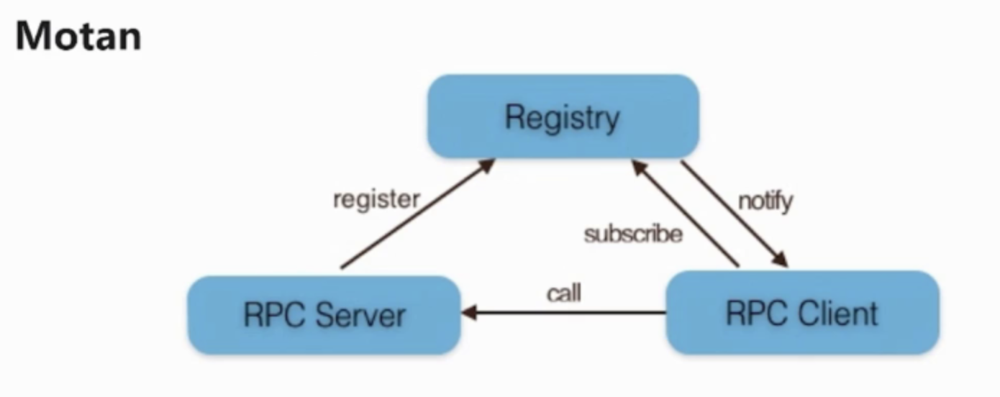

### 3.Thrift

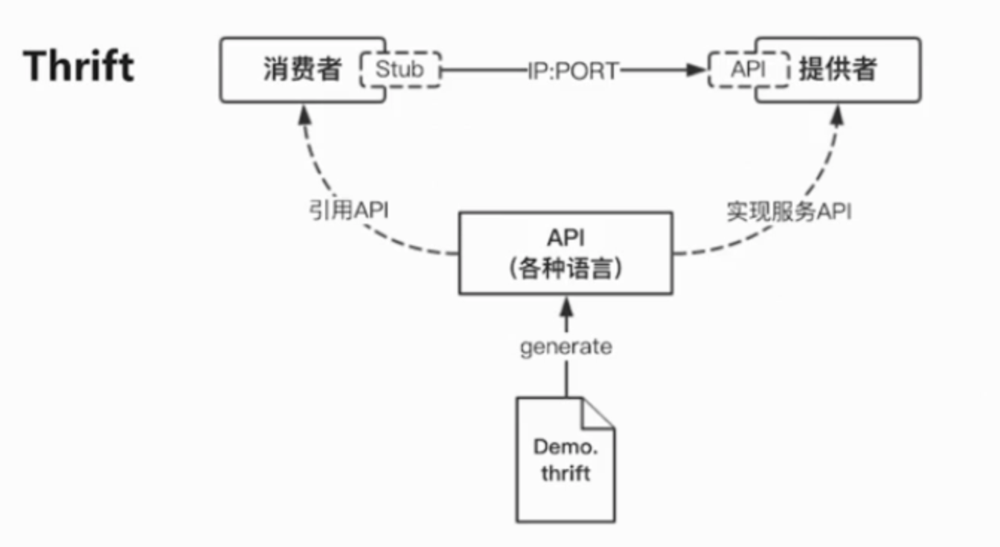

### 4.GRPC

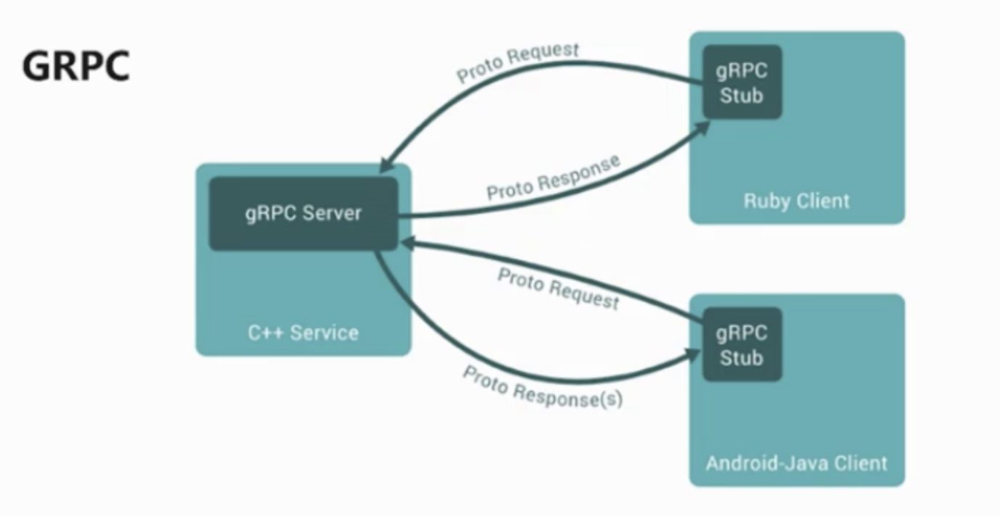

### 框架对比

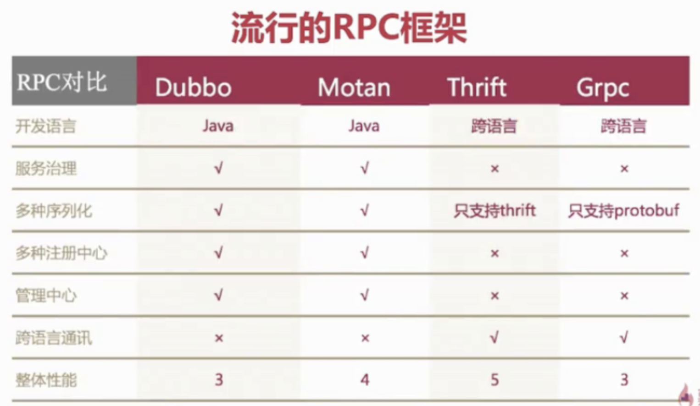

# 四、服务发现、服务部署、更新和扩容

## 传统服务 VS 微服务的服务发现

传统服务：
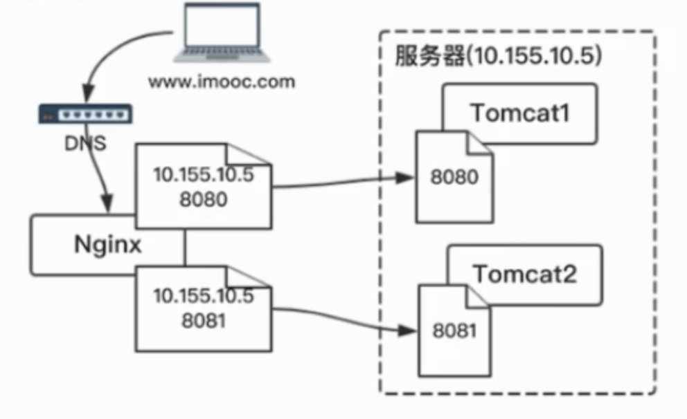

微服务：
分为两部分：客户端发现和服务端发现
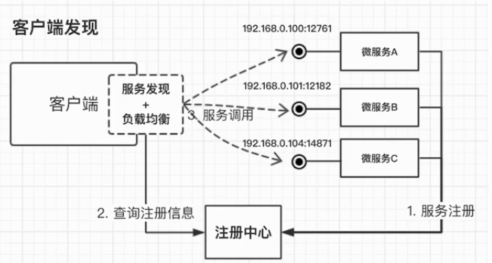
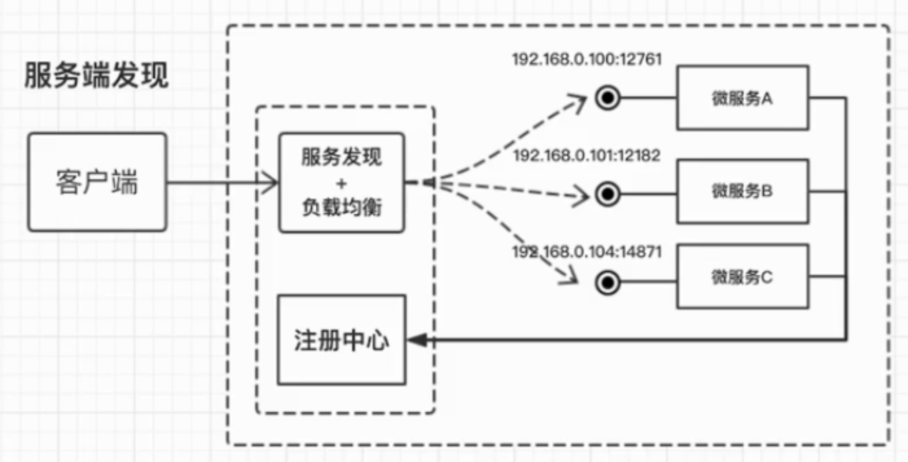

## 什么是服务编排？

服务编排包含了服务发现、服务部署、更新和扩容等操作。

# 五、SpringBoot
