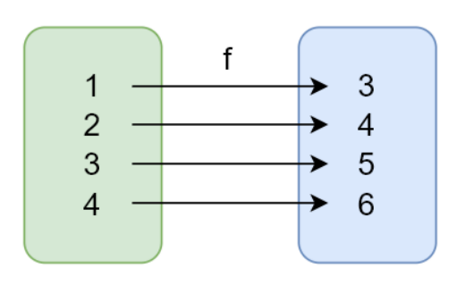

# 纯函数

## 纯函数概念

纯函数：相同的输入永远会得到相同的输出，而且没有任何可观察的副作用

纯函数就类似数学中的函数(用来描述输入和输出之间的关系)，y = f(x)：


lodash 是一个纯函数的功能库，提供了对数组、数字、对象、字符串、函数等操作的一些方法。
数组的 slice 和 splice 分别是：纯函数和不纯的函数

- slice 返回数组中的指定部分，不会改变原数组
- splice 对数组进行操作返回该数组，会改变原数组

```javascript
let numbers = [1, 2, 3, 4, 5];
// 纯函数
numbers.slice(0, 3); // => [1, 2, 3]
numbers.slice(0, 3); // => [1, 2, 3]
numbers.slice(0, 3); // => [1, 2, 3]

// 不纯的函数
numbers.splice(0, 3); // => [1, 2, 3]
numbers.splice(0, 3); // => [4, 5]
numbers.splice(0, 3); // => []
```

函数式编程不会保留计算中间的结果，所以变量是不可变的（无状态的）
我们可以把一个函数的执行结果交给另一个函数去处理

## 纯函数的好处

- 可缓存。
  因为纯函数对相同的输入始终有相同的结果，所以可以把纯函数的结果缓存起来：
  ```javascript
  const _ = require("lodash");
  function getArea(r) {
    console.log("执行了");
    return Math.PI * r * r;
  }
  let getAreaWithMemory = _.memoize(getArea);
  console.log(getAreaWithMemory(4)); // 打印出了内容
  console.log(getAreaWithMemory(4)); // 未打印
  console.log(getAreaWithMemory(4)); // 未打印
  ```
  自己模拟一个 memoize 函数：
  ```javascript
  function memoize(f) {
    let cache = {};
    return function () {
      let arg_str = JSON.stringify(arguments);
      cache[arg_str] = cache[arg_str] || f.apply(f, arguments);
      return cache[arg_str];
    };
  }
  ```
- 可测试。纯函数让测试更方便
- 方便并行处理
  - 在多线程环境下并行操作共享的内存数据很可能会出现意外情况，而纯函数不需要访问共享的内存数据，所以在并行环境下可以任意运行纯函数 (Web Worker)

# 副作用

纯函数：对于相同的输入永远会得到相同的输出，而且没有任何可观察的副作用

```javascript
// 不纯的（当输入20，是否会永远返回true？答案是否定的，当全局变量mini改变之后，返回值就会发生变化。）
let mini = 18;
function checkAge(age) {
  return age >= mini;
}
// 纯的(有硬编码，即18是定死的，后续可以通过柯里化解决)
function checkAge(age) {
  let mini = 18;
  return age >= mini;
}
```

副作用让一个函数变的不纯(如上例)，纯函数的根据相同的输入返回相同的输出，如果函数**依赖于外部**的状态就无法保证输出相同，就会带来副作用。

副作用来源：

- 配置文件
- 数据库
- 获取用户的输入
- ...

所有的外部交互都有可能带来副作用，副作用也使得方法通用性下降不适合扩展和可重用性，同时副作用会给程序中带来安全隐患给程序带来不确定性，但是副作用不可能完全禁止，尽可能控制它们在可控范围内发生。

# 柯里化 (Haskell Brooks Curry)

## 柯里化 (Currying)：

当一个函数有多个参数的时候先传递一部分参数调用它（这部分参数以后永远不变），然后返回一个新的函数接收剩余的参数，返回结果

## 使用柯里化解决上一个案例中硬编码的问题

```javascript
function checkAge(age) {
  let min = 18;
  return age >= min;
}
// 普通纯函数，将min改为参数
function checkAge(min, age) {
  return age >= min;
}
checkAge(18, 24);
checkAge(18, 20);
checkAge(20, 30);

// 柯里化
function checkAge(min) {
  return function (age) {
    return age >= min;
  };
}
// ES6 写法
let checkAge = (min) => (age) => age >= min;

let checkAge18 = checkAge(18); // 可以看到18就可以重复使用
let checkAge20 = checkAge(20);
checkAge18(24);
checkAge18(20);
checkAge20(30);
```

# lodash 中的柯里化函数

到这里已经知道了柯里化的概念，在上一节的柯里化案例不是很通用，下面介绍一下 lodash 中的通用的科利华

## \_.curry(func)

- 功能：创建一个函数，该函数接收一个或多个 func 的参数，如果 func 所需要的参数都被提供则执行 func 并返回执行的结果。否则继续返回该函数并等待接收剩余的参数。
- 参数：需要柯里化的函数
- 返回值：柯里化后的函数

lodash 中的 curry 方法基本使用：

```javascript
const _ = require("lodash");
// 要柯里化的函数
function getSum(a, b, c) {
  return a + b + c;
}
// 柯里化后的函数
let curried = _.curry(getSum);
// 测试
curried(1, 2, 3); // 传递了全部参数，就直接返回执行结果
curried(1)(2)(3); // 第一次传递了一个参数，就返回函数并等待接收剩余的参数
curried(1, 2)(3);
```

# 柯里化案例

场景：需要判断一个字符串中是否有空白字符，或者要剔除其中的空白字符，就可以用 match 方法。

```javascript
// 参数复用
const _ = require("lodash");
const match = _.curry(function (reg, str) {
  return str.match(reg);
});
const haveSpace = match(/\s+/g);
const haveNumber = match(/\d+/g);
console.log(haveSpace("hello world"));
console.log(haveNumber("25$"));

const filter = _.curry(function (func, array) {
  return array.filter(func);
});
console.log(filter(haveSpace, ["John Connor", "John_Donne"]));
const findSpace = filter(haveSpace);
console.log(findSpace(["John Connor", "John_Donne"]));
```

# 柯里化原理模拟—— 模拟\_.curry() 的实现

核心：传入一个函数，并返回一个柯里化之后的函数。对于柯里化函数，先判断传入的参数个数，如果全部传入了就返回执行结果，否则就返回柯里化函数。

- 调用

```javascript
function curry(func) {
  return function curriedFn(...args) {
    // 判断实参和形参的个数
    if (args.length < func.length) {
      return function () {
        return curriedFn(...args.concat(Array.from(arguments)));
      };
    }
    // 实参和形参个数相同，调用 func，返回结果
    return func(...args);
  };
}
```

# 柯里化总结

- 柯里化可以让我们给一个函数传递较少的参数得到一个已经记住了某些固定参数的新函数
- 这是一种对函数参数的'缓存'
- 让函数变的更灵活，让函数的粒度更小
- 可以把多元函数转换成一元函数，可以组合使用函数产生强大的功能
