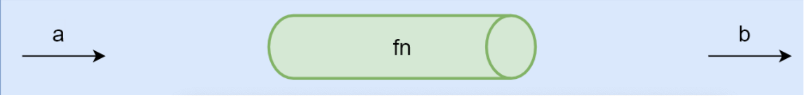
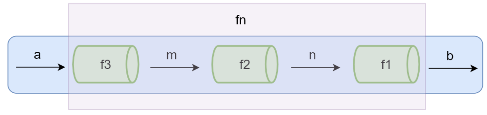
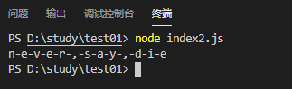
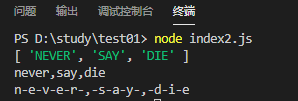

# 函数组合

- 纯函数和柯里化很容易写出洋葱代码 h(g(f(x)))
  - 获取数组的最后一个元素再转换成大写字母， _.toUpper(_.first(\_.reverse(array)))
- 函数组合可以让我们把细粒度的函数重新组合生成一个新的函数

## 管道

下面这张图表示程序中使用函数处理数据的过程，给 fn 函数输入参数 a，返回结果 b。可以想想 a 数据通过一个管道得到了 b 数据。



当 fn 函数比较复杂的时候，我们可以把函数 fn 拆分成多个小函数，此时多了中间运算过程产生的 m 和 n。

下面这张图中可以想象成把 fn 这个管道拆分成了 3 个管道 f1, f2, f3，数据 a 通过管道 f3 得到结果 m，m
再通过管道 f2 得到结果 n，n 通过管道 f1 得到最终结果 b。



```javascript
fn = compose(f1, f2, f3);
b = fn(a);
```

## 函数组合概念

函数组合 (compose)：如果一个函数要经过多个函数处理才能得到最终值，这个时候可以把中间过程的函数合并成一个函数。

- 函数就像是数据的管道，函数组合就是把这些管道连接起来，让数据穿过多个管道形成最终结果
- 函数组合默认是从右到左执行

```javascript
// 组合函数
function compose(f, g) {
  return function (x) {
    return f(g(x));
  };
}
function first(arr) {
  return arr[0];
}
function reverse(arr) {
  return arr.reverse();
}
// 从右到左运行
let last = compose(first, reverse);
console.log(last([1, 2, 3, 4]));
```

## lodash 中的组合函数

lodash 中组合函数 flow() 或者 flowRight()，他们都可以组合多个函数
flow() 是从左到右运行
flowRight() 是从右到左运行，使用的更多一些

```javascript
const _ = require("lodash");

const toUpper = (s) => s.toUpperCase();
const reverse = (arr) => arr.reverse();
const first = (arr) => arr[0];

const f = _.flowRight(toUpper, first, reverse);

console.log(f(["one", "two", "three"]));
```

## 组合函数原理模拟——模拟实现 lodash 中的 flowRight 方法

```javascript
// 多函数组合
function compose(...fns) {
  return function (value) {
    return fns.reverse().reduce(function (acc, fn) {
      return fn(acc);
    }, value);
  };
}
// ES6
const compose =
  (...fns) =>
  (value) =>
    fns.reverse().reduce((acc, fn) => fn(acc), value);
```

## 函数组合-结合律

函数的组合要满足结合律 (associativity)：
我们既可以把 g 和 h 组合，还可以把 f 和 g 组合，结果都是一样的

```javascript
// 结合律（associativity）
let f = compose(f, g, h);
let associative = compose(compose(f, g), h) == compose(f, compose(g, h));
// true
```

所以代码还可以像下面这样：

```javascript
const _ = require("lodash");
// const f = _.flowRight(_.toUpper, _.first, _.reverse)
// const f = _.flowRight(_.flowRight(_.toUpper, _.first), _.reverse)
const f = _.flowRight(_.toUpper, _.flowRight(_.first, _.reverse));
console.log(f(["one", "two", "three"])); // => THREE
```

## 函数组合-调试

现在可以通过函数的组合解决一些问题，当我们使用函数组合的时候，如果组合执行的结果跟我们预期的不一致，怎么去调试这多个函数的时候哪个函数出现的问题呢？我们可以在函数执行之后把结果打印出来。

假设下面要实现把 NEVER SAY DIE 转换成 never-say-die

```javascript
const _ = require("lodash");

const split = _.curry((sep, str) => _.split(str, sep));
const join = _.curry((sep, array) => _.join(array, sep));
const f = _.flowRight(join("-"), _.toLower, split(" "));

console.log(f("NEVER SAY DIE"));
```

打印结果为：



可以写一个 log 函数把每个函数调用后的值打印出来，看哪个函数最终输出的值有问题再做具体的调试。

```javascript
const _ = require("lodash");

const log = (v) => {
  console.log(v);
  return v;
};

const split = _.curry((sep, str) => _.split(str, sep));
const join = _.curry((sep, array) => _.join(array, sep));
const f = _.flowRight(join("-"), log, _.toLower, log, split(" "));

console.log(f("NEVER SAY DIE"));
```



# Lodash 中的 fp 模块

在使用函数组合解决问题的时候，会使用到 lodash 中提供的一些方法，但是这些方法有多个参数的时候，需要对这些方法进行柯里化的处理，需要重新包装这些方法稍微有些麻烦。

[lodash/fp](https://github.com/lodash/lodash/wiki/FP-Guide)

- lodash 中 fp 模块，提供了一些实用的对函数式编程友好的方法。
- 提供了不可变 auto-curried iteratee-first data-last 的方法（提供的方法是不可变的，如果一个方法的参数是函数的话，会要求函数优先并且数据置后）。

```javascript
//lodash 模块
const _ = require("lodash");

_.map(["a", "b", "c"], _.toUpper);
//=>['A','B','C']
_.map(["a", "b", "c"]);
//=>['a','b','c']

_.split("Hello World", " ");

//lodash/fp模块
const fp = require("lodash/fp");
fp.map(fp.toUpper, ["a", "b", "c"]);
fp.map(fp.toUpper)(["a", "b", "c"]);

fp.split(" ", "Hello World");
fp.split(" ")("Hello World");
```

lodash 模块中的 map 方法和 split 方法，map 方法可以对数组进行遍历，并且在遍历的过程中可以指定一个函数对数组中的每个元素进行处理，在调用的时候要求数据优先,函数置后，当 map 方法只传递了一个参数，没有传递这个函数的时候，会原封不动的返回这个数组。split 方法是对字符串进行切割，会要求首先传递数据，再传入分割符。传入的参数都是数据优先，函数置后的。

再看 lodash/fp 中提供的这些方法。和上面是相反的，先传入函数再传入数据，如果只传入了一个参数，此时会返回一个新的函数，来等待接收剩余的参数，所以 map 是一个柯里化的函数，split 也是传入一个分割符，返回一个函数等待接收剩余的参数。

针对之前的案例，用 lodash/fp 模块改进：

```javascript
//NEVER SAY DIE 转 never-say-die
const _ = require("lodash");

const split = _.curry((sep, str) => _.split(str, sep));
const join = _.curry((sep, array) => _.join(array, sep));
const map = _.curry((fn, array) => _.map(array, fn));
const f = _.flowRight(join("-"), map(_.toLower), split(" "));

console.log(f("NEVER SAY DIE"));

// 使用lodash/fp模块
const fp = require("lodash/fp");
const f = fp.flowRight(fp.join("-"), fp.map(fp.toLower), fp.split(" "));
console.log(f("NEVER SAY DIE"));
```

# Lodash/fp 模块与 Lodash 模块中的 map 方法区别

## Lodash 模块中的 map

```javascript
const _ = require("lodash");
console.log(_.map(["23.3", "8", "10"], parseInt)); // [23, NaN, 2]
```

## Lodash/fp 模块中的 map

```javascript
const fp = require("lodash/fp");
console.log(fp.map(parseInt, ["23.3", "8", "10"])); // [23, 8, 2]
```

这两个区别是 parseInt 接收的参数不一样，lodash 中所接收的参数是 3 个，第一个是要处理的每个元素，第二个是索引（而 parseInt 第二个参数是转成几进制数），第三个是数组，而 lodash/fp 中这个 map 方法他所接收的 parseInt 函数的参数，只有一个当前处理的元素。

# Point Free

[阮一峰-Pointfree 编程风格指南](http://www.ruanyifeng.com/blog/2017/03/pointfree.html)

PointFree 是一个编程的风格，他的具体实现就是函数的组合，只是感觉更抽象一些。
Point Free：我们可以把数据处理的过程定义成与数据无关的合成运算，不需要用到代表数据的那个参数，只要把简单的运算步骤合成到一起，在使用这种模式之前我们需要定义一些辅助的基本运算函数。（不使用所要处理的值，只合成运算过程）

- 不需要指明处理的数据
- 只需要合成运算过程（其实就是函数的组合）
- 需要定义一些辅助的基本运算函数

案例演示：

```javascript
// 非 Point Free 模式
// Hello World => hello_world
function f(word) {
  return word.toLowerCase().replace(/\s+/g, "_");
}
// Point Free
const fp = require("lodash/fp");
const f = fp.flowRight(fp.replace(/\s+/g, "_"), fp.toLower);
console.log(f("Hello World"));
```
