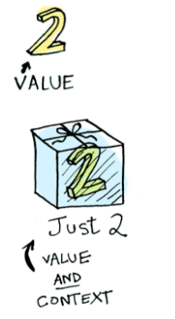

# Functor (函子)

## 为什么要学函子

到目前为止已经已经学习了函数式编程的一些基础，但是我们还没有演示在函数式编程中如何把副作用控制在可控的范围内、异常处理、异步操作等。

## 什么是 Functor

- 容器：包含值和值的变形关系(这个变形关系就是函数)
- 函子：是一个特殊的容器，通过一个普通的对象来实现，该对象具有 map 方法，map 方法可以运行一个函数对值进行处理(变形关系)。（函子是一个持有值的容器，返回一个叫 map 的方法）

为什么函子需要实现 map 函数？记住，Container 仅仅持有了值。但持有值在实际应用场景中没有任何用处。这就是 map 函数发挥的地方了，它允许我们使用 Container 持有的值调用任何函数。map 函数从 Container 中取出值，将传入的函数应用于上面，并将结果放回 Container。

## Functor 函子

```javascript
// 一个容器，包裹一个值
class Container {
  // of 静态方法，可以省略 new 关键字创建对象
  static of(value) {
    return new Container(value);
  }
  constructor(value) {
    this._value = value;
  }
  // map 方法，传入变形关系，将容器里的每一个值映射到另一个容器
  map(fn) {
    return Container.of(fn(this._value));
  }
}
// 测试
Container.of(3)
  .map((x) => x + 2)
  .map((x) => x * x);
```

## 总结

- 函数式编程的运算不直接操作值，而是由函子完成
- 函子就是一个实现了 map 契约的对象
- 我们可以把函子想象成一个盒子，这个盒子里封装了一个值
- 想要处理盒子中的值，我们需要给盒子的 map 方法传递一个处理值的函数（纯函数），由这个函数对值进行处理
- 最终 map 方法返回一个包含新值的盒子（函子）

在 Functor 中如果我们传入 null 或 undefined，发现报错了，看下一节对于此问题如何解决。

```javascript
// 值如果不小心传入了空值(副作用)
Container.of(null).map((x) => x.toUpperCase());
// TypeError: Cannot read property 'toUpperCase' of null
```

# MayBe 函子

我们在编程的过程中可能会遇到很多错误，需要对这些错误做相应的处理（比如上一节传入了 null 就会报错），MayBe 函子的作用就是可以对外部的空值情况做处理（控制副作用在允许的范围）。

```javascript
class MayBe {
  static of(value) {
    return new MayBe(value);
  }

  constructor(value) {
    this._value = value;
  }
  // 如果对空值变形的话直接返回 值为 null 的函子
  map(fn) {
    return this.isNothing() ? MayBe.of(null) : MayBe.of(fn(this._value));
  }

  isNothing() {
    return this._value === null || this._value === undefined;
  }
}

let r = MayBe.of(null)
  .map((x) => x.toUpperCase())
  .map((x) => null)
  .map((x) => x.split(" "));
console.log(r); // => MayBe { _value: null }
```

总结：这个例子中，对空值做了处理，但是我们很难确认是哪一步产生的空值问题

# Either 函子

- Either 两者中的任何一个，类似于 if...else...的处理
- 异常会让函数变的不纯，Either 函子可以用来做异常处理

核心原理：
其中 Left 返回的是原值，是为了返回错误信息。

```javascript
class Left {
  static of(value) {
    return new Left(value);
  }
  constructor(value) {
    this._value = value;
  }
  map(fn) {
    return this;
  }
}
class Right {
  static of(value) {
    return new Right(value);
  }
  constructor(value) {
    this._value = value;
  }
  map(fn) {
    return Right.of(fn(this._value));
  }
}

let r1 = Right.of(12).map((x) => x + 2);
let r2 = Left.of(12).map((x) => x + 2);
console.log(r1, r2); // Right { _value: 14 } Left { _value: 12 }
```

Either 用来处理异常：

```javascript
function parseJSON(json) {
  try {
    return Right.of(JSON.parse(json));
  } catch (e) {
    // 如果发生错误，也需要返回错误信息。
    return Left.of({ error: e.message });
  }
}
let r = parseJSON('{ "name": "zs" }').map((x) => x.name.toUpperCase());
console.log(r); // Right { _value: 'ZS' }
let r_error = parseJSON('{ name: "zs" }').map((x) => x.name.toUpperCase());
console.log(r_error); // Left { _value: { error: 'Unexpected token n in JSON at position 2' } }
```

# IO 函子

- IO 函子中的 \_value 是一个函数，这里是把函数作为值来处理
- IO 函子可以把不纯的动作存储到 \_value 中，延迟执行这个不纯的操作(惰性执行)，包装当前的操作纯
- 把不纯的操作交给调用者来处理

```javascript
const fp = require("lodash/fp");
class IO {
  static of(x) {
    // 接收一个数据，返回一个函子
    return new IO(function () {
      return x;
    });
  }
  constructor(fn) {
    this._value = fn;
  }
  map(fn) {
    // 把当前的 value 和 传入的 fn 组合成一个新的函数
    return new IO(fp.flowRight(fn, this._value));
  }
}

let io = IO.of(process).map((p) => p.execPath);
console.log(io._value());
```

# Folktale

函子不但可以控制副作用，进行异常处理，还可以处理异步任务。Folktale 可以处理回调地狱问题。

## Task 异步执行

- 异步任务的实现过于复杂，我们使用 folktale 中的 Task 来演示
- folktale 是一个标准的函数式编程库
  - 和 lodash、ramda 不同的是，他没有提供很多功能函数
  - 只提供了一些函数式处理的操作，例如：compose、curry 等，一些函子 Task、Either、 MayBe 等

```javascript
const { compose, curry } = require("folktale/core/lambda");
const { toUpper, first } = require("lodash/fp");
// 第一个参数是传入函数的参数个数
let f = curry(2, function (x, y) {
  console.log(x + y);
});
f(3, 4); // 7
f(3)(4); // 7
// 函数组合
let f2 = compose(toUpper, first);
const res = f2(["one", "two"]);
console.log(res); // ONE
```

- Task 异步执行
  - folktale(2.3.2) 2.x 中的 Task 和 1.0 中的 Task 区别很大，1.0 中的用法更接近我们现在演示的函子
  - 这里以 2.3.2 来演示

```javascript
const fs = require("fs");
const { task } = require("folktale/concurrency/task");
const { split, find } = require("lodash/fp");
function readFile(filename) {
  return task((resolver) => {
    fs.readFile(filename, "utf-8", (err, data) => {
      // 读取文件这个方法是异步的
      if (err) resolver.reject(err);
      resolver.resolve(data);
    });
  });
}
// 调用 run 执行
readFile("./package.json")
  .map(split("\n"))
  .map(find((x) => x.includes("version")))
  .run() // 开始读取文件
  .listen({
    onRejected: (err) => {
      console.log(err);
    },
    onResolved: (value) => {
      console.log(value); // 输出  "version": "1.0.0"
    },
  });
```

# Pointed 函子

- Pointed 函子是实现了 of 静态方法的函子
- of 方法是为了避免使用 new 来创建对象，更深层的含义是 of 方法用来把值放到上下文 Context（把值放到容器中，使用 map 来处理值）
  

前面一直有在用 Pointed 函子

```javascript
class Container { static of (value) {
  return new Container(value)
  }
  ……
}
Contanier.of(2) .map(x => x + 5)
```

# Monad（单子）

## IO 函子中的问题

学习 Monad（单子）之前，先来看 IO 函子中的一个问题——实现一个 cat 功能的函数：

```javascript
const fp = require("lodash/fp");
const fs = require("fs");
class IO {
  static of(x) {
    // 接收一个数据，返回一个函子
    return new IO(function () {
      return x;
    });
  }
  constructor(fn) {
    this._value = fn;
  }
  map(fn) {
    // 把当前的 value 和 传入的 fn 组合成一个新的函数
    return new IO(fp.flowRight(fn, this._value));
  }
}

// let io = IO.of(process).map((p) => p.execPath);
// console.log(io._value());

// linux中有个cat命令，作用是读取文件内容并打印
// 现在实现cat函数，功能是：读取文件、打印

let readFile = function (filename) {
  return new IO(function () {
    return fs.readFileSync(filename, "utf-8");
  });
};

let print = function (x) {
  return new IO(function () {
    console.log(x);
    return x;
  });
};

let cat = fp.flowRight(print, readFile);
// IO(IO(x))
let r = cat("./package.json")._value()._value();

console.log(r);

// 发现已经实现了cat的功能，但是cat其实是IO里嵌套了一个IO，因此如果要得到最终结果，就必须调用两次_value，这种api风格并不是最好的
```

## 现在使用 Monad 函子处理 IO 的问题

- Monad 函子是可以变扁的 Pointed 函子，IO(IO(x))。（变扁就是解决函数嵌套的问题，之前学过，如果函数嵌套可以使用函数组合的方式解决，如果函子嵌套就可以用 Monad 解决）
- 一个函子如果具有 join 和 of 两个方法并遵守一些定律就是一个 Monad

分析 IO 函子中的 那个代码：

- readFile 以及 print 方法有个共同的特点——都返回了一个 IO 函子。
- 对于 readFile 方法，读取文件的操作不是直接在函数里，因为读取文件的操作依赖了外部资源，会产生副作用，因此将读文件的操作放在返回的函子里，以保证 readFile 是一个纯函数，因为此时根据输入对象是返回固定内容的。

如何改为 Monad 方法：

- 增加 join 方法，此方法调用 value 并返回，因为在 IO 函子创建的时候，需要传入函数（构造函数的参数是一个 fn），而当这个函数是返回一个函子时，需要将其变为 Monad 函子。
- 增加 flatMap 方法，在使用 Monad 时一般会将 map 和 join 一起使用。

```javascript
const fp = require("lodash/fp");
// IO Monad
class IO {
  static of(x) {
    return new IO(function () {
      return x;
    });
  }
  constructor(fn) {
    this._value = fn;
  }
  map(fn) {
    return new IO(fp.flowRight(fn, this._value));
  }
  join() {
    return this._value();
  }
  flatMap(fn) {
    return this.map(fn).join();
  }
}
let r = readFile("./package.json").map(fp.toUpper).flatMap(print).join();
```
