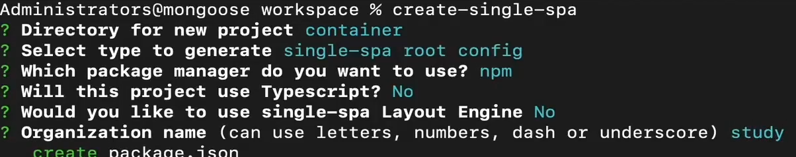
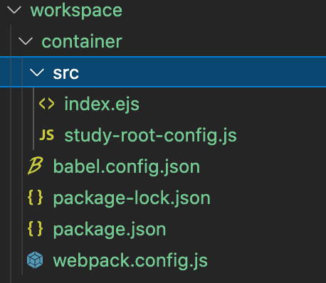

# demo概述
使用create-single-spa脚手架工具创建容器应用， demo见workspace/container文件夹
# 步骤
- step1. 安装 single-spa   
    `脚手架工具：npm install create-single-spa@2.0.3 -g`
- step2. 创建微前端应用目录：  
    `mkdir workspace && cd "$_"`
- step3. 创建微前端容器应用：`create-single-spa`
    1. 应用文件夹填写 container
    2. 应用选择 single-spa root config
    3. 组织名称填写 study  
    组织名称可以理解为团队名称，微前端架构允许多团队共同开发应用，组织名称可以标识应用由哪个团队开发。  
    应用名称的命名规则为@组织名称/应用名称，比如@study/todos
- step4. 启动应用：npm start
- step5. 访问应用：localhost:900

- step6.默认代码解析

