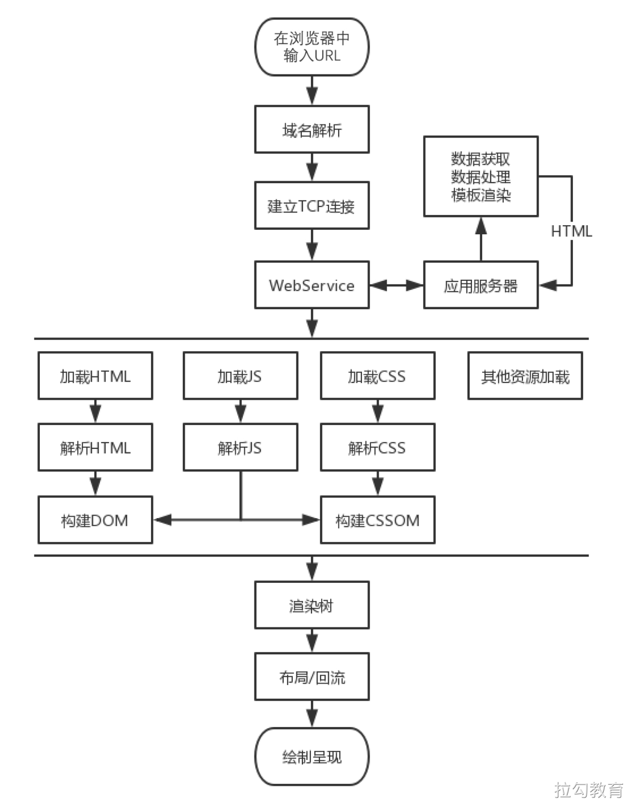

[课程资料](https://www.yuque.com/books/share/bee30889-85b8-442e-be5c-6c683f783e2f/xgqh7t)
密码：xa3i

# [MDN上的Web性能定义](https://developer.mozilla.org/en-US/docs/Learn/Performance/What_is_web_performance)
Web性能时网站或应用程序的客观度量和可感知的用户体验。
- 减少整体加载时间：减小文件体积、减少HTTP请求、使用预加载
- 使网站尽快可用：仅加载首屏内容，其它内容根据需要进行懒加载
- 平滑和交互性：使用CSS替代JS动画、减少UI重绘
- 感知表现：你的页面可能不能做的更快，但你可以让用户感觉更快。耗时操作要给用户反馈，比如加载动画、进度条、骨架屏等提示信息
- 性能测定：性能指标、性能测试、性能监控持续优化

# 如何进行Web性能优化？
- 1.首先需要了解性能指标 - 多快才算快？
- 2.使用专业的工具可量化的评估出网站或应用的性能表现
- 3.然后立足于网站页面响应的生命周期，分析出造成较差性能表现的原因
- 4.最后进行技术改造、可行性分析等具体的优化实施
- 5.迭代优化

# 性能指标
- [RAIL性能模型](https://web.dev/rail/)
- [基于用户体验的核心指标](https://web.dev/metrics/)
- [新一代性能指标：Web Vitals](https://web.dev/vitals/)

# 生命周期
网站页面的生命周期，通俗地讲就是从我们在浏览器的地址栏中输入一个 URL 后，到整个页面渲染出来的过程。整个过程包括域名解析，建立 TCP 连接，前后端通过 HTTP 进行会话，压缩与解压缩，以及前端的关键渲染路径等，把这些阶段拆解开来看，不仅能容易地获得优化性能的启发，而且也能为今后的前端工程师之路构建出完整的知识框架，网站页面加载的生命周期如下图所示。

## 优化方案
经过对网站页面性能的测量及渲染过程的了解，相信你对于糟糕性能体验的原因已经比较清楚了，那么接下来便是优化性能，这也是本课程所要呈现给读者的大部分篇幅。本节先简单扼要地介绍一些优化方面的思路。
- 从发出请求到收到响应的优化，比如 DNS 查询、HTTP 长连接、HTTP 2、HTTP 压缩、HTTP 缓存等。
- 关键渲染路径优化，比如是否存在不必要的重绘和回流。
- 加载过程的优化，比如延迟加载，是否有不需要在首屏展示的非关键信息，占用了页面加载的时间。
- 不同的格式类型会有不同的使用场景，在使用的过程中是否恰当。
- 构建优化，比如压缩合并、基于 webpack 构建优化方案等。
- ...