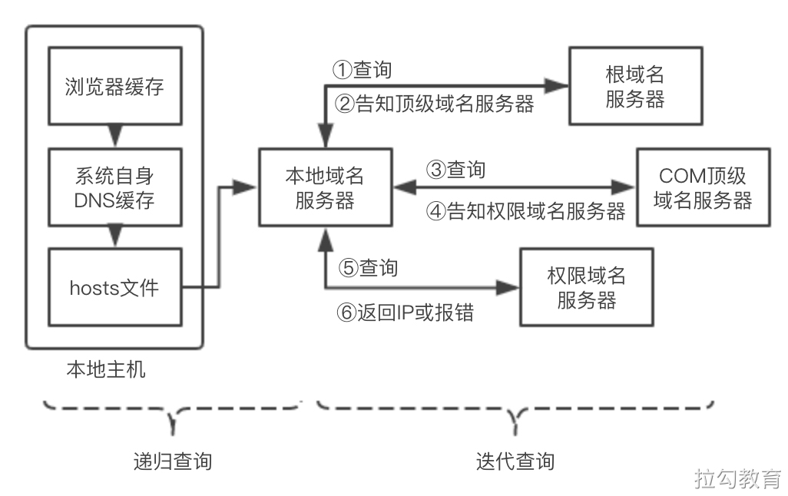

# 一道面试题
从浏览器地址栏输入URL后，到页面渲染出来，整个过程都发生了什么？

其实这个问题的回答可以非常细致，能从信号与系统、计算机原理、操作系统聊到网络通信、浏览器内核，再到 DNS 解析、负载均衡、页面渲染等，但这门课程主要关注前端方面的相关内容，为了后文表述更清楚，这里首先将整个过程划分为以下几个阶段。
- （1）浏览器接收到 URL，到网络请求线程的开启。
- （2）一个完整的 HTTP 请求并的发出。
- （3）服务器接收到请求并转到具体的处理后台。
- （4）前后台之间的 HTTP 交互和涉及的缓存机制。
- （5）浏览器接收到数据包后的关键渲染路径。
- （6）JS 引擎的解析过程。

# 一、网络请求线程开启
此阶段主要内容：进程与线程、多进程浏览器->多进程浏览器

# 二、建立HTTP请求
此阶段主要内容：DNS解析和通信链路的建立
## 1.DNS解析
根据host域名（比如baidu.com）找到相应的ip地址。

由此可以看出 DNS 解析是个很耗时的过程，若解析的域名过多，势必会延缓首屏的加载时间。

## 2.网络模型

## 3.TCP连接

# 三、前后端的交互
## 1.反向代理服务器

## 2.后端处理流程

## 3.HTTP相关协议特性

## 4.浏览器缓存

# 四、关键渲染路径（CRP）
当我们经历了网络请求过程，从服务器获取到了所访问的页面文件后，浏览器如何将这些 HTML、CSS 及 JS 文件组织在一起渲染出来呢？

## 1.构建对象模型
首先浏览器会通过解析 HTML 和 CSS 文件，来构建 DOM（文档对象模型）和 CSSOM（层叠样式表对象模型），为便于理解，我们以如下 HTML 内容文件为例，来观察文档对象模型的构建过程。

## 2.构建 CSSOM

## 3.渲染绘制

