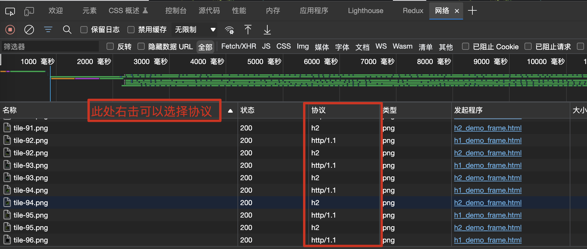
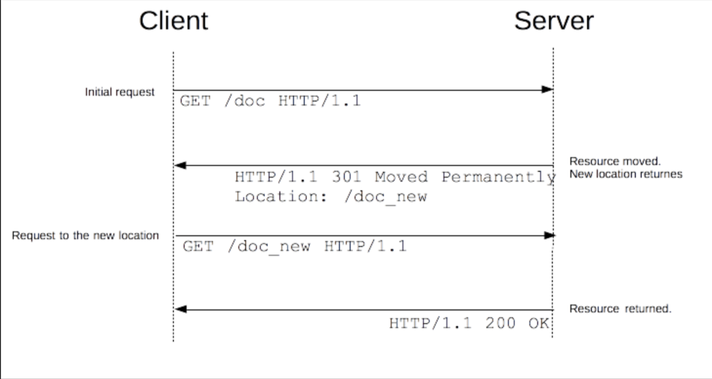
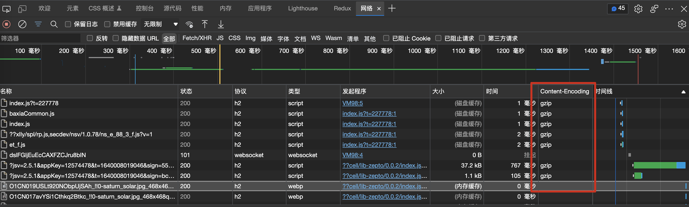

# 请求和响应优化概述
目的：更快的内容到达时间

核心思路：
- 更好的连接传输效率（DNS查询、TCP三次握手等）
- 更少的请求数量
- 更小的资源大小
- 合适的缓存策略

最佳实践：
- 减少 DNS 查找：每次主机名的解析都需要一次网络往返，从而增加了请求的延迟时间，同时还会阻塞后续的请求。
- 重用 TCP 连接：尽可能的使用持久连接，以消除因 TCP 握手和慢启动导致的延迟。
- 减少 HTTP 重定向：HTTP 冲定向需要额外的 DNS 查询、TCP 握手等非常耗时，最佳的重定向次数为0。
- 使用缓存：比如 HTTP 缓存、CDN 缓存、Service Worker 缓存。
- 使用 CDN（内容分发网络）：：把数据放在离用户地理位置更近的地方，可以明显减少每次 TCP 连接的网络延迟，增大吞吐量。
- 删除没有必要请求的资源
- 在客户端缓存资源：缓存必要的应用资源，避免每次都重复请求相同的内容，例如多图片下载可以考虑使用缓存。
- 内容在传输前先压缩：传输数据之前应该先压缩应用资源，把要传输的字节减少到最小，在压缩的时候确保对每种不同的资源采用最好的压缩手段。
- 消除不必要的请求开销：减少请求的 HTTP 首部数据（比如 HTTP COokie）
- 并行处理请求和响应：请求和响应的排队都会导致延迟，可以尝试并行的处理请求和响应（利用多个 HTTP1.1 连接实现并行下载，在可能的情况下使用 HTTP 管道计数）。
- 针对协议版本采取优化措施。升级到 HTTP2.0。
- 根据需要采用服务端渲染方式。这种方式可以解决 SPA 应用首屏渲染慢的问题。
- 采用预渲染的方式快速加载静态页面。页面渲染的极致性能，比较适合静态页面。

# 一、DNS解析
当浏览器从（第三方）服务器请求资源时，必须先将该跨域域名解析为 IP 地址，然后浏览器才能发出请求。此过程称为  DNS 解析。DNS 作为互联网的基础协议，其解析的速度似乎很容易被网站优化人员忽视。现在大多数新浏览器已经针对 DNS 解析进行了优化，比如 DNS 缓存。典型的一次 DNS 解析需要耗费 20-120 毫秒，所花费的时间几乎可以忽略不计，但是当网站中使用的资源依赖于多个不同的域的时候，时间就会成倍的增加，从而增加了网站的加载时间。比如在某些图片较多的页面中，在发起图片加载请求之前预先把域名解析好将会有至少 5% 的图片加载速度提升。

一般来说，在前端优化中与 DNS 有关的有两点：
- 减少 DNS 的请求次数
- 进行 DNS 预获取：DNS Prefetch

## 1.减少 DNS 的请求次数
注意事项：
- 关于DNS解析过程的分析：在chrome里的Network面板里进行分析，主要在分析之前最好清除DNS缓存（清除浏览器DNS缓存以及系统DNS缓存）。
- 关于浏览器缓存：默认情况下，Internet Explorer 会缓存 30 分钟的 DNS 查找，这是由`DnsCacheTimeout` 注册表设置指定的 。Firefox 在`network.dnsCacheExpiration` 配置设置的控制下缓存 DNS 查找1分钟。Chrome 也是1分钟。
- 关于系统DNS缓存：根据具体的DNS缓存过期时间，这个可以在域名的解析设置里进行配置。（比如阿里云->域名解析->解析设置->修改TTL）
- 减少域名的数量有可能减少页面中并行下载的数量。避免 DNS 查找会减少响应时间，但是减少并行下载可能会增加响应时间。最佳实践是将这些资源划分为至少两个但不超过四个域名。这将在减少 DNS 查找和允许高度并行下载之间取得良好的折衷。

## 2.Dns Prefetch
域名解析和内容载入是串行的网络操作，所以这个方式能减少用户的等待时间，提升用户体验 。


```js
// 方式1:link元素使用dns-prefetch的rel属性
<link rel="dns-prefetch" href="https://fonts.googleapis.com/"/> 
// 方式2:通过使用HTTP Link字段将dns-prefetch（以及其他资源提示）指定为 HTTP 标头。 这种方法不常用，因为需要后台进行响应设置，并且需要知道当前页面上用到了哪些链接。
Link: <https://fonts.gstatic.com/>; rel=dns-prefetch
```

dns-prefetch的注意事项：
- 仅对`跨域`域上的 DNS 查找有效。因此请避免使用它来指向您的站点或域。这是因为，到浏览器看到提示时，您站点域背后的IP已经被解析。
- 需慎用，多页面重复dns预解析会增加重复dns查询次数
- 默认情况下浏览器会对页面中和当前域名（正在浏览网页的域名）不在同一个域的域名进行预获取，并且缓存结果，这就是隐式的 DNS Prefetch。如果想对页面中没有出现的域进行预获取，那么就要使用显示 DNS Prefetch 了。（高版本浏览器才有）
- 虽然使用 DNS Prefetch 能够加快页面的解析速度，但是也不能滥用，因为有开发者指出禁用 DNS 预读取能节省每月100亿的 DNS 查询。
    ```js
    // 禁用预解析
    <meta http-equiv="x-dns-prefetch-control" content="off">
    ```
## 3.更多DNS解析优化
- 延长 DNS 缓存时间
- 尽可能使用 A 或 AAAA 记录代替 CNAME
- 使用 CDN 加速域名（通常针对静态资源）
- 自己搭建 DNS 服务（动态资源也实现加速域名效果的话，可以自己搭建DNS服务或使用国际DNS服务，实现就近查找，这些服务要实现分布式）


# 二、HTTP长连接
## 1.短连接
为了解决短连接这个问题，有些浏览器在请求时，用了一个非标准的 Connection 字段。这个字段要求服务器不要关闭 TCP 连接，以便其他请求复用。服务器同样回应这个字段。一个可以复用的 TCP 连接就建立了，直到客户端或服务器主动关闭连接。但是，这不是标准字段，不同实现的行为可能不一致，因此不是根本的解决办法。
```
Connection: keep-alive
```
## 2.长连接
1997 年 1 月，HTTP/1.1 版本发布，只比 1.0 版本晚了半年。它进一步完善了 HTTP 协议，直到现在还是最流行的版本。HTTP 1.1 版的最大变化，就是引入了持久连接（HTTP Persistent Connections），即 TCP 连接默认不关闭，可以被多个请求复用，不用声明`Connection: keep-alive`。

持久连接的好处在于减少了 TCP 连接的重复建立和断开所造成的额外开销，减轻了服务器端的负载。另外，减少开销的那部分时间，使 HTTP 请求和响应能够更早的结束，这样 Web 页面的显示速度也就相应提高了。
客户端和服务器发现对方一段时间没有活动，就可以主动关闭连接。不过，规范的做法是，客户端在最后一个请求时，发送 `Connection: close`，明确要求服务器关闭 TCP 连接。

目前，对于同一个域名，大多数浏览器允许同时建立6个持久连接。

## 3.管道机制
HTTP 1.1 版还引入了管道机制（pipelining），即在同一个 TCP 连接里面，客户端可以同时发送多个请求。这样就进一步改进了 HTTP 协议的效率。
从前发送请求后需等待并接收响应，才能发送下一个请求。管线化技术出现后，不用等待响应即可直接发送下一个请求。这样就能够做到同时并行发送多个请求，而不需要一个接一个的等待响应了，与挨个连接相比，用持久连接可以让请求更快结束。而管线化技术则比持久连接还要快。请求数越多，时间差就越明显。

## 4.Content-length字段
一个 TCP 连接现在可以传送多个回应，势必就要有一种机制，区分数据包是属于哪一个回应的。这就是 `Content-length` 字段的作用，声明本次回应的数据长度。
```js
Content-Length: 3495 // 告诉浏览器，本次回应的长度是3495个字节，后面的字节就属于下一个回应了。
```
在1.0版中， `Content-length` 字段不是必需的，因为浏览器发现服务器关闭了 TCP 连接，就表明收到的数据包已经全了。

## 5.分块传输编码
使用 Content-Length 字段的前提条件是，服务器发送回应之前，必须知道回应的数据长度。对于一些很耗时的动态操作来说，这意味着，服务器要等到所有操作完成，才能发送数据，显然这样的效率不高。更好的处理方法是，产生一块数据，就发送一块，采用“流模式”（stream）取代“缓存模式”（buffer）。

因此，1.1版规定可以不使用 `Content-length`  字段，而使用"分块传输编码"（chunked transfer encoding）。只要请求或回应的头信息有`Transfer-Encoding`字段，就表明回应将由数量未定的数据块组成。
```js
Transfer-Encoding: chunked
```
每个非空的数据块之前，会有一个16进制的数值，表示这个块的长度。最后是一个大小为0的块，就表示本次回应的数据发送完了。下面是一个例子。
```js
HTTP/1.1 200 OK
Content-Type: text/plain
Transfer-Encoding: chunked

25
This is the data in the first chunk

1C
and this is the second one

3
con

8
sequence

0
```

## 6.长连接的缺点
虽然 HTTP 1.1 版允许复用 TCP 连接，但是同一个 TCP 连接里面，所有的数据通信是按次序进行的。服务器只有处理完一个回应，才会进行下一个回应。要是前面的回应特别慢，后面就会有许多请求排队等着。这称为"队头堵塞"（Head-of-line blocking）。

为了避免这个问题，只有两种方法：
- 一是减少请求数
- 二是同时多开持久连接

这导致了很多的网页优化技巧，比如合并脚本和样式表、将图片嵌入 CSS 代码、域名分片（domain sharding）等等。如果 HTTP 协议设计得更好一些，这些额外的工作是可以避免的。

# 三、HTTP2
2009 年，谷歌公开了自行研发的 SPDY 协议，主要解决 HTTP/1.1 效率不高的问题。

这个协议在 Chrome 浏览器上证明可行以后，就被当作 HTTP/2 的基础，主要特性都在 HTTP/2 之中得到继承。

2015年，HTTP/2 发布。它不叫 HTTP/2.0，是因为标准委员会不打算再发布子版本了，下一个新版本将是 HTTP/3。

## 1.二进制协议
HTTP/1.1 版的头信息肯定是文本（ASCII 编码），数据体可以是文本，也可以是二进制。HTTP/2 则是一个彻底的二进制协议，头信息和数据体都是二进制，并且统称为"帧"（frame）：头信息帧和数据帧。

二进制协议的一个好处是，可以定义额外的帧。HTTP/2 定义了近十种帧，为将来的高级应用打好了基础。如果使用文本实现这种功能，解析数据将会变得非常麻烦，二进制解析则方便得多。

## 2.多工
HTTP/2 复用 TCP 连接，在一个连接里，客户端和浏览器都可以同时发送多个请求或回应，而且不用按照顺序一一对应，这样就避免了"队头堵塞"。

举例来说，在一个 TCP 连接里面，服务器同时收到了 A 请求和 B 请求，于是先回应 A 请求，结果发现处理过程非常耗时，于是就发送 A 请求已经处理好的部分， 接着回应 B 请求，完成后，再发送 A 请求剩下的部分。

这样双向的、实时的通信，就叫做多工（Multiplexing）。

这是一个对比 HTTP1 和 HTTP2 资源加载的在线示例：https://http2.akamai.com/demo

如何查看网站使用的是什么协议的？


## 3.数据流
因为 HTTP/2 的数据包是不按顺序发送的，同一个连接里面连续的数据包，可能属于不同的回应。因此，必须要对数据包做标记，指出它属于哪个回应。  
HTTP/2 将每个请求或回应的所有数据包，称为一个数据流（stream）。每个数据流都有一个独一无二的编号。数据包发送的时候，都必须标记数据流 ID，用来区分它属于哪个数据流。另外还规定，客户端发出的数据流，ID 一律为奇数，服务器发出的，ID 为偶数。  
数据流发送到一半的时候，客户端和服务器都可以发送信号（RST_STREAM帧），取消这个数据流。1.1 版取消数据流的唯一方法，就是关闭 TCP 连接。这就是说，HTTP/2 可以取消某一次请求，同时保证 TCP 连接还打开着，可以被其他请求使用。  
客户端还可以指定数据流的优先级。优先级越高，服务器就会越早回应。

## 4.头信息压缩
HTTP 协议不带有状态，每次请求都必须附上所有信息。所以，请求的很多字段都是重复的，比如 Cookie 和 User Agent，一模一样的内容，每次请求都必须附带，这会浪费很多带宽，也影响速度。

HTTP/2 对这一点做了优化，引入了头信息压缩机制（header compression）。一方面，头信息使用 gzip 或 compress 压缩后再发送；另一方面，客户端和服务器同时维护一张头信息表，所有字段都会存入这个表，生成一个索引号，以后就不发送同样字段了，只发送索引号，这样就提高速度了。

## 5.服务器推送
HTTP/2 允许服务器未经请求，主动向客户端发送资源，这叫做服务器推送（server push）。

常见场景是客户端请求一个网页，这个网页里面包含很多静态资源。正常情况下，客户端必须收到网页后，解析 HTML 源码，发现有静态资源，再发出静态资源请求。其实，服务器可以预期到客户端请求网页后，很可能会再请求静态资源，所以就主动把这些静态资源随着网页一起发给客户端了。

参考链接：
- https://developers.google.com/web/fundamentals/performance/http2?hl=zh-cn


# 四、避免重定向
参考：https://developer.mozilla.org/zh-CN/docs/Web/HTTP/Redirections

URL 重定向，也称为 URL 转发，是一种当实际资源，如单个页面、表单或者整个 Web 应用被迁移到新的 URL 下的时候，保持（原有）链接可用的技术。HTTP 协议提供了一种特殊形式的响应—— HTTP 重定向（HTTP redirects）来执行此类操作。

重定向可实现许多目标：
- 站点维护或停机期间的临时重定向。
- 永久重定向将在更改站点的URL，上传文件时的进度页等之后保留现有的链接/书签。
- 上传文件时的表示进度的页面。

## 1.原理
在 HTTP 协议中，重定向操作由服务器通过发送特殊的响应（即 redirects）而触发。HTTP 协议的重定向响应的状态码为 3xx 。

浏览器在接收到重定向响应的时候，会采用该响应提供的新的 URL ，并立即进行加载；大多数情况下，除了会有一小部分性能损失之外，重定向操作对于用户来说是不可见的。



不同类型的重定向映射可以划分为三个类别：
- 永久重定向
- 临时重定向
- 特殊重定向

## 2.永久重定向
这种重定向操作是永久性的。它表示原 URL 不应再被使用，而应该优先选用新的 URL。搜索引擎机器人会在遇到该状态码时触发更新操作，在其索引库中修改与该资源相关的 URL 。  
|编码|含义|处理方式|典型应用场景|
|---|---|---|---|
|301|Moved Permanently|**Get**方法不会发生变更，其他方法**有可能会**变更为**Get** |网站重构|
|308|Permanent Redirect|方法和消息主体都不发生变化。|网站重构，用于非GET方法。(with non-GET links/operations)|

## 3.临时重定向
有时候请求的资源无法从其标准地址访问，但是却可以从另外的地方访问。在这种情况下可以使用临时重定向。
搜索引擎不会记录该新的、临时的链接。在创建、更新或者删除资源的时候，临时重定向也可以用于显示临时性的进度页面。

|编码|含义|处理方式|典型应用场景|
|---|---|---|---|
|302|Found|**Get**方法不会发生变更，其他方法**有可能会**变更为**Get** |由于不可预见的原因该页面暂不可用。在这种情况下，搜索引擎不会更新它们的链接。|
|303|See Other|**Get**方法不会发生变更，其他方法**会**变更为**Get**（消息主体会丢失） |用于**PUT**或**POST**，请求完成之后进行页面跳转来防止由于页面刷新导致的操作的重复触发|
|307|Temporary Redirect |方法和消息主体都不发生变化。|由于不可预见的原因该页面暂不可用。在这种情况下，搜索引擎不会更新它们的链接。当站点支持非 GET 方法的链接或操作的时候，该状态码优于 302 状态码。|

## 4.特殊重定向
除了上述两种常见的重定向之外，还有两种特殊的重定向。304 （Not Modified，资源未被修改）会使页面跳转到本地陈旧的缓存版本当中（该缓存已过期(?)），而 300 （Multiple Choice，多项选择） 则是一种手工重定向：以 Web 页面形式呈现在浏览器中的消息主体包含了一个可能的重定向链接的列表，用户可以从中进行选择。
|编码|含义|典型应用场景|
|---|---|---|
|300|Multiple Choice|不常用：所有的选项在消息主体的 HTML 页面中列出。鼓励在 **Link**头部加入机器可读的**rel=alternate** |
|304|Not Modified|发送用于重新验证的条件请求。表示缓存的响应仍然是新鲜的并且可以使用。|

# 五、压缩传输的数据资源
数据压缩是提高 Web 站点性能的一种重要手段。对于有些文件来说，高达 70% 的压缩比率可以大大减低对于带宽的需求。随着时间的推移，压缩算法的效率也越来越高，同时也有新的压缩算法被发明出来，应用在客户端与服务器端。

## 1.HTTP 响应数据压缩
- 压缩 JS、CSS：这里所说的压缩指的是去除换行空格之类的压缩，文件内容不变。
- 压缩图片
- 使用 Gzip 压缩文本：浏览器和服务器之间会使用[主动协商机制](https://developer.mozilla.org/en-US/docs/Web/HTTP/Content_negotiation)。浏览器发送 `Accept-Encoding`首部，其中包含有它所支持的压缩算法（gzip、deflate、br等），以及各自的优先级，服务器则从中选择一种，使用该算法对响应的消息主体进行压缩，并且发送 `Content-Encoding` 首部来告知浏览器它选择了哪一种算法。由于该内容协商过程是基于编码类型来选择资源的展现形式的，在响应中， `Vary` 首部中至少要包含 `Accept-Encoding` ；这样的话，缓存服务器就可以对资源的不同展现形式进行缓存。  
    下面是一个请求响应的 HTTP 报文示例：
    ```js
    GET /encrypted-area HTTP/1.1
    Host: www.example.com
    Accept-Encoding: gzip, deflate
    ```
    ```js
    HTTP/1.1 200 OK
    Date: Tue, 27 Feb 2018 06:03:16 GMT
    Server: Apache/1.3.3.7 (Unix)  (Red-Hat/Linux)
    Last-Modified: Wed, 08 Jan 2003 23:11:55 GMT
    Accept-Ranges: bytes
    Content-Length: 438
    Connection: close
    Content-Type: text/html; charset=UTF-8
    Content-Encoding: gzip
    ```



## 2.HTTP 请求数据压缩

### 2-1.头部数据压缩
HTTP 协议不带有状态，每次请求都必须附上所有信息。所以，请求的很多字段都是重复的，比如 Cookie 和 User Agent，一模一样的内容，每次请求都必须附带，这会浪费很多带宽，也影响速度。
HTTP/2 对这一点做了优化，引入了头信息压缩机制（header compression）。一方面，头信息使用 gzip 或 compress 压缩后再发送；另一方面，客户端和服务器同时维护一张头信息表，所有字段都会存入这个表，生成一个索引号，以后就不发送同样字段了，只发送索引号，这样就提高速度了。
### 2-2.请求体数据压缩
HTTP协议中的`Accept-Encoding/Content-Encoding` 机制。这套机制可以很好地用于文本类响应正文的压缩，可以大幅减少网络传输，从而一直被广泛使用。但 HTTP 请求的发起方（例如浏览器），无法事先知晓要访问的服务端是否支持解压，所以现阶段的浏览器没有压缩请求正文。
有一些通讯协议基于 HTTP 做了扩展，他们的客户端和服务端是专用的，可以放心大胆地压缩请求正文。例如 WebDAV 客户端就是这样。
实际的 Web 项目中，会存在请求正文非常大的场景，例如发表长篇博客，上报用于调试的网络数据等等。这些数据如果能在本地压缩后再提交，就可以节省网络流量、减少传输时间。本文介绍如何对 HTTP 请求正文进行压缩，包含如何在服务端解压、如何在客户端压缩两个部分。

开始之前，先来介绍本文涉及的三种数据压缩格式：
- DEFLATE，是一种使用 Lempel-Ziv 压缩算法（LZ77）和哈夫曼编码的压缩格式。详见[RFC 1951](https://datatracker.ietf.org/doc/html/rfc1951)
- ZLIB，是一种使用 DEFLATE 的压缩格式，对应 HTTP 中的 Content-Encoding: deflate。详见 [RFC 1950](https://datatracker.ietf.org/doc/html/rfc1950)
- GZIP，也是一种使用 DEFLATE 的压缩格式，对应 HTTP 中的 Content-Encoding: gzip。详见 [RFC 1952](https://datatracker.ietf.org/doc/html/rfc1952)

Content-Encoding 中的 deflate，实际上是 ZLIB。为了清晰，本文将 DEFLATE 称之为 RAW DEFLATE，ZLIB 和 GZIP 都是 RAW DEFLATE 的不同 Wrapper。

下面是一个简单示例。

（1）压缩请求正文数据
```js
var rawBody = 'content=test';
var rawLen = rawBody.length;

var bufBody = new Uint8Array(rawLen);
for(var i = 0; i < rawLen; i++) {
    bufBody[i] = rawBody.charCodeAt(i);
}

var format = 'gzip'; // gzip | deflate | deflate-raw
var buf;

switch(format) {
    case 'gzip':
        buf = window.pako.gzip(bufBody);
        break;
    case 'deflate':
        buf = window.pako.deflate(bufBody);
        break;
    case 'deflate-raw':
        buf = window.pako.deflateRaw(bufBody);
        break;
}

var xhr = new XMLHttpRequest();
xhr.open('POST', '/node/');

xhr.setRequestHeader('Content-Encoding', format);
xhr.setRequestHeader('Content-Type', 'application/x-www-form-urlencoded; charset=UTF-8');

xhr.send(buf);
```
（2）在 Node 中解压请求正文中的数据
```js
var http = require('http');
var zlib = require('zlib');

http.createServer(function (req, res) {
    var zlibStream;
    var encoding = req.headers['content-encoding'];

    switch(encoding) {
        case 'gzip':
            zlibStream = zlib.createGunzip();
            break;
        case 'deflate':
            zlibStream = zlib.createInflate();
            break;
        case 'deflate-raw':
            zlibStream = zlib.createInflateRaw();
            break;
    }

    res.writeHead(200, {'Content-Type': 'text/plain'});
    req.pipe(zlibStream).pipe(res);
}).listen(8361, '127.0.0.1');
```
参考链接：
- https://developer.mozilla.org/zh-CN/docs/Web/HTTP/Compression
- https://zh.wikipedia.org/wiki/HTTP%E5%8E%8B%E7%BC%A9

